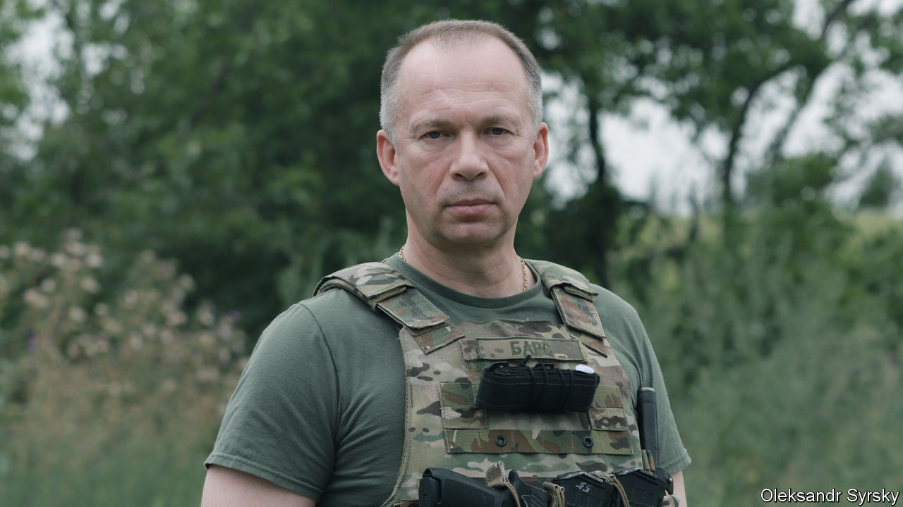
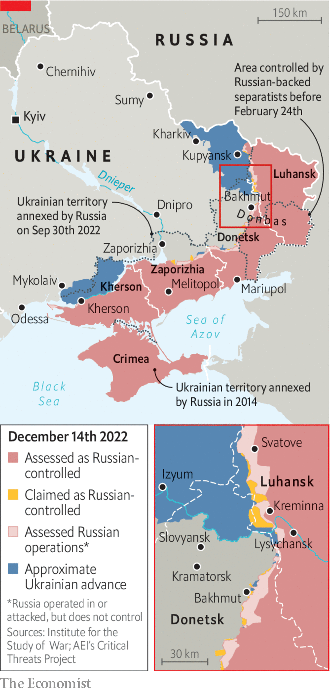

###### General principles

# “Anyone who underestimates Russia is headed for defeat” 

##### An interview with Colonel-General Oleksandr Syrsky, Ukraine’s second most senior soldier 

 

> Dec 15th 2022 

GENERAL OLESKANDR SYRSKY is late. He apologises when he eventually arrives, two hours behind schedule, at a location near his situation room in eastern Ukraine. War has a habit of surprising, he says: just when things appear fine, you are hit with a storm. Punching words out in a strained staccato, he appears exhausted by the stress of overseeing . “The Russians aren’t idiots,” he says. “They aren’t weak. Anyone who underestimates [them] is headed for defeat.” 

Described by colleagues as an ascetic, an obsessive planner with an addiction to the gym, even building one at his headquarters, the head of Ukraine’s ground forces has done much to tilt the war in his country’s favour. He was responsible for two critical victories: stopping what  considered to be the “world’s second army” at the gates of Kyiv in March; and then pushing it out of the Kharkiv region in September. Now he is the man charged with facing down a humiliated but regrouped Russian army that is throwing everything it has at the town of Bakhmut in Donbas.

 


In a rare interview, the general explains that the Russians are changing tactics under their new commander, Sergei Surovikin. They are attacking using smaller, well co-ordinated detachments on foot, he says: costly in terms of soldiers’ lives, but that has “never been Russia’s highest priority”. General Syrsky thumps his chest. “I feel any loss right here, in my heart.”

Born in Vladimir, Russia, 200km east of Moscow but living in Ukraine since the 1980s, General Syrsky has managed most levels of the Ukrainian army, from platoon upwards. Before becoming head of Ukraine’s land forces in 2019, he was the ground commander for military operations in the east, and he played a prominent role in many of the key battles of the then-undeclared war with Russia. 

On several occasions, he was actually senior in the chain of command to Valery Zaluzhny, appointed to be the commander-in-chief of the entire armed forces in July 2021. Some political actors behind the scenes may be using that fact in an apparent attempt to foment tensions between the two. Rumours even persist that the presidential administration might be inclined to replace the popular but independent-minded General Zaluzhny with his former boss. Cracks of disunity have high-placed Western military officials worried. The two generals on their part say they fully trust each other and wish to stay out of politics. General Syrsky is uncomfortable with the conversation. “The army is outside of politics,” he says. “It is how it should be, and how the law demands it to be.” 


Not unusually for his generation, General Syrsky went to school with many Russian commanders. He graduated from the Higher Military Command School in Moscow, the Soviet Union’s equivalent of America’s West Point. But that is largely where the similarities end. His own command style departs starkly from Soviet and Russian hierarchical practice. He preaches NATO principles of decentralised command, and stresses the importance of morale. The modern commander needs to stay connected, he says. He gets 300 messages a day from soldiers. “You must feel the spirit of the army,” he says. 

General Syrsky’s command style emphasises the elements of deception and surprise, using them to compensate for Ukraine’s obvious disadvantage in firepower. In Kyiv, where at one point Ukrainian forces were outnumbered by 12 to one, he cobbled together makeshift battalions from military-training institutes, and then used partisan groups to pick off a 64km-long supply convoy as it attempted to steamroll its way towards Kyiv. It was a close-run thing, he says. 

In the Kharkiv region General Syrsky used light, mobile groups that he built by picking out small units from existing brigades. His most ambitious objectives—overrunning two crucial Russian logistical hubs in Kupyansk and Izyum—were fulfilled by day five. The commander says he was as surprised as anyone by the speed of progress. Rather than stick to the plan and switch to defence, he ordered his troops to pursue fleeing Russian forces as far as they could go, which turned out to be 50km in three days.

There might well have been a more severe collapse of the Russian front in the nearby northern Luhansk region near Svatove and Kreminna had the general been able to call on reinforcements. But forces were tied up in battles near the Lysychansk oil refinery to the south, and the Russians were eventually able to stop the offensive by using thousands of newly mobilised soldiers. “You are always short of troops. We’ve practically been fighting this war with reserves the whole time,” the general says.

What the Luhansk experience showed, he suggests, was that Vladimir Putin’s conscription drive can work. Reasonably well-prepared soldiers are now appearing en masse all along the eastern frontlines, some arriving from “from the depths of Russia, including…from the eastern districts and the Urals”. That is a concern, the general says, but an even more pressing worry is keeping up Ukraine’s arms supplies. Ammunition is being consumed at a rate that is comparable to that during the second world war. Battles are being won by whichever side gets shells delivered to guns quickly enough.

Asked what victory looks like, General Syrsky repeats the maximalist mantra of his president, Volodymyr Zelensky. “We’ve won when the enemy is destroyed and we are standing on our borders,” he says. His sobering assessment of the current predicament suggests that he isn’t convinced that will happen any time soon. For the immediate future Ukraine will offer what he describes as “active defence”. But the commander’s record suggests that he may have something more ambitious up his sleeve. He remains coy. “All I will say is we are studying the enemy closely. And every poison has an antidote.” ■


