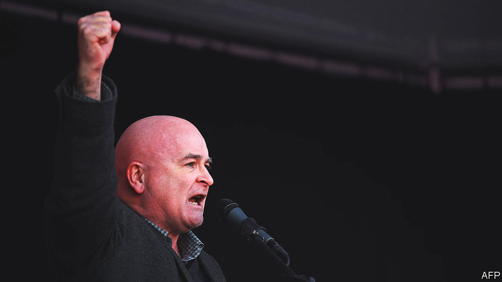
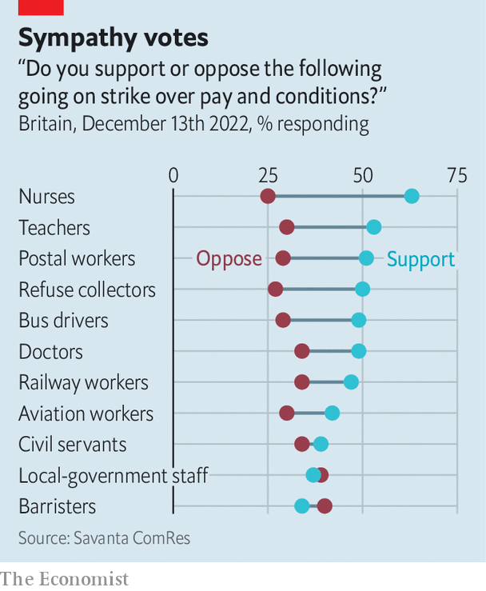

###### Railing against the system

# The British government and the unions dig in on train strikes 

##### A battle for public sympathy alongside a dispute over pay and conditions 

 

> Dec 13th 2022 

M ick lynch sounds like a prophet of Britain’s end-times. In interviews the twinkly-eyed secretary-general of the  (RMT) paints a picture of a country with crumbling Victorian-era infrastructure, mounting inequality and “the ordinary Joe out there on the street, trying to go about their daily life despite all the pressure”. Yet the 40,000-odd RMT railway workers who launched more strikes this week—in the longest of the country’s wave of industrial disputes—are not at the sharpest end of Britain’s problems. 

In comparison with the nurses, teachers and postal workers who have also voted to strike, employees on Britain’s railways are fairly well paid. The average salary of rail workers, excluding drivers (who earn much more and are mostly represented by a different union), is £39,518 ($49,100); the RMT says that figure omits train cleaners. Between 2011 and 2021 pay for railway employees (including drivers) rose by 24%; in that period average pay for nurses grew by about 13%, a fall in real terms of about 5%. 

Britain does not depend on its railways as it once did—in part because trains are so unreliable and expensive that only a small proportion of Britons use them to get to work. The effects of the current strikes will nonetheless be considerable. Network Rail, which owns and manages Britain’s rail infrastructure, has warned of some disruption every day until January 8th. Many people’s plans to travel for Christmas—the first since 2019 during which Britons have been free to mingle without covid-19 restrictions—will be ruined. 

Restaurants, many of which are still struggling to recover from the pandemic, are also concerned about the impact of the strikes in their busiest period. UKHospitality, an industry body, reckons the strikes could cause £1.5bn in lost sales as companies cancel or scale down Christmas-party plans and workers stay at home. 

Both sides seem to be digging in. On December 12th the RMT said its members had rejected a fresh offer from Network Rail of a 5% pay rise this year and 4% in 2023. That was in part, it said, because Network Rail wanted to make job cuts and force more “unsocial hours” on workers. On the same day Unite, which represents a small number of railway workers, said its members had voted to accept this offer. The Rail Delivery Group (RDG), which represents the companies that operate trains, has offered 4% this year and 4% next; the RMT has rejected that proposal, too.

The union’s critics point out that these offers compare well with those made to nurses and teachers, who are more highly skilled than many who work on the railways. The RMT counters that it has rejected the RDG pay rise largely because it would be funded by reforms that it deems unacceptable. Ministers riposte in turn that these changes are essential to modernising the railways, especially in a post-pandemic era of remote working. The Office for National Statistics says that 14% of British workers now work entirely at home; around a quarter stay at home for at least part of the week.

Some of the mooted reforms are reasonable. They include the closure of more ticket offices: in an era in which tickets are increasingly bought online and collected from machines, that seems inevitable. Including Sundays in the contractual definition of the working week, rather than leaving it as a day when employees can choose to work, also makes sense. The expansion of “driver-only trains”, with station staff doing some of the work currently done by on-board train guards, would need to be managed carefully; Mr Lynch has repeatedly argued that trains without guards compromise the security of disabled and female passengers. Yet given that train companies have seen revenues fall by 20% since the pandemic, according to the RDG, the railways must be made more efficient. 

 


The government seems to be in no mood to compromise. This month the  reported that ministers had prevented rail employers from offering a 10% pay rise over two years. (Mark Harper, the transport secretary, has denied this.) Although the government says it is up to rail employers to negotiate terms with unions, railways are a public utility, overseen and subsidised by the government. It seems unlikely that pay offers to railway workers will be increased before those to nurses and teachers. 

Many rail commuters, who tend to be an affluent bunch, can find other ways to travel to work or just stay at home. Indeed, some commuters from the prosperous Home Counties harrumph that there are plenty of problems with trains on non-strike days; at least when industrial action is announced, they can plan for it. “There’s a political calculation that there are votes in being anti-union,” says Edmund Heery, a professor of employment relations at Cardiff Business School. That depends on which group of workers you are talking about. Public support for strikes by nurses, who staged the first of two planned walkouts on December 15th, and postal workers is higher than it is for railway workers, for example (see chart). 

The government is planning to pass legislation that would make it harder to strike. The Trade Union Act of 2016 already means that workers in some sectors can strike only if 40% of members vote for industrial action (and if 50% of members turn up to vote). Rishi Sunak, the prime minister, has said that he wants to pass a new “minimum-service-level” law that would make it harder for transport workers to walk out. Such legislation would not come in time to prevent the current rash of train strikes; it may even prolong them, if the RMT wants to make life difficult for the government while it can. ■


