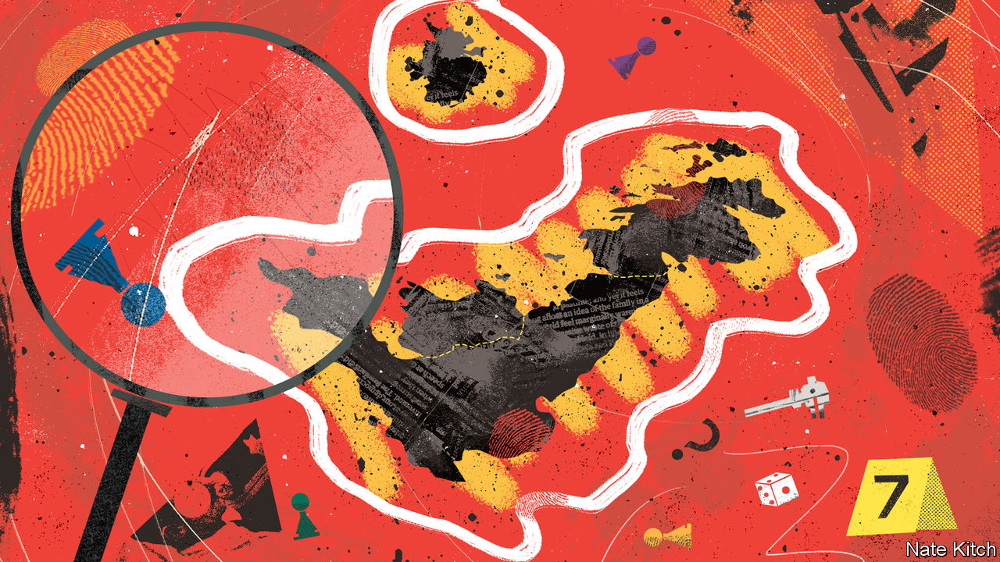
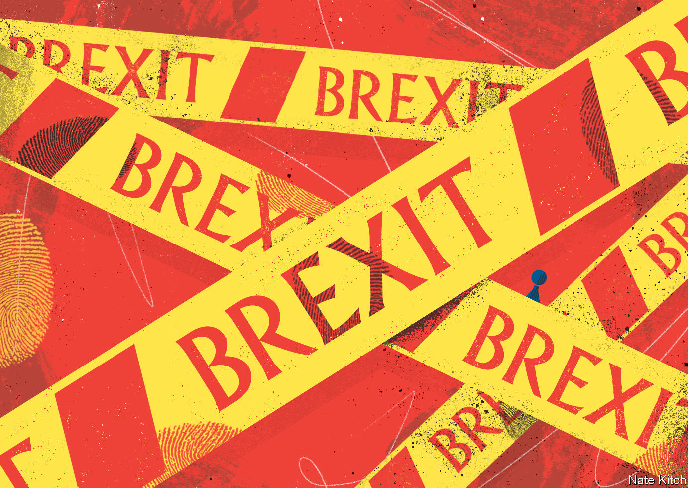
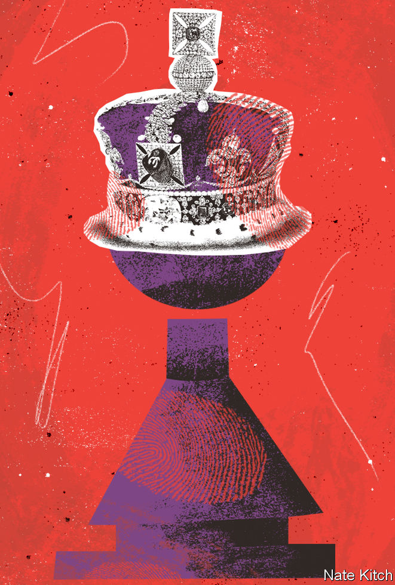
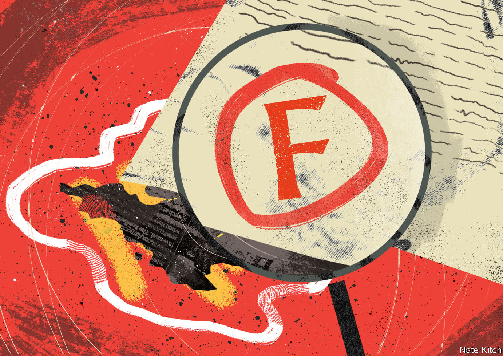

###### A historical mystery

# The strange case of Britain’s demise 

##### A country that prided itself on stability has seemed to be in free-fall. Whodunnit? 

 

> Dec 12th 2022 

THE DRIVEWAY dips as you approach Belton House, the gold-hued façade rising before you as the road tilts up again. Passing through a marble-floored hall to the ornate saloon, early visitors would have admired a portrait of the original master’s daughter with a black attendant. For a while, says Fiona Hall of the National Trust, a heritage charity that these days owns the property, servants came and went from the kitchen wing through a discreet tunnel. A magnificent staircase led finally to a rooftop cupola, and views of an estate that stretched beyond the horizon.

Built in the 1680s, the idyllic mansion embodies a costume-drama view of Britain’s past that is widely cherished at home and abroad. Its location in Lincolnshire makes it emblematic in another way: in the heart of England, in a region that in 2016 voted decisively for Brexit, and on the outskirts of Grantham, a typical market town that was the birthplace of Margaret Thatcher, the country’s most important post-war prime minister. Previously the venue for a murder-mystery evening featuring suspects in period dress, this history-laden spot is an apt place to ponder a different sort of mystery. Who nobbled Britain?

Alas, the victim is in a . A country that likes to think of itself as a model of phlegmatic common sense and good-humoured stability has become an international laughing stock: three prime ministers in as many months, four chancellors of the exchequer and a carousel of resigning ministers, some of them repeat offenders. “The programme of the Conservative Party,” declared Benjamin Disraeli in 1872, “is to maintain the constitution of the country.” The latest bunch of party leaders have broken their own laws, sidelined official watchdogs, disrespected Parliament and dishonoured treaties.

Not just a party, or a government, but Britain itself can seem to be kaput. , cemented not long after Belton House was built, is fraying. Real incomes have disappointed since the crash of 2008, with more years of stagnation to come as the  behind those of most other rich countries. The  in September threatened to deliver the . The pound tanked, markets applied a “moron premium” to British sovereign debt and the Bank of England stepped in to save the government from itself.

Today the economy is entering recession, inflation is high and pay strikes are disrupting , schools and even hospitals. The National Health Service (nhs), the country’s most cherished institution, is buckling. Millions of people are waiting for treatment in hospitals. Ambulances are perilously scarce.

In Grantham, a town of neat red-brick terraced houses, half-timbered pubs and 45,000 residents, the malaise shows up in a penumbra of hardship. Amid staff shortages in the NHS—and an uproar—the local emergency-care service has been cut back. Immured in stacks of nappies and cornflakes at the food bank he runs, Brian Hanbury says demand is up by 50% on last year, and is set to rocket as heating bills bite. Rachel Duffey of PayPlan, a debt-solutions firm that is one of the biggest local employers, predicts that need for help with debts is “about to explode” nationwide, as people already feeling the pinch come to the end of fixed-rate mortgage deals. As for the mini-budget: “It was a shambles,” laments Jonathan Cammack, steward of Grantham Conservative Club.

Natural causes

Whodunnit? A rich cast of suspects is implicated in the debacle. Some are obvious, others lurk in the shadows of history, seeping poison rather than dealing sudden blows. A few are outsiders, but as in many of the spookiest mysteries, most come from inside the house.

To begin with, Britons with long memories may detect a familiar condition: a government that has reached . A parliamentary remark in October about soon-to-quit Liz Truss—“the prime minister is not under a desk”—brought to mind immortal lines from the death-spiral of the Labour administration that lasted from 1997 to 2010. Then the chancellor referred to the prime minister’s henchmen as “the forces of hell”; “Home secretary’s husband put porn on expenses”, newspapers reported. In the mid-1990s, at the fag-end of Tory rule that began in 1979, a run of MPs were caught with their pants down or their fingers in the till in another relay of shame.

Britain seems trapped in a doom loop of superannuated governments which, after a term or two of charismatic leadership and reformist vim, wind up bereft of talent, sinking in their own mistakes and wracked by backbench rebellions; in office but barely in power. Eventually routed at the polls, it then takes the guilty parties several parliamentary terms to recover. In opposition, both Labour and the Tories have determinedly learned the wrong lessons from defeat before alighting on the right ones. In a system with two big parties, for either to lose its mind is dangerous. For both to do so at once—as happened when, amid recent Tory convulsions, Labour was led by Jeremy Corbyn, a hard-left throwback—is a calamity.

“A family with the wrong members in control,” George Orwell wrote of the English. Yet a repeating cycle of senile governments does not, by itself, explain the national plight. Those previous administrations never plumbed the depth of disarray the current lot has reached. Something else has struck a country that has spewed out ruinous policies and a sequence of leaders resembling a reverse ascent of man: from plausible but glib David Cameron, to out-of-her-depths Theresa May, disgraceful Boris Johnson and then Ms Truss, probably the worst premier in modern history. Philip Cowley of Queen Mary University of London says that, in bygone days, Rishi Sunak would at this stage of his career have been a junior Treasury minister, rather than the latest prime minister.

Violence has been inflicted on the body politic—most brazenly, by Brexit, in the referendum, with 52%. Parties in power for over a decade are bound to scrape the bottom of the talent barrel. In this case, much of the Tory barrel was poured down the drain when support for Brexit became a prerequisite for office. The outcome has been rule by chancers and cranks. Mr Johnson’s Brexit machinations put him in Downing Street; the tribalism that the campaign fostered kept him there for much longer than he deserved. Brexit has wrecked the Tory party—and yet it is, broadly speaking, the side that won.

 


Brexit has also institutionalised lying in British politics, as the dishonesty of Brexiteer promises segued into the pretence that they are being fulfilled. They are not. “Nothing much has changed,” Mr Cammack in Grantham says glumly. “Life just keeps going on.” But some things have changed for the worse. Investment is down and inflation higher than it would have been inside the European Union. Labour, skilled and otherwise, is scarce. Farmers are losing crops for want of workers. In Lincolnshire, says Johanna Musson of the National Farmers Union, tulip-growers are especially fretful. The county’s exports have fallen as, across Britain, Brexit-induced red tape leads some businesses to give up on European markets.

In 1975, during an earlier strike-hit era, Britain held another referendum on its relationship with Europe. Roy Jenkins, a pro-Europe statesman, predicted that, if it left, it would wind up in “an old people’s home for faded nations”. Give or take a detour to the lunatic asylum, that judgment looks prescient. The economy is floundering and the country’s international prestige is plummeting: precisely the future Brexit was meant to avoid.

Still, as any murder-mystery aficionado knows, the obvious suspect is rarely the right one. In the curious case of Britain’s decline, Brexit is as much a weapon as the ultimate culprit. 

The hand of history

Many of the factors behind the decision to leave have roughed up other countries, too. Lots of people on both sides of the Atlantic crave simple answers to complex questions, and populists have provided them. Faith in mainstream parties has waned, even as expectations of government have risen. The line between politics and entertainment has blurred, aggravating, in Britain, an old reluctance to take things  seriously, and a weakness for wits and eccentrics who cock a snook at convention. That is less damaging when there is substance behind their insouciance and discipline beneath the panache.

Ben Page, the boss of Ipsos, a global research firm, points to what he terms the “loss of the future”, common across the West but acute in Britain. In 2008, as the financial crisis struck, only 12% of Britons thought youngsters would have a worse quality of life than their parents, Mr Page notes. Now that figure is 41%. As elsewhere, people worry about immigration and feel threatened by globalisation. All this makes Britain’s predicament seem less an inside job than part of a wider takedown of democracy.

But other likely suspects lurk in the attic of British history. One grew up down the road from Belton House. The grocer’s shop in Grantham above which Margaret Roberts, later Thatcher, was born is now a chiropractor and beautician. A statue of her put up earlier this year was quickly egged and defaced (she endured worse in real life). Her legend still looms over the country—particularly her Conservative Party.

Thatcher’s 11-year rule was an amalgam of caution, patience, luck and boldness. But among some Tories it is often misremembered as a prolonged ecstasy of tax-cutting, fight-picking, union-bashing and shouting “No, no, no” at Brussels. The rows over Europe that erupted on her watch rumbled on till the referendum of 2016. For some, she bequeathed a hunch that if economic policy doesn’t hurt, it isn’t working. Her ousting nurtured a lasting taste for party bloodletting. To court Tory members, Ms Truss even seemed to mimic Thatcher’s wardrobe. (It took just 81,326 of them to put her in Downing Street.)

Peer deeper into the past and more evidence comes to light. Recall, for instance, that painting in the saloon at Belton House, of the girl and her black attendant, possibly a slave. Her family, the Brownlows, had links to both Caribbean plantations and the East India Company, which helps explain the house’s splendid collection of Asian porcelain. The wider legacy of Britain’s former empire, runs a plausible theory, is a gnawing sense of unmet expectations and a fatal delusion of grandeur over the country’s place in the world.

For Sathnam Sanghera, author of “Empireland”, a powerful book about the largely unspoken effects of imperialism, “the original sin behind Brexit is empire.” The circumstances in which that empire was lost may have redoubled the psychic blow: in the wake of the second world war, during which, at least in the popular memory, Britain stood nobly alone against the Nazi onslaught. Afterwards it found itself diminished, broke and outdone by erstwhile foes, nurturing entwined feelings of greatness and grievance and haunted by phantom invasions. As the Irish author Fintan O’Toole has quipped, “England never got over winning the war.” In his view, Brexit was “imperial England’s  last stand”.

 


Perhaps not quite the last. Even now you can hear an echo of imperial hubris in the tendency of some British politicians to talk to EU negotiators, or the international bond markets, as if they were waiters in a Mediterranean bistro, liable to comply if only you repeat yourself loudly enough. It resounds in hollow boasts about having the best health care or army (or football team) in the world, in the yen to “punch above our weight”, and in the pursuit of a pure sort of sovereignty which, in an age of climate change, pandemics and imported gas, no longer exists.

“Until we face up to our history,” thinks Mr Sanghera, “we’re just going to carry on being dysfunctional.” On this analysis, the unravelling of Britain is a kind of karma. 

In the 18th century, with a shrug

Maybe. Yet imperialism, greatness and all that have always been more an elite preoccupation than a popular one. In his enlightening new book, “The Strange Survival of Liberal Britain”, Vernon Bogdanor of King’s College London cites a survey of Britons conducted in 1951, when the loss of empire ought to have been most raw. Half of respondents couldn’t name a single colony (one suggested Lincolnshire). Odd as it is to say of a country that for centuries ruled swathes of the world, it may not be ruptures like the end of empire or Brexit that have done in modern Britain, but, less dramatically, a kind of long-term drift; not violence, in other words, but neglect.

Think back to the era in which Belton House was built. After the execution of Charles I in 1649 and the short-lived English Commonwealth, the monarchy had been restored. Compared with other European nations, the English got their big revolution done early—but then thought better of it, afterwards nudging forwards to constitutional monarchy and democracy. This piecemeal approach has characterised the country’s political evolution ever since. Walter Bagehot, a great Victorian editor of , noted the habit of compromising on thorny constitutional issues—or ducking them. “The hesitating line of a half-drawn battle was left to stand for a perpetual limit,” he wrote of such botches, and “succeeding generations fought elsewhere.”

Booby traps were often left behind. One lies in the fuzzy and weak restraints on the British executive. As Lord Hailsham, a Tory grandee, warned in 1976, a government with a secure majority in the House of Commons has an inbuilt tendency towards “elective dictatorship”. The House of Lords, which is meant to scrutinise legislation, is the fudge  In an absurd backroom deal of 1999, the hereditary peers who once dominated it were ejected—except for 92 of them. They are still there; when one dies, another is elected to replace him. Those are the only elections to Parliament’s upper chamber. 

It is hard to see many other countries tolerating such a farrago. Meanwhile, a gentlemanly understanding that leaders would regulate their personal behaviour, once known as the “good chaps” theory of government, did not survive contact with Mr Johnson. As when a mob realises the rule of law is a confidence trick, it turned out that a few good shoves could dispense with much of the flimflam of oversight.

Or consider the myopic attitudes of successive governments to devolution. When it created the Scottish Parliament, Sir Tony Blair’s Labour administration did not fully anticipate the subsequent surge in English nationalism. Nor did it foresee how, after taking office in Edinburgh, the canny, pro-independence Scottish National Party (SNP) would enjoy both the dignity of power and the sheen of opposition to Westminster. Now Brexit is inflicting more casual vandalism on the union, undermining support for it in Scotland and Northern Ireland, which both voted to remain in the EU.

Whereas once Scottish independence was an in-or-out proposition, says Sir John Curtice of the University of Strathclyde, it has become a choice between competing unions, British and European. As the SNP vows to rejoin the EU, some Scottish Remainers who had rejected independence are embracing the idea. For some in Northern Ireland, explains Katy Hayward of Queen’s University Belfast, the mere fact of Brexit made a united Ireland more desirable; the region’s awkward post-Brexit position has led still more to think unification is likelier than it was before. Across Britain, a majority thinks the union will fall apart. It is not on the cards yet, but one day Britain may dissolve itself by accident.

Drift and neglect have undermined more than the constitution and the union. David Kynaston, the pre-eminent historian of 20th-century England, invokes Sir Siegmund Warburg, a German-born banker who helped shake up the City (on the slide as an equity market in the aftermath of Brexit). Warburg detested the British fondness for the phrase, “We’ll cross that bridge when we come to it.” As Mr Kynaston observes, Britain is not a place that is “good at grasping the nettle”. 

With some glaring, uncharacteristic exceptions—Thatcher’s battle with the coal miners, the bust-up over Brexit—Britain tends to dislike confrontation, especially the ideological kind, perhaps a legacy of the civil war. It prefers irony to ideas and douses plain-speaking in good manners; its people have a quaint instinct to apologise when a stranger steps on their foot. Alongside this squeamishness, says Mr Kynaston, runs a “deep-dyed anti-intellectual empiricism”, and an inclination to tackle problems “pragmatically, as and when they arise, not looking for trouble in advance”.

This reticence has costs, not least through its complicity in the underpowered economy. Consider the , or—an even more venerable problem—the skewed education system. It produces a narrow elite, dominated for too long by the alumni of a few private schools: Brexit and the mini-budget can both be traced to the playing fields of Eton, attended by Mr Johnson, Mr Cameron, who botched the referendum, and Kwasi Kwarteng, very briefly the chancellor. Less conspicuous, but at least as damaging, is the country’s long educational tail.

 


It has recently made some progress in international education rankings, but a stubborn quarter or so of 11-year-olds in England are unable to read at the expected level. A higher share of teenage boys are not in work, education or training than in most other rich countries. As for those who stay in the classroom: the “greater part of what is taught in schools and universities…does not seem to be the most proper preparation” for “the business which is to employ [students] during the remainder of their days.” That was Adam Smith in “The Wealth of Nations”, published in 1776. Employers make similar complaints in 2022. 

In a post-imperial, post-industrial, ever-more competitive world, all that contributes to a skills shortage and a long-term productivity gap with other advanced economies. The fat years under Sir Tony and Gordon Brown disguised these shortcomings—until the crash, when it became clear that the boom they oversaw was over-reliant on financial services and debt. Using the fruits of Thatcherite economics to fund a more generous state had seemed a political elixir; it turned out to be a fair-weather formula. In the kindest of circumstances, New Labour left some of the hardest problems unsolved. Most new jobs went to foreign-born workers. The number of working-age adults receiving welfare benefits barely shifted. 

The cradle of the Industrial Revolution has not yet found a secure niche in the 21st-century economy. Nor has it figured out how to pay sustainably for the sort of public services that Britons expect. If, in the matter of Britain’s meltdown, Thatcher is an accessory before the fact, so is Sir Tony.

The country-house red herring

In the upstairs-downstairs, country-house vision of Britain, the country is a museum of class, with overlords surveying their lands and minions scurrying below stairs as they once did at Belton House. Famously, Disraeli wrote of “two nations”, the rich and the poor, as distinct as “inhabitants of different planets”. England, especially, is indeed a class-ridden place, whose denizens still make snap judgments about each other’s backgrounds based on accents, shoes and haircuts. Too many at the bottom of the ladder cannot see a way up it. Some at the top still benefit from unearned deference. Politicians often share this binary outlook, thinking the business of government is to squeeze the rich and comfort the poor, or vice versa. 

But Disraeli’s formulation is too crude for 21st-century Britain. After generations of muddling through, it is in large part a country of people who are not exactly poor but are by no means rich. Instead they are “just about managing”, as Mrs May, the last prime minister but two, described them.

Take Grantham, a constituency in which the average income in 2020 was £25,600 ($32,900), just below the national median. (This year, Britain’s GDP per person will be more than 25% lower than America’s, measured at purchasing-power parity.) Amid the cost-of-living squeeze, says Mr Hanbury at the food bank, not only households that rely on welfare benefits but nurses and teachers are coming unstuck: “People live so close to the edge.” 

It is only a 70-minute train ride to London, but power in Westminster seems remote, reflects Father Stuart Cradduck of St Wulfram’s, a lovely medieval church behind Grantham’s low-slung high street. Lincolnshire, he says, feels like a “forgotten county”. Kelham Cooke, the leader of the local council, says young people who leave for university often don’t come back.  is another old, hard problem that successive British governments have only desultorily tackled, watching on as London sucked in talent and capital and other places fell behind. 

There is something to be said for drift; or, to put it another way, gradualism. A “highly original quality of the English”, Orwell wrote in 1947, “is their habit of not killing one another.” By slowly expanding the franchise and incorporating the labour movement into democratic politics, Britain avoided continental-style extremism in the 19th and 20th centuries. When liberalism perished elsewhere in Europe in the 1930s, observes Mr Bogdanor, it survived in Britain. Compared with places such as France or Italy, where the far right is resurgent—or with ultrapolarised America—it is healthy in Britain still. Ms Truss’s stint in Downing Street was inglorious, but, Mr Bogdanor notes, she was removed quietly and efficiently, without riots or fuss. The flawed parliamentary system worked.

So drift can be benign. But it can also take you into a cul-de-sac—or off a cliff. In Britain it has led to economic mediocrity and disgruntlement, which in turn contributed to the yelp of Brexit and the desperate magical thinking of the mini-budget. Senile governments, self-inflicted wounds, the blowback of empire, corrosive global trends, the spectres of bygone leaders: they are all accomplices. But the main cause of Britain’s woe belongs less at a crime scene than in a school report. In the end, it didn’t try hard enough. ■


