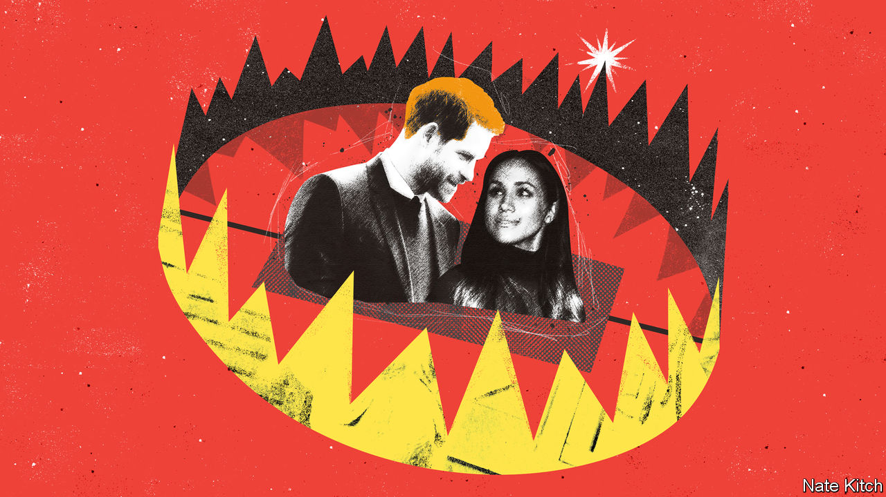

###### Bagehot

# Why do Harry and Meghan wind people up? 

##### The couple represent a return to an old norm for the royal family 

 

> Dec 15th 2022 

In 1901 Edward VII was waiting in Portsmouth for the return of his eldest son, who had been on a tour of the British empire. To pass the time, he pulled a prank on his grandchildren who were waiting alongside him. “Our parents, he reminded us, had been exposed for a long time to the fierce tropical sun and in all probability their skins had turned black,” recalled the Duke of Windsor, who was seven at the time, and would go on to accede to the throne 35 years later. “Needless to say I was horrified,” wrote the former monarch in his memoir. “To my immense relief…their complexions were still as naturally white as I had remembered them.”

Published in 1951, “A King’s Story” is a tell-all tale of press intrusion, casual racism, stuffy courtiers refusing to modernise an outdated institution and a man falling in love with an American divorcee. Seven decades on and a new version of an old tale has emerged. “Harry &amp; Meghan”, a Netflix documentary about the royal couple, is a tell-all tale of press intrusion, casual racism, stuffy courtiers refusing to modernise an outdated institution and a man falling in love with an American divorcee. 

 are far from the first to break the dictum of Walter Bagehot, a former editor of , and let daylight in on the magic of monarchy. For much of the 20th century the magicians wandered round the stage with their trousers round their ankles. When not writing scurrilous memoirs, the Duke of Windsor sidled up to Nazis and griped about his royal stipend (worth the best part of £1.4m, or $1.7m, per year in today’s money). Princess Margaret, the late queen’s sister, enjoyed a well-reported, gin-soaked existence in the Caribbean. During the 1980s and 1990s it was impossible to open a newspaper without being exposed to the toe-sucking excesses of minor royals. 

Yet there is something about Harry and Meghan that drives a slice of Britain insane. One Conservative mp tabled a proposal to strip the duo of their royal titles, aiming a kick at Britain’s rickety constitution. Social media froths with indignation at each glossy episode, in which the duo explain at length why they quit their royal duties. Harry, once the most popular royal, is now among the least. Meghan ranks above only Prince Andrew, who was accused of sexually assaulting a minor (he denied the allegations; the parties reached a settlement earlier this year).

Part of the backlash is understandable. Watching a documentary in which the subjects have been paid a reported $100m to moan about their lives sticks in the craw. Some abuse suffered by the couple is vile; some is banal. At one point newsreel footage compares Meghan’s hats to “the happy poo emoji”, before cutting to the duchess looking sad. Harry complains that the monarchy is a hierarchy, which is akin to moaning that water is wet. 

At the heart of the documentary is the idea that the monarchy, and Britain at large, is inherently racist. This raises hackles, even if it should not. In absolute terms, the duo have a point. It is impossible to wander round a British palace and not think that racism was a ladder for those who lived in them. A country that still dishes out Orders of the British Empire probably has a few issues to work through. Coverage of their courtship had racist overtones. Meghan’s maternal line, a middle-class black family from Los Angeles, were painted by the press as “(Almost) Straight Outta Compton”, where they did not grow up.

In relative terms, however, Britain has a proud record. On most metrics Britain has a better record of integration than its European peers. The government is stuffed with high- (and low-) achieving ethnic minorities, including, in Rishi Sunak, the country’s first ethnic-minority prime minister. When it comes to race, Britain is both a relative success story and a failure. Neither side of the debate will back down because neither side is wrong. 

Harry and Meghan have inserted themselves in a wider civil war among the Establishment. Once it was fairly easy to identify the “pale, male and stale” types who ran Britain’s institutions. Harry and Meghan personify a new Establishment, which is international, diverse and stridently progressive, and which increasingly sets social norms. Harry, a former squaddie who was once filmed calling someone a “Paki” and a “raghead”, has repented and now speaks of “unconscious bias”. For Conservative mps who spend their days raging against the “woke” and the “blob”—their nickname for civil servants and leftie lawyers who thwart Tory will—the documentary is another assault in a broader conflict.

The show also rubs up against a new age of deference towards the royal family. During the 1990s Britain’s newspapers were almost sociopathic when it came to covering the monarchy. In 1993 newspapers published a mortifying transcript between Prince Charles and Camilla Parker Bowles in which the then heir to the throne joked about being reincarnated as a tampon. The  ran a poll of readers to determine whether they should publish the transcript. Readers said “yes”. Skip forward 30 years and the press are a praetorian guard for the main strand of the monarchy. Harry and Meghan do suffer from media attacks, but because they have veered from The Firm, not because they are part of it. 

Coronation Street 

British newspapers may have been brought to heel but the royal family is beginning to lose control of the narrative again. The monarchy’s image is forged in California as much as Fleet Street. “Harry &amp; Meghan” comes alongside “The Crown”, Netflix’s sprawling drama of the monarchy under , which is a de facto documentary for many viewers. 

The institution is becoming a soap opera once more, with rogue elements scattered across the world settling scores, and no matriarch to step in. For all the anger they excite, Harry and Meghan represent a return to a bumpy norm, rather than a new threat. There is a great deal of ruin in a nation; there is also a great deal of embarrassment in a monarchy. ■


