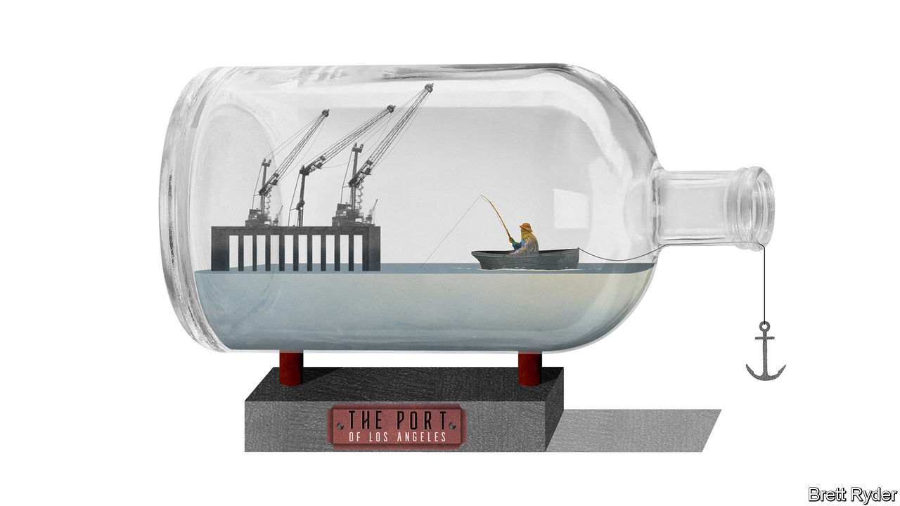

###### Schumpeter

# America’s biggest ports face a new kind of paralysis 

##### Rather than too much cargo as last year, ships are now bringing in too little 

 

> Dec 15th 2022 

It was called the tweetstorm that saved Christmas. In October 2021 scores of freighters idled at anchor off the west coast of America unable to deliver imports to docks already choc-a-bloc with containers. To find out what was wrong Ryan Petersen, founder of Flexport, a logistics firm, took a boat tour of America’s biggest port complex. He concluded that the adjacent ports of Los Angeles and Long Beach were at a standstill largely because of a shortage of space, which meant empty containers could not be removed from the dock. “OVERWHELM THE BOTTLENECK!” he tweeted. The thread went viral. Politicians were stung into action. Long Beach relaxed restrictions on how high containers could be stacked. Goods moved again. Santa Claus heaved a sigh of relief. 

In recent days your columnist took a similar boat trip. Rather than the pre-Christmas bustle, he witnessed another eerie paralysis. Except this time the cause was not surfeit but deficit. Only four container ships were docked at the Port of Los Angeles. Last year there would have been more than three times as many. There was hardly a longshoreman in sight, or crewmen on the ships. The cranes stood silently, like Ghosts of Christmas Past. The only vessel anchored offshore was an antiquated brigantine. 

The languor reflected a staggering drop in cargo volumes to the two southern Californian ports, which normally welcome 37% of imports to America. On December 14th the Port of Los Angeles said import volumes fell by 24% year on year in November. The Port of Long Beach has suffered similar shortfalls recently. From a business perspective, the slump raises interesting questions about the future of inflation, the bargaining position of workers, and a shift in the country’s economic geography. A good person to discuss these subjects with is Dave Clark, who until the start of this year was the logistics supremo at Amazon, and builder of one of the world’s biggest supply chains. He has recently joined Mr Petersen as co-CEO of Flexport.

A self-styled “supply-chain geek”, Mr Clark waxes lyrical about ports, whose importance to so many American firms was on display during the covid-19 pandemic. “They are national treasures,” he says. “When you saw those trucks cruising, and the yards full…the number of ships parked, waiting to get into the port, it was a visualisation of the power of the American economy.” 

It was also a visualisation of the economic risks when things go awry. Supply-chain congestion was a cause of surging inflation in the pandemic, alongside loose monetary policy, fiscal stimulus and, this year, the war in Ukraine. Yet the bottlenecks ended abruptly. Ships waiting to enter both ports fell from 109 in January to 20 in June and negligible numbers in the past few weeks. Mr Clark says that in the second quarter, importers suddenly switched from wanting to get their hands on more merchandise to worrying they had too much. They rushed to cancel orders. 

The result, according to Flexport, is that a record number of seaborne journeys have been cancelled in recent months, container-freight rates have plunged back to pre-pandemic levels, and shipowners have gone from feast to famine. Maersk, the world’s second-largest container carrier, named a new CEO on December 12th to steer it through an “increasingly challenging” period. Its share price has tumbled since March. 

This relaxation of supply-chain pressure may help explain why goods-price inflation is easing. However, goods account for only a third of consumer spending; services account for two-thirds. Moreover, as Mr Clark points out, a shortage of personnel, such as dockers, truckers and warehouse workers, means the cost of labour in the supply chain remains high. “Labour costs inside the US haven’t budged,” he says. “Most of the job reductions are white-collar, not front-line workers.” For these reasons, he is not convinced the inflationary threat is over. 

Adding to the prospect of wage inflation is union bargaining power. It has risen during the pandemic as workers went the extra mile to keep goods flowing, even as their employers, such as shipping and rail firms, raked in record profits. It is relevant in the ports of Los Angeles and Long Beach where, since July 1st, the International Longshore and Warehouse Union has operated without a labour contract as it negotiates a new one with ocean carriers and terminal operators. Both sides insist there will be no strikes or lockouts. But the fear of industrial unrest has been heightened by the recent threat of a rail strike, only averted by an act of Congress. It is all the more tricky when unions want a share of recent profits, while the shippers are braced for coming losses. 

Nothing to lose except their supply chains 

Mr Clark expects the discussions to remain “blustery”. But the threat of something more catastrophic is not lost on importers. It has caused many to divert ships from west-coast destinations to ports in the Gulf of Mexico and the east coast, even though costs via the Panama canal are higher and shipping times longer. That is a big reason why late this summer the Port of Los Angeles lost its 22-year-old crown as America’s busiest container terminal to the Port of New York and New Jersey. Added to this, Asian supply chains are beginning to shift away from China to new locations, including in South-East Asia and South Asia, that tend to send more freight via the Suez canal to America’s east coast. 

The change in economic geography is stark. Still, Mr Clark believes the west coast will rebound. “People have short memories and cost usually wins,” he says. Though he expects the American economy to get worse next year before it gets better, he is confident trade will eventually swing back to where it was before the pandemic. The same with globalisation. If it does, ports like Los Angeles and Long Beach will have to prepare themselves for the future by becoming cleaner and more automated (though technology should “elevate” workers, he insists, not replace them). In California the optimistic pioneer spirit is alive and well. ■


