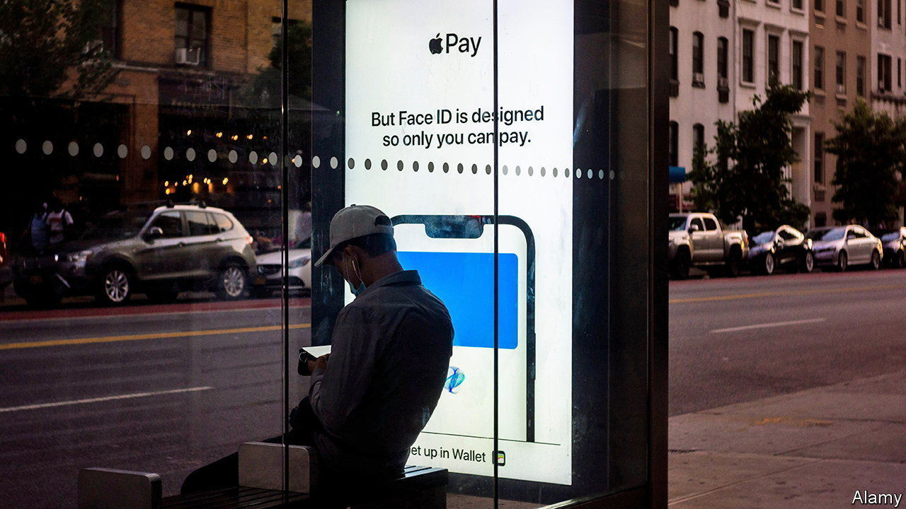

###### Silicon Wall Street

# Big tech pushes further into finance 

##### The move may upset regulators—and their own customers 

 

> Dec 15th 2022 

With no end to the tech downturn in sight, the industry’s titans are eyeing new markets. The bigger, the better: in the past year the combined revenue of Alphabet, Amazon, Apple, Microsoft and Meta reached $1.5trn, so further growth that moves the needle can only come from a giant business. One candidate is finance. What is more, that industry generates petabytes of data, the crunching of which is a core competency of tech firms. And it is dominated by stuffy, old institutions. For a tech CEO, it looks ripe for disruption. 

One such boss is Microsoft’s Satya Nadella. On December 12th his company announced a ten-year deal to provide cloud-computing and data-analytics services to the London Stock Exchange Group. As part of the transaction, Microsoft has agreed to pay £1.5bn ($1.9bn) for a 4% stake in the financial-services firm. This follows a tie-up last year between Google Cloud Platform, Alphabet’s cloud business, and cme, one of the world’s busiest derivatives exchanges. Weeks later, Amazon Web Services (AWS), that giant’s cloud division, announced a similar arrangement with the Nasdaq stock exchange. 

It is not just exchanges. Almost all banks and insurers now use big tech’s cloud services, including increasingly sophisticated and tailor-made analytics, often powered by artificial intelligence. In October the Options Clearing Corporation became the first clearing house to get permission from American regulators to move its core operations on to the cloud. 

Another big market is digital payments. These make purchases smoother for customers, while allowing tech firms to collect data to improve the overall user experience on their platforms, explains Alina Lantsberg of Oliver Wyman, a consultancy. Three in four iPhone users have now activated Apple Pay on their devices, compared with a third in 2018, according to Bernstein, a broker. Apple, Google and Meta also offer peer-to-peer transfers. 

Amazon and Apple are experimenting with credit. Amazon helps merchants on its marketplace to secure loans, and in June Apple announced plans for a “buy now, pay later” (bnpl) service. Both firms already sell credit cards. Apple’s credit cards are issued and underwritten by Goldman Sachs, a bank. But in June the iPhone-maker said it would handle the lending for its bnpl service. That may explain why it acquired Credit Kudos, a credit-reference agency, in March. Apple does not publish results for its consumer-finance business, but analysts put its annual revenue at between $1.7bn and $3bn—less than 1% of Apple’s total but not to be sniffed at.

Two factors could limit big tech’s financial ambitions. One is that financial firms are valued cloud customers, which could be lost if big tech starts to feel like competition. That was said to be the reason why Google binned its attempt to offer online checking and savings accounts in 2021. Amazon and Microsoft have their own cloud relationships to nurture.

Then there are the regulators, many of whom already hold a dim view of big tech and are watching its advances into finance closely. The Bank of England has said it wants to stress-test cloud providers because so many banks use their services. In America the Consumer Financial Protection Bureau has ordered the tech giants to share information on their payment systems. The further tech moves into finance, the more it may have to be treated like a bank. There is only so much disruption that financial regulators will brook. ■


