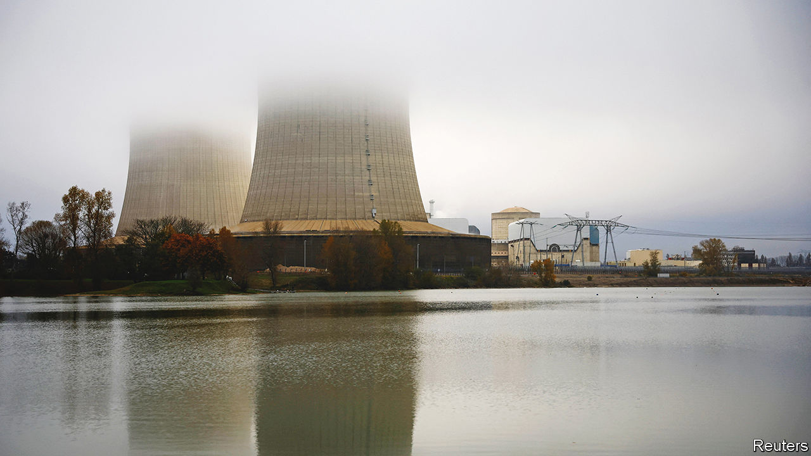
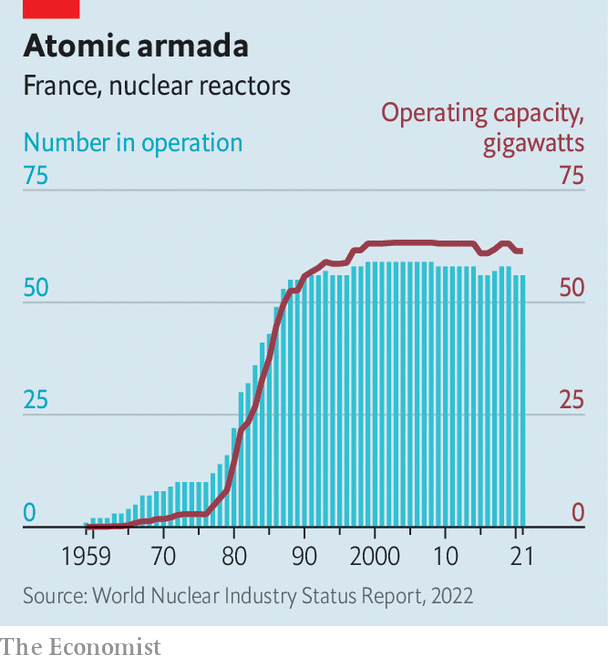
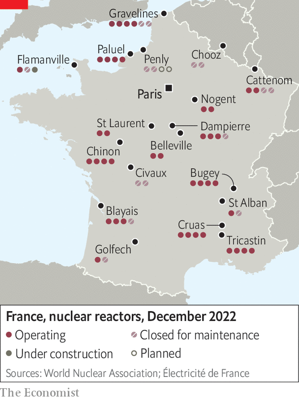

###### Atomic reactions

# Can the French nuclear industry avoid meltdown? 

##### Emmanuel Macron envisions a national nuclear renaissance. First France’s reactors must survive the winter 

 

> Dec 12th 2022 

Nuclear power seems tailor-made for this . It emits next to . It provides reliable baseload electricity, vital when sun isn’t drenching solar panels or wind isn’t wafting through turbine blades. And it does not leave its operators hostage to dictators like Vladimir Putin, who has throttled the supply of Russian natural gas to Europe in response to Western sanctions over his war in Ukraine. With memories of the Fukushima meltdown in Japan 11 years ago fading,  from Britain to India view fission as a critical part of their future energy mix. Even in nuclear-sceptical Germany, which vowed to shut its nuclear reactors in that disaster’s wake, the government has extended the lifetime of the three remaining ones until April 2023.

If there is one country that should already be enjoying the benefits of abundant carbon- and autocrat-free power, it is France. A fleet of 56 reactors make up around 70% of its electricity-generating capacity, the highest share in the world and more than three times the figure in America. The average French resident emits just 4.5 tonnes of CO a year, much less than gas-addled Germans (7.9 tonnes) or car-crazy Americans (14.7 tonnes). As for Mr Putin’s energy blackmail, on European minds again as a mild autumn gives way to a frigid winter, you might expect the French to react with a Gallic shrug.

France should, in other words, be basking in the warm glow of controlled fission reactions. Instead a decade of mismanagement and political mixed signals has brought its nuclear industry to the brink of implosion. A quarter of the fleet is out of action owing to maintenance and other technical problems. Experts warn of possible power outages during extreme cold spells later this winter. To keep up with demand, France has to import pricey electricity, from Germany of all places. The fleet’s state-controlled operator, EDF, is being fully renationalised to save it from bankruptcy. The company’s newly appointed boss, Luc Rémont, talks of a “serious crisis”. 

A lot is riding on its resolution. Europe is counting on the French nuclear industry to stop being a drag on the continent’s strained energy system. Emmanuel Macron, France’s president, is counting on it for a national nuclear renaissance. And its success may determine whether the world’s newer nuclear converts see the French experience as an inspiration—or a cautionary tale. 

To understand France’s nuclear predicament consider its roots in the oil shock of 1973. At the time, most French power plants ran on petroleum. As the fuel became scarce, French politicians concluded that true sovereignty required an energy source France could control. Nuclear power fitted the bill. France knew something about the technology, having built an atom bomb and nuclear submarines. It boasted a cohesive corps of engineers, most of whom attended the same university, the École Polytechnique. And a centralised political system allowed the powerful executive branch to ram through the ambitious programme with little input from the French public or their elected representatives.

 


This rapid ramp-up enabled France to enjoy what industry types call the “fleet effect”. Building a reactor is complex and requires a lot of learning by doing. So long as you keep doing, the expertise grows, making each new project easier. Between 1974 and the late 1980s EDF brought reactors online at a rhythm of up to six a year, with construction crews moving swiftly from one plant to another (see chart). 

However, the French approach has created lingering problems. On the technical side, squeezing a lot of construction into a few years means that reactors undergo their big decennial refit () around the same time. And since they are built to the same standard, problems found in one trigger repairs in others. As a result, French reactors’ “load factor”, a measure of whether a plant is running at full capacity, hovers at 60% or so, compared with more than 90% in America. In 2021, 5,810 reactor-days were lost to outages, of which almost 30% were unplanned, according to the “World Nuclear Industry Status Report”, an independent publication. The latest refits keep revealing ugly surprises: a year ago EDF discovered cracks, due to corrosion, in the emergency core-cooling systems of some reactors, leading the company to shut down 19 of them. Fifteen remain idle. 

Meanwhile, with little accountability and oversight the industry became a state within a state, characterised by what one former insider calls “a serious lack of self-doubt”. This led to some terrible business decisions. In the early 2000s Framatome, the company that built reactors for EDF, developed ambitions of its own. Under new management—and a new name, Areva—it signed a contract with Finland to build a new type of plant, the European pressurised-water reactor (EPR), developed jointly with Siemens, a German conglomerate. Not to be outdone, EDF decided to build its own EPR at home in Flamanville, and sell others to China and Britain. 

 


Areva and EDF both started construction before they knew what exactly they would build and how much it would cost. As often happens in Franco-German projects, the EPR was an unwieldy beast, not least because it had to satisfy both countries’ nuclear inspectors. The upshot is that neither reactor has yet produced much electricity. Both are way over budget. The Finnish project, at Olkiluoto, bankrupted Areva, whose reactors business EDF took over in 2017. The cost of Flamanville has gone from €3.3bn in 2007 (then $4.8bn) to €19bn (including financing) and counting.

Atom’s heart smothered

Bypassing the legislature, meanwhile, may have speeded things up at first but has made French nuclear policy vulnerable to political winds. In 2012 François Hollande, a Socialist, convinced the Greens to back his presidential campaign in exchange for a promise to close France’s two oldest reactors and limit nuclear power in the electricity mix to 50% by 2025, which implied the closure of up to 20 reactors. Mr Hollande kept the first promise but not the second. Still, the prospect of decommissioning helped put the fleet effect into reverse. Just as nuclear success begets more success, nuclear failure feeds on itself, as lost expertise gets harder to replenish. 

Mr Macron now wants to undo the damage. Even before Mr Putin attacked Ukraine in February, the French president announced a plan to build at least six new reactors, and up to 14 if things go well. “We have to pick up the thread of the great adventure of civil nuclear energy,” he declared. Barring last-minute legal hiccups, the French state will have full control of EDF by the end of the year, recreating a certain . “The state is now fully back in charge,” explains Emmanuel Autier of BearingPoint, a consultancy.

The next, harder task is for the president’s hand-picked EDF boss, Mr Rémont, to get as many of the shut reactors back online as he can. EDF has pledged to have most of them up and running by January, which seems ambitious. The new CEO must also deal with the bill for the outages, and for the government’s cap on tariff rises, imposed to placate voters. This, plus the requirement to sell some power at a discount to rival suppliers, could push EDF into a €42bn gross operating loss this year, reckons Moody’s, a rating agency. With net debt already at €90bn, up from around €70bn a year ago, Mr Rémont must convince the French state to provide the firm with additional capital to pay for the upcoming big refit, which could cost €50bn-60bn, and Mr Macron’s six new reactors, which would add up to about the same, all told. And he has to persuade the eu’s competition enforcers to turn a blind eye to the state aid and refrain from insisting that EDF spin off its profitable global renewables business.

More difficult still may be building the new reactors. EDF engineers have been working on a fresh design, called EPR2. Gone are many parts needed to comply with German rules. Components will be standardised. Instead of 13,309 different faucets and valves, the EPR2 is to sport only 1,205. And it will be built in pairs, with 18 months between the start of construction of the first and the second reactor. 

To ensure everything goes smoothly, EDF has added a head of “industrial quality” to its executive board. In this role Alain Tranzer, a former carmaking executive, has launched “Excell plan” to fortify the ecosystem of nuclear-related companies, digitise the surprisingly analogue industry and introduce better project management. As part of the plan, in April France created a University for Nuclear Trades and in October EDF and its partners added a school for welders, who must bind a reactor’s 370km or so of pipes so tightly that no superheated, often contaminated water can escape; such technicians are so scarce in France that EDF has had to fly them in at a high cost from America and Canada. 

Not everyone is convinced of the new strategy. “They are making the same mistake again by starting before detailed engineering is completed,” says Mycle Schneider, co-ordinator of the report on the state of the industry. EDF has invested more than 1m engineer-hours in the EPR2, but another 19m may be needed to fine-tune the design. Even some government experts have doubts about whether EDF can deliver six EPR2s on time and on budget. A leaked internal memo from late 2021 warns that the first pair may not be ready before 2043, not by 2035 as promised, and could cost €21bn in today’s money, rather than €17bn-18.5bn. France’s Court of Audit has calculated that in 2019 a megawatt-hour (MWh) of nuclear power cost nearly €65 to generate (taking into account construction costs). The EPR2 may be able to produce it more cheaply, but certainly not for €15 and €46 that Spaniards and Germans, respectively, already sometimes pay per solar MWh.

Recreating the broader tailwinds that helped France launch the fleet effect in the 1970s and 1980s will not be easy, either. France is no longer the industrial power it once was, limiting the pool of candidates to the new university and welding school. It may be hard to recruit the skilled workers needed, beyond the 220,000 that already work in the sector. And although the reputation of nuclear power is improving—two-thirds of French think that it has a future, up from less than half in 2016—local protests are likely near proposed plants. “We have to be very humble about our capacity to build new reactors,” cautions Nicolas Goldberg of Colombus Consulting, a firm of advisers. For the French, a nation not known for humility, that may be the hardest test of all. ■


