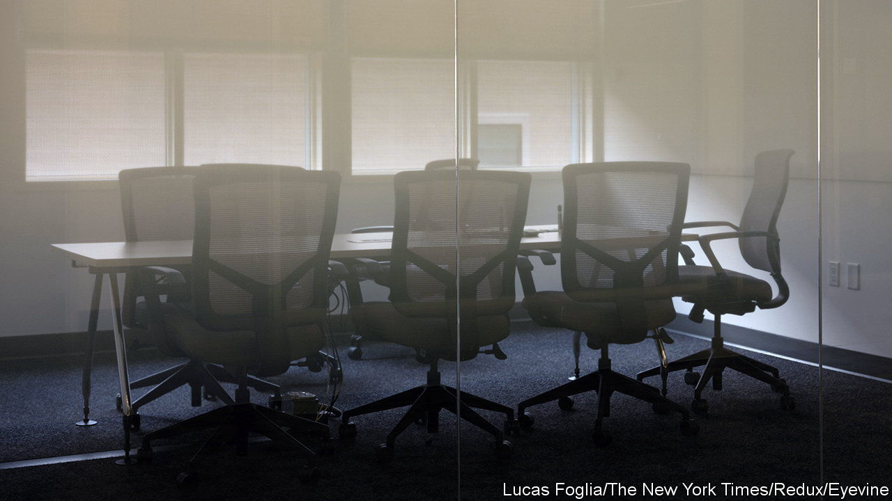
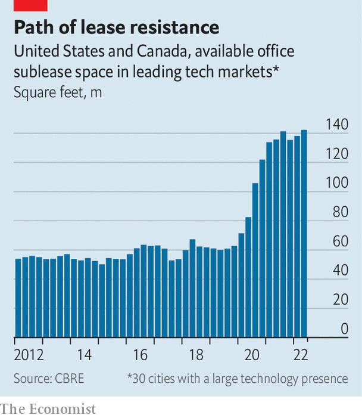

###### Log off-ice

# Tech lay-offs are the latest blow to office landlords 

##### Downsizing among tech firms will squeeze the commercial-property sector 

 

> Dec 15th 2022 

Not long ago, big tech was splurging on flashy office space to woo talent. Money sloshed around and a hiring boom was under way. Even as the pandemic forced programmers and software engineers to work remotely, tech giants splashed out on lavish workplaces. Google has been beavering away on a sprawling complex in London with a 25-metre swimming pool and a rooftop running track, due to open in 2024, while shelling out $1bn on another building in the city. Amazon said it would add a dog-day-care facility and hiking trail at its new complex in Arlington, Virginia. In the two years to March, other tech companies across America and Canada added enough office space to fill the Empire State Building more than 20 times over. 

As recession looms and businesses tighten their belts, surplus office space presents an easy target. This is especially true in tech, which is sacking workers en masse. Technology firms around the world have announced 150,000 job cuts so far this year, according to Layoffs.fyi, a jobs-data website. On December 13th Amazon delayed the start-dates for graduates who were meant to begin work in May to the end of 2023. Bad news for tech workers is also bad news for tech landlords.

 


Meta (which is laying off 13% of its workforce) has abandoned plans to expand in New York. So has Amazon, which has also paused construction on six new buildings in Tennessee and Washington state. Snap, which has sacked a fifth of its workers, has permanently shut its office in San Francisco. Twitter has reportedly stopped paying rent. Netflix, Lyft and Salesforce, among other downsizers, are trying to sublet unneeded property. It all adds up to a lot of empty desks. Since early 2020 office space available to sublet across America’s top 30 tech markets has more than doubled (see chart) to a record 142m square feet (13m square metres).

This puts an end to a decade-long office expansion. Since 2010 tech firms have acquired more space than any other industry, accounting for 17.5% of leasing activity in America. In 2021 a fifth of all leased office space was taken up by tech companies. Big tech signed more than a third of the largest leases by floor space last year. 

And landlords have more to worry about more than nervy tech darlings pulling back. The spillover from a shrinking tech sector will hit the broader economy, and with it demand for offices of all kinds. An analysis of 11m American workers in 2012 by Enrico Moretti of the University of California, Berkeley, shows that for every new high-tech job in a city, two well-paid professional positions are created outside the industry. Cities where tech jobs are booming generate other professional positions at twice the national rate. 

The property sector’s tech problem compounds an underlying malaise. Even as crowds have flocked to busy restaurants, concerts and other public spaces, companies are still questioning whether office life will return to something resembling the pre-pandemic normal. At the start of lockdowns, some argued that remote work would permanently reduce companies’ property needs. Others believed that office life would eventually return. More than two years on, the evidence suggests remote working is here to stay. Many office buildings in New York, San Francisco and other cities remain ghostly quiet: around one in five offices across the country is empty. 

Long leases obliged firms to hold onto offices even as lockdowns emptied them. A record number of leases are now set to expire, offering a chance to trim unwanted space. In 2022, 243m square feet will have hit the market in America, equivalent to more than one in ten leased offices, according to jll, a property firm. By 2025 another 650m—more than all the office space in Manhattan—is up for renewal. Unless the economy rebounds spectacularly, and businesses sour on working from home, landlords will be stuck with too much room for comfort. ■


