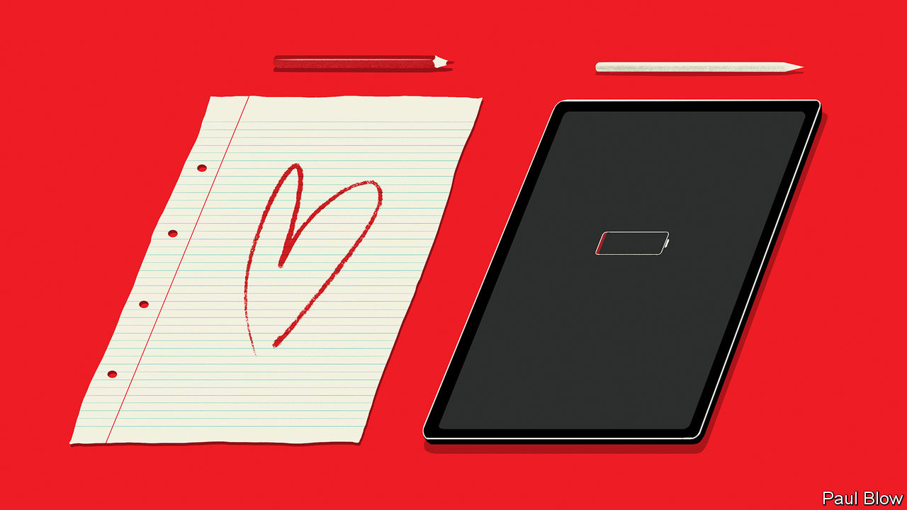

###### Bartleby

# The enduring value of an analogue technology 

##### When paper beats the screen 

 

> Dec 15th 2022 

This is the digital age, and the advice to executives is clear. Managers need to have a digital mindset; the organisations they run must embrace digital transformation. If you don’t know what ChatGPT is, think of Dan Brown when you hear the word “code” or dislike the idea of working with a cobot, enjoy your retirement. So what present should you be getting the executive in your life this festive season? Answer: anything made of paper. Even if the recipient of your gift never uses it, it can still serve as a useful reminder of where the digital world’s limitations lie. 

Recent research underscores the enduring value of this ancient technology, whether in making decisions, enhancing productivity or winning over customers. Start with decision-making, and a study from Maferima Touré-Tillery of the Kellogg School of Management at Northwestern University and Lili Wang of Zhejiang University. In one part of their study, the researchers approached strangers and asked them to take a made-up survey. Half the respondents were given a pen and paper to fill out the form; the other half were handed an iPad. At the end of the exercise, respondents were asked if they wanted to give their email address to receive information on how to donate to a charity. Those who used paper were much likelier to provide their email addresses. 

The researchers also saw differences in behaviour when they showed Chinese university students an ad for a bookseller at the end of the survey, and then asked them to select some of the books that were being promoted. Those using paper to fill out the questionnaire chose more highbrow books on average than those using the tablet. The researchers speculate that people make more virtuous decisions on paper because it feels more consequential than a pixelated screen. When asked, paper-and-pen respondents were indeed more likely than iPad users to think their choices were more indicative of their characters. The nib is the nub.

Next, in the right circumstances paper can improve productivity. A study from Vicky Morwitz of Columbia Business School, Yanliu Huang of Drexel University and Zhen Yang of California State University, Fullerton, finds that paper calendars provoke different behaviours from digital calendars. Users of old-fashioned calendars made more detailed project plans than those looking at an app, and they were more likely to stick to those plans. Simple dimensions seem to count. The ability to see lots of days at once on a paper calendar matters, the researchers reckon; mobile-calendar users kept to their plans more if they used a “multi-day view” on their devices.

Third, paper appeals to customers. In a study from 2017 researchers found that people assigned a greater value to the physical version of a product than its digital instantiation. Shoppers were willing to pay more for books and films they could hold than ones they could only download. Even the sight of someone handling something can help online sales, according to a study last year by Andrea Webb Luangrath of the University of Iowa and co-authors. They found that Instagram posts showing hands touching products like cups of coffee or smartphones got more likes than those that were not being pawed. Similarly, people browsing in a virtual-reality shop were more willing to buy a T-shirt if they saw their own simulated hand touch it.

All of which helps explain why retail catalogues continue to thud onto doormats and jam mailboxes. In a new study Jonathan Zhang of Colorado State University confirmed previous findings that consumers who receive paper catalogues as well as emails spend more than those who receive only digital marketing. Mr Zhang also delved into when these catalogues work best—as it turns out, when they are selling pricier, less functional products, and targeting consumers who do more of their shopping offline. 

Technology can close the gap between paper and screen, but not entirely. Typing will never be as distinctive as handwriting. Doodling on a phone is just not as satisfying. And some of the attractions of the analogue become even clearer as digital technology becomes more pervasive and powerful. Catalogues do not have to be checked for viruses (however obsessively people wiped them down in the early days of covid-19). As machines get better at generating text, more exams and interview tests may be conducted with pen and paper, just to be sure. Mastery of digital technologies is vital. But a sense of touch, authenticity and humanity still matter—and not just on paper.■


