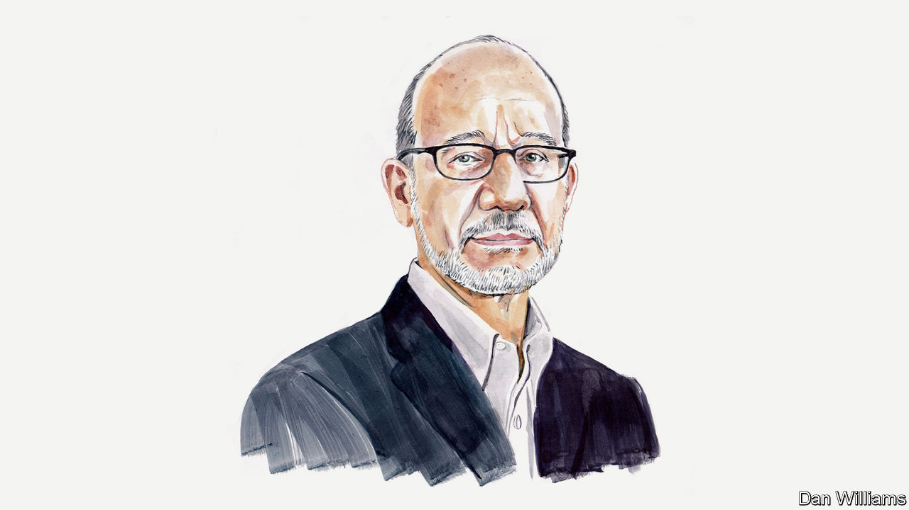

###### Geopolitics

# Aaron Friedberg says the West should abandon efforts to integrate a hostile, revisionist China 

##### Democracies must recreate a strong liberal bloc and resist authoritarian aggression, says the Princeton professor 

 

> Dec 12th 2022 

THREE TIMES in the past century, the countries of the democratic West have tried and failed to create a global order built on the same liberal principles as their domestic political regimes. Following the first world war, America’s allies baulked at President Woodrow Wilson’s revolutionary vision for a system of states based on self-determination, free trade and international law. America then retreated into isolation and its erstwhile European partners grew apart, emboldening fascist aggression and setting the stage for the next great conflagration. 

As the second world war drew to a close the alliance between the democratic powers and the Soviet Union broke down, dooming any hope of reviving Wilson’s dream. This time, however, the democracies were able to regroup and build a partial, rather than a truly global, liberal system held together by trade, alliances, and common values. 

The third attempt came with the collapse of the Soviet empire and the end of the cold war. The West pursued what the Clinton administration described as a strategy of “enlargement”, as opposed to containment. The aim was to extend the scope of the liberal system across Eurasia, incorporating Russia, China and, eventually, the entire world. The expectation was that new trade and investment would promote growth and ease former Communist bloc countries down the road towards full economic and political liberalisation. 

It was widely believed that their integration into global markets and international institutions would also give both Russia and China a stake in the stability of an all-encompassing liberal order. Despite some successes in central and eastern Europe, this dream has ended in tears, too.

After initial attempts at rapid economic reform resulted in near collapse , Russia lapsed into corruption, crony capitalism, authoritarian rule and foreign-policy revanchism, all of it cloaked in virulent anti-Western nationalism. This has culminated in Vladimir Putin’s disastrous invasion of Ukraine. 

China has travelled a different path towards a similar destination. Since Deng Xiaoping the country’s Communist rulers have seen engagement as a trap, the real purpose of which was to subvert their regime. In response the Chinese Communist Party (CCP) took advantage of the opportunities presented by engagement while working to ensure that it did not lead to “bourgeois liberalisation”. The party has been occasionally willing to expand the role of the market and even to permit somewhat greater freedom of expression. But its leaders have never had any intention of surrendering control of the economy or relinquishing their monopoly on political power. 

Rapid growth helped the CCP secure popular acquiescence while accelerating the expansion of China’s military and technological capabilities. As growth has slowed the CCP has intensified surveillance, ramped up repression and reverted to a more state-driven model of economic development. Under Xi Jinping the regime has amplified appeals to popular nationalism, demanding more struggle and sacrifice to achieve “the great rejuvenation of the Chinese nation”.

This rhetoric is paired with increasingly aggressive foreign-policy posturing. Instead of becoming a satisfied supporter of the existing order, China is now a frankly revisionist state. Beijing uses the threat of force to try to alter the territorial status quo in the Indo-Pacific; it has deployed its growing clout in the developing world to manipulate international institutions and challenge the “so-called universal values” of the liberal West; and it seeks to wield its economy as a weapon, threatening to cut off supplies of critical materials and deny access to its massive market to countries that oppose its policies. Mr Xi aims to weaken, divide and isolate the advanced democracies. He evidently also intends to put China at the centre of an alternative, anti-Western grouping that includes much of the world’s population and extends across large swathes of the global South.

Having tried and failed once again to construct an inclusive, globe-spanning order, liberal democracies must once again fall back to a more defensible position: protecting the perimeter of an expanded but still partial bloc of liberal nations, strengthening ties among members and shielding their open societies and economies from penetration and exploitation. The advanced democracies must also challenge the ideological pretensions of their illiberal rivals and compete more effectively for influence in the developing world.

The war in Ukraine and China’s mounting threats against Taiwan highlight the enduring challenge of deterrence. A prolonged period of conflict and tension in Europe would suit Beijing’s purposes, giving it more time to complete its own military buildup, even as it diverts Washington’s attention and draws resources away from the Indo-Pacific. America is going to have to do more in both theatres, keeping more ground forces in Europe while continuing to build up its air and naval capabilities in Asia. This will require larger defence budgets than at present, which will be impossible to sustain politically unless the hike in American spending is matched by significant increases from America’s prosperous allies.

Recent events also drive home the dangers of excessive economic dependence on hostile, revisionist powers. It should not have taken a war to wean Europe off Russian energy. Western countries must learn the lesson and act now to reduce their vulnerability to coercion or sabotage by shifting critical supply chains away from China. Over the next decade, advanced industrial nations should aim to reduce their overall reliance on the Chinese market, lowering remaining barriers to trade and investment among themselves while seeking new opportunities in South Asia, Africa and other fast-growing regions of the developing world.

A core group of Western countries also needs to work together to maintain a lead in cutting-edge technologies, co-ordinating subsidies and export controls to promote innovation while making it harder for China to access and exploit the fruits of their investments. 

Western support for Ukraine has not won universal acclaim in the global South. This is a reminder that, like it or not, the Western democracies are now locked in what CCP theorists describe as a “discursive struggle” with their authoritarian rivals. Moscow and Beijing denounce the West as arrogant, intrusive, hypocritical and decadent. China, in particular, now claims to have a better model of top-down governance, a “whole process democracy” better suited to serve the needs of its citizens than the creaky institutions of its liberal competitor.

The West must demonstrate the practical assets and the moral advantages of its methods. But it should also take the offensive in this clash of systems by shining a harsh, unblinking spotlight on the corruption and brutality of the Chinese and Russian regimes, illuminating the ways in which they deny the rights and destroy the dignity of their people. The rulers of these regimes know something that their counterparts in the free world seem sometimes to have forgotten: despite periods of ebb and flow, over the past 200 years the desire for freedom has proved to be a powerful solvent, eating away at the foundations of dictatorship and enabling the spread of democracy. Behind their bluster, the authoritarians rightly fear that they are on the wrong side of history.■

_______________


