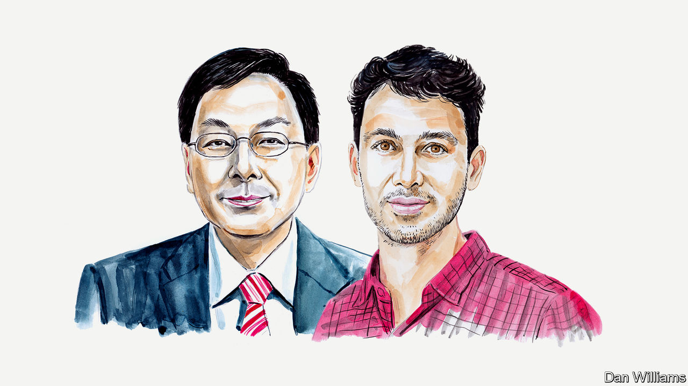

###### Covid-19 in China

# Two health experts say China’s haste to re-open risks needless death and disruption 

##### Eyck Freymann and Yanzhong Huang say the government’s new approach is worrying 

 

> Dec 13th 2022 

IN THE WEEKS since Chinese authorities suppressed the anti-lockdown protests that began on November 25th, the “zero-covid” policy has been turned on its head. Under the pretext of following the democratic will, Chinese authorities have lurched from excessive caution to a hands-off approach. 

Beijing is already experiencing a major outbreak. The rest of China is probably close behind and will face a massive wave in January. But because the government reversed its longstanding policy without a roadmap to reopening, undervaccinated elderly citizens have not been given enough time to get a booster shot. The result is likely to be more than a million deaths over the next few months– hundreds of thousands of them preventable. 

Few people saw this coming. In mid-November, health officials announced 20 new guidelines for “optimising” covid-management procedures. Yet the party mouthpiece insisted that the goal was not an end to zero covid, but rather a better “balance” between zero covid and the needs of the broader society and economy. As recently as last month, party media were covering covid outbreaks in Western countries on a nearly daily basis, painting them as scenes of chaos and despair and boasting that China’s “people-first” policies were superior. 

The Chinese government clearly wanted a new equilibrium that delivered both zero covid and economic normality. The problem was that it never figured out how to achieve this. Local officials struggled to reconcile the two contradictory directives. Over the course of November, daily cases skyrocketed. 

When the central government realised that “optimisation” was not working, its first instinct was to slam on the brakes again. On November 21st Sun Chunlan, a deputy prime minister in charge of public health, travelled to the south-western city of Chongqing to instruct local officials to lock back down. From Beijing to Guangzhou, cities across China began to follow her instructions. In November alone, the government traced and identified approximately 5.2m close contacts. Some 1.5m of them were sent to quarantine in centralised facilities, more than twice as many as had been quarantined during the entire pandemic to date. This was the key trigger of the protests that began on November 25th. 

Then, as if to respond to the simmering social discontent, the party made the policy U-turn almost overnight. On November 30th, Ms Sun claimed that the virus had mutated to become far less deadly, and that the nation now faced an entirely “new situation.” She also stopped using the party’s previous slogan, “dynamic zero-covid”. Now, party media are instructing the population not to worry about being infected. They are also suggesting traditional Chinese medicine can help protect against the disease. 

One by one, the Chinese government is lifting its remaining pandemic restrictions. Mild cases are now allowed to isolate at home. Testing rates have plummeted so fast that it is impossible to tell where the major outbreaks are. Citizens no longer need to show QR codes proving a recent negative test to travel or enter public venues, and the government on December 12th announced it will deactivate a phone app that has tracked people’s movements during the pandemic. 

China’s national outbreak has therefore begun. Various official news sources now suggest that cases are rampant in Beijing. If true, the rest of the country cannot be far behind. Hundreds of millions of people plan to travel back to their hometowns over the Chinese New Year in January, seeding infections across China’s vast rural hinterland. If the virus spreads as quickly as Omicron spread in the rest of the world last winter, there will be tens of millions of cases per day in just a few weeks’ time. 

These decisions have put China’s elderly population in the firing line. China has 264m people aged 60 or above, and 36m aged 80 or above. According to National Health Commission statistics, 25m of those over-60s and 8m of those over-80s were never vaccinated at all. Tens of millions more got the first two doses but declined to get the booster. (The United States measures it differently, but 98.5% of American pensioners have now had at least one shot of much higher-efficacy vaccines than any available in China.) 

In just the past two weeks, central government authorities have finally started to talk about the importance of vaccinating those at high risk, especially in care homes. But in the past, it has taken China at least four months to deliver a round of vaccinations to its vast population. Unless the whole country locks down again–an unlikely prospect–only a fraction of those at high risk will be vaccinated before the tsunami of infections arrives. 

No one, including the Chinese government, knows what the fatality rate will be. New variants seem to be milder than the original Omicron. But China is the only country in the world where most of the population has never been naturally infected and, though most of the population is vaccinated, very few booster doses have been given in the past year. As a result, some younger, vaccinated people are likely to require hospitalisation as well. 

Facing a chronic shortage of intensive-care beds and health-care workers, the system will need to kick triage into high gear. Health-care workers will also be infected in large numbers, making it even harder to deliver essential services at the peak of the wave. 

Even if Chinese authorities are earnestly responding to the popular will by lifting the zero-covid policy, their failure to prepare for the worst-case scenario is puzzling. They could have imported Western mRNA vaccines, which numerous studies have shown provide far better protection than their own. They could have imposed soft vaccination mandates for those at high risk. They could have stockpiled and delivered more effective anti-viral medication to the at-risk population, trained emergency nurses to help at the peak, and expanded intensive-care capacity in poorer parts of the country. 

Just three or four months of dedicated preparation would have left China far better prepared to deal with a major national wave than it is today. Instead, most of the country’s covid spending has gone on testing and quarantine facilities, rather than hospitals. Spending on testing alone last year was worth one-fifth of its entire pre-pandemic health budget. 

The Chinese authorities, and the Chinese people themselves, are suffering from lockdown fatigue and are determined to achieve a new and better normal. Though the decision to ditch zero covid is long overdue, the hasty and messy path toward re-opening may incur a devastating human toll that challenges the party’s own “people first, life first” approach.■

_______________


