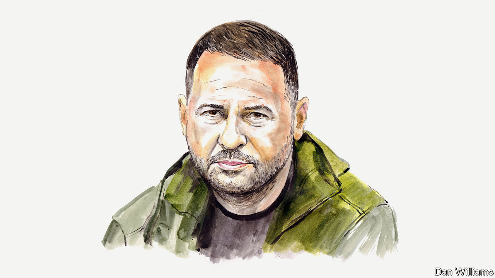

###### Ukraine and Russia

# Volodymyr Zelensky’s chief of staff on how to end war in Ukraine 

##### Andriy Yermak says talks are the final step to peace not the first 

 

> Dec 15th 2022 

Peace is not just the absence of fighting. So the view of some Western politicians that sitting down at a negotiating table is the first thing that needs to happen before peace can reign in  is a fundamental error. The war is not just about the indiscriminate killing that  have visited upon the Ukrainian people (though that is a big and brutal part of it). It is about the destruction of Ukrainian energy and food sources, the destruction of infrastructure, the illegal deportation of Ukrainian citizens and much more. 

Calling for both sides to talk before Russia admits Ukraine’s very right to exist as a sovereign nation is ridiculous. Until Western nations create effective mechanisms to deter the Russian aggressors, punish them, and force them to fulfil their obligations under international law, any negotiations will just allow Russia to weaponise the diplomacy, giving themselves a break to prepare for their next act of aggression.

To end the war, we need something completely different. President Volodymyr Zelensky presented his ideas for this as a ten-point road map in his speech to the G19 powers in Bali in mid-November. Sitting across a table to confirm the end of fighting should be the last thing on the list. There are nine other things that have to happen first, all of them based on the principles of the UN Charter and the norms of international law.

The first few points protect security in different areas. Nuclear security is one. Nuclear blackmail poses a critical challenge for both our country and the whole world. Threats of using nuclear weapons against a state that voluntarily renounced them 28 years ago jeopardises the non-proliferation regime and may encourage other countries to build their own nuclear arsenals as the only defence against potential aggression. So we need effective mechanisms to prevent this. The international working group that I co-chair with NATO’s former secretary-general, Anders Fogh Rasmussen, is already preparing a series of recommendations.

Another priority is food security. Expanding our initiative on the safe transportation of grain and foodstuffs from Ukrainian ports (also known as the Black Sea Grain Initiative), and ensuring it continues indefinitely, would be a safeguard against further attempts to weaponise hunger. The Grain from Ukraine programme is another contribution of ours to international food security, enabled by the introduction of grain corridors. Fully 30 countries have already joined the Initiative, with the EU and the UN supporting it. 


A third focus is energy security. On fossil fuels, we have limited Russia’s ability to use energy as a geopolitical weapon. Europe has significantly reduced dependence on Russian gas and set an oil price cap. However, the level of sanctions against Russian energy carriers is insufficient. Gazprom continues to finance the war against Ukraine, but Gazprombank is still connected with SWIFT, the global money-transfer system. The possibilities of limiting Russia’s oil profits have also not yet been exhausted, even as these funds keep the Kremlin’s war machine running.

On top of that, energy infrastructure also needs to be protected from further destruction. Ukraine needs help to strengthen air- and anti-missile-defence of critical facilities. International cooperation with Russia on nuclear energy should be terminated because of the systematic attacks on nuclear facilities in Ukraine. The Zaporizhia nuclear power plant, captured by the Russians in March, must be immediately returned to Ukrainian control. Securing the others should be a top priority. 

A fourth aim is environmental safety. According to our government’s estimates, the environmental damage that Ukraine has suffered as a result of the war exceeds €37bn ($39bn) This includes the littering of nearly a third of our territory with mines and explosives as well as air and soil pollution and the extermination of flora and fauna. Disruption of ecosystems poses a global threat. This is why, at the COP27 climate summit, we proposed to create a global platform for assessing war-related climate and environmental damage. 

Other elements of the ten-point plan involve defence and prevention. One aim here is the withdrawal of Russian troops from all internationally recognised Ukrainian territories and a full cessation of hostilities. To force this through, Ukraine needs continued military and technical assistance to ensure our superiority on the battlefield and to secure our civil infrastructure. This would be greatly facilitated by a multilateral declaration of an air shield over Ukraine to provide help from guarantor states in creating a modern multi-level missile-defence system. 

Another priority would then be the prevention of escalation. Effective security guarantees for Ukraine are crucial for this in order to boost our defence capabilities until Ukraine is able to join NATO. This is why we have proposed the Kyiv Security Compact, which seeks to secure such legally binding security guarantees from Western countries. It should provide a range of mechanisms to deter an aggressor, such as helping Ukraine foster capable defence forces and preventative sanctions. It should also provide tools to assist Ukraine in case of actual aggression, including immediate military technical support and punitive sanctions against the invading state. 

Fulfilment of these two aims would facilitate the full restoration of Ukraine’s sovereignty and territorial integrity in accordance with the UN Charter.

Two final aims involve human rights: the first is the release of prisoners and deportees. Almost 3m Ukrainian citizens, including over 12,000 children, have forcibly been deported to territories controlled by the Russian government. They all must be allowed freely to return home. Thousands more are held captive. We are ready to carry out a prisoner swap according to the “all for all” formula, whereby all prisoners held on both sides are returned to their original home.

The other is the need for justice. This means the trial and conviction of those guilty of war crimes and crimes against humanity, as well as compensation for damages caused by Russian aggression. A special tribunal must be set up to punish those guilty of the crime of aggression who cannot be reached by the International Criminal Court and other existing international judicial institutions. To make Russia pay financially for the restoration of Ukraine, we have also initiated the creation of a compensation mechanism at the UN. 

Once all of these nine conditions have been met, the signing of a multilateral document to certify the end of the war could be considered. An international conference that could be held in early 2023 would be the starting point for implementation of the plan. The view of post-war peace should be determined by the international community’s active stance, not by the aggressor’s possible reactions.

We Ukrainians are grateful for all the help we have received in repelling Russian aggression. But we ask that those suggesting compromise listen to Ukrainian voices more. Appeals addressed to both belligerent parties to end the war in Ukraine must be discarded. We need a comprehensive strategy such as the one outlined above to force Russia to make peace.■


