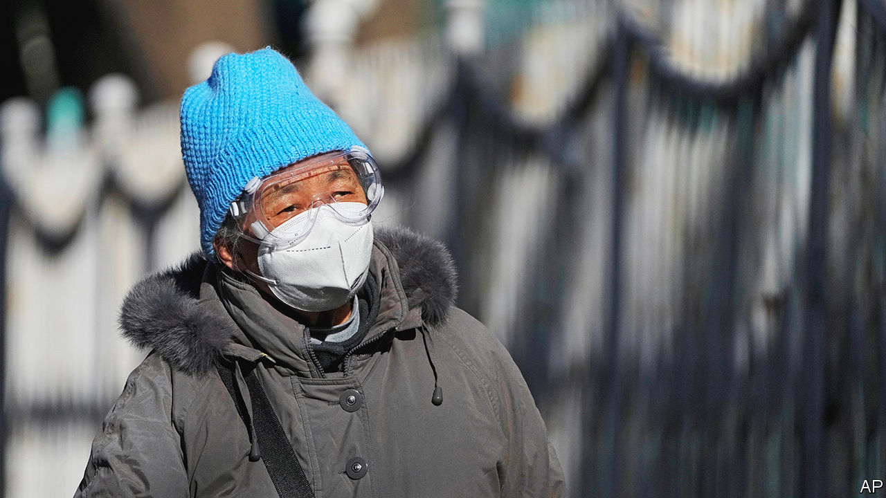

###### On their own

# How Chinese people are dealing with the spread of covid-19 

##### The government has left the public to fend for itself 

 

> Dec 13th 2022 

Just a few months ago Chinese people had little fear of catching covid-19. The government’s “” measures kept them safe for the most part. Mass testing and strict lockdowns contained the virus. If a person did test positive,  would swoop in. The infected were taken to state-run quarantine centres. If symptomatic, they were treated in a designated hospital. Health workers would douse their house with disinfectant and test their neighbours.

All this changed on December 7th, when the central government , lifting most restrictions. Six days later it scrapped an app that tracked people’s movements. The highly transmissible Omicron variant had made zero-covid unsustainable.

Now the public is expected to fend for itself. “Be the first person responsible for your own health,” wrote the , a Communist Party mouthpiece. Some residents of Beijing have received letters from the local committees that used to enforce covid controls. Stop reporting fevers and coughs to us, one read, before wishing people good luck. “Thank you for the past three years of support and understanding.”

The official number of new cases is falling, as if the virus were fading away. But official numbers are  because the government has scaled back testing. If it has an alternative way of keeping tabs on the epidemic, it is not sharing it.

Still, it is pretty clear that a covid wave is building, as people share stories of infection online. An informal survey has been circulating on social media asking Beijing residents if they have caught the virus. As  went to press, 39% of the 434,000 or so respondents had said yes.

Such surveys are striking, not just for the numbers. A few months ago people who had caught covid were stigmatised. They might, for example, struggle to find jobs after recovering. Now the disease is so common that people are posting their test results on social media, often substituting for the word “positive” a cartoon of a sheep (which is a Chinese homophone for positive). Others are sharing lighthearted advice about the best time to catch covid. An infection now or in early January, for example, might clear up in time for a person to enjoy both Christmas and the lunar new year. “Why aren’t I positive yet?” complained one young woman in a video.

Others, though, are worried. Until recently the government told people that covid was to be feared. Now the  is that Omicron is no worse than the flu. Infected people who are not showing serious symptoms have been encouraged to stay at home and treat themselves. Not everyone is listening. Beijing’s emergency-call operators have been swamped by over 30,000 calls a day, about six times the average. Queues have appeared outside fever clinics in several cities. Certain medicines are in short supply. On December 13th a health-care website began selling Paxlovid, a highly effective antiviral drug used to treat covid. Its initial stocks sold out in half an hour.

Hospitals are under more stress as doctors and nurses catch the virus. There are reports that some medical workers who have tested positive have been asked to come in anyway, risking more transmission within hospitals. As of December 13th Beijing had 50 severely ill patients, according to the official numbers. So far, the health system does not appear to be overwhelmed. But the peak of this wave is still some way off. It will probably come in late January, at least in Beijing, says Ben Cowling, a professor of epidemiology at the University of Hong Kong.

With the government changing its message, people are looking elsewhere for guidance. Overseas Chinese students who have experience with covid are sharing advice on WeChat, a social-media app. They tell people what symptoms to expect and how long they might last. In general, though, good information on the virus is lacking. There are reports of people going to hospital after taking too much fever medicine. Herbal remedies used to combat covid are in hot demand, though doctors doubt their effectiveness.

Vaccines, not voodoo

At least people now see the need to protect themselves against the virus, which was once viewed as a terrifying but distant threat. More are getting vaccinated. The number of jabs administered each day has increased from fewer than 200,000 to over 1m. But there is a lot of ground to make up, especially when it comes to the most vulnerable. Only  have received the three doses needed to significantly reduce the chances of severe disease or death. Yet some elderly people have had trouble getting a shot because of a lack of supply at clinics.

People are also taking steps that will help mitigate the spread of the disease and perhaps reduce the pressure on hospitals. In Beijing the shopping centres and streets are largely empty, as people stay inside. Call it a self-imposed lockdown. People who do venture out wear N95 masks (which are good at filtering small airborne particles). Demand for home deliveries of meals and groceries has shot up.

But people are still making plans to travel back to their villages and home towns for the lunar new year in late January. Data from Ctrip, a booking platform, show that the volume of searches for flights has increased by 160% since the government loosened restrictions. Searches for train tickets on Baidu, a search engine, increased by nearly 600% during that time. Many rural areas are woefully unprepared to handle a surge in cases.

When the peak of this wave approaches, “it would make a lot of sense to bring back some public-health measures,” says Mr Cowling. But reversing course may be hard for the government to justify without admitting that it had made a mistake. ■


