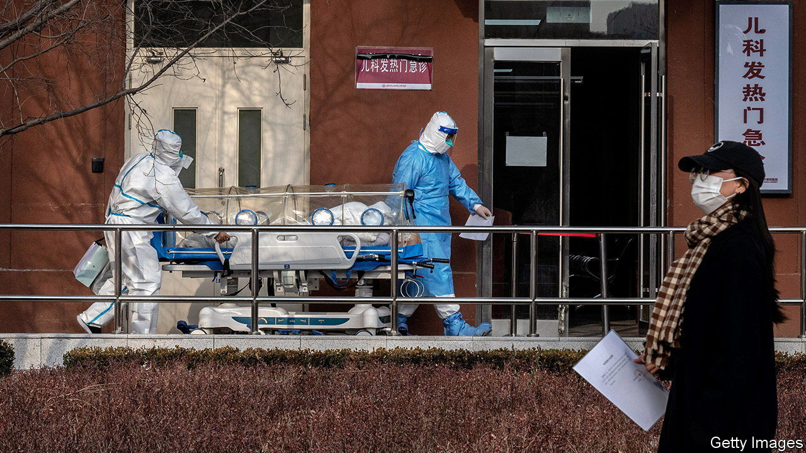
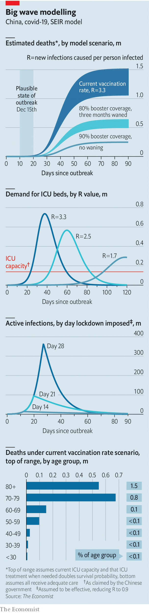

###### Lives on the lines

# Our model shows that China’s covid death toll could be massive 

##### It should act as a wake-up call for the government 

 

> Dec 15th 2022 

Modelling a covid-19 epidemic anywhere is difficult. But it is especially hard in China, where the data are often unreliable. Take the official case numbers, which suggest the  is waning. It is clearly not. No one knows the true state of the epidemic in China.

But there is enough data available to produce an informed estimate of where things are heading. So we have built a model that calculates the trajectory of China’s outbreak under different scenarios based on estimates of the rates at which people become infected, get sick, recover or die (known as a SEIR model). The results are shocking. If the virus is allowed to spread unencumbered, we predict that 1.5m Chinese people will die.

 


Our model builds upon work by Jun Cai of Fudan University and others. We account for how people of different age groups are affected by covid and how protected they are by Chinese vaccines. We looked at when the jabs were administered and assumed that they wane at the same rate as Western ones, though there is little evidence on this. We take China at its word when it comes to vaccination rates and intensive-care-unit (ICU) capacity because there are no alternative statistics.

Our model offers scenarios, not forecasts. The first, referenced above, is the most grim. About 96% of the population would catch the virus in the next three months. The demand for ICU beds would quickly exceed the supply. People over the age of 60 would account for 90% of the deaths. The economy would suffer, too. Nearly 2% of the working-age population would be sick and symptomatic at the height of such an outbreak.

At the other end of the spectrum is a scenario where 90% of the population is boosted and there are enough antiviral drugs to treat 90% of cases in people 60 or older. Had the government prepared in this way it could have lifted all restrictions and still kept the death toll under 72,000.

Our worst-case scenario is in line with estimates elsewhere. Wigram Capital Advisors, an investment firm, projects 1m covid deaths in China over the winter. It used a similar model with different assumptions. Before China lifted its restrictions, Airfinity, a data firm, estimated that between 1.3m and 2.1m people would die if China ended its “zero-covid” policy. They simply took the outbreak in Hong Kong earlier this year and scaled it to China’s population, with a range of 25% in either direction.

Even in the face of such dismal projections, new lockdowns seem unlikely. But people are taking steps, such as masking and staying at home, to “flatten the curve”. That might spread cases over time, easing the pressure on hospitals. If such steps reduced by a third the reproductive rate of the virus (known as ), the death toll would fall to 1.3m. If the government used that time to jab people and stock up on antiviral drugs, even more lives could be saved.

There is much we still don’t know. For example, the government claimed this month to have 138,000 ICU beds, more than double what it had recently been saying. That is an unbelievable increase. Nor is it clear exactly how much ICU access affects mortality rates (we assume that getting an ICU bed doubles the chance of survival for those who need one). Then there are covid drugs, which could prevent hundreds of thousands of deaths. Whether or not China has enough is unknown. Lastly, the sub-variant hitting China is still being studied.

All these factors could throw off our estimates, which will anyway be hard to judge. China is likely to hide the true toll of covid. So many preventable deaths do not chime with the Communist Party’s self-styled image of infallibility. ■


