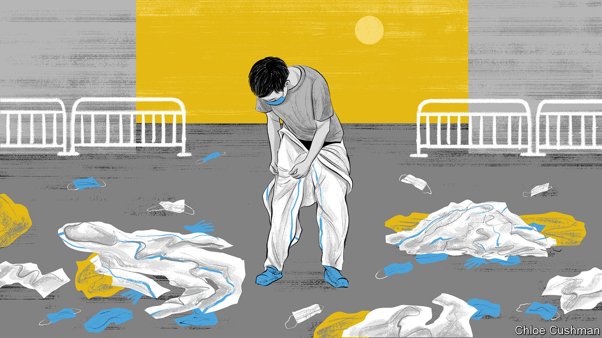

###### Chaguan

# The politics of Xi Jinping’s covid retreat 

##### China’s Communist Party prepares to spin its way out of a rout 

 

> Dec 15th 2022 

Born as an underground movement, the Communist Party of China prefers to advance by stealth, revealing its ambitions only once it feels confident of success. True to its guerrilla roots, it is still more secretive in retreat. Whenever failures loom, a familiar response may be expected. Party leaders fall silent, propaganda takes a flag-waving turn, statistics become even less reliable than usual and security is tightened. These evasive manoeuvres can be seen now, as China abandons its “all-out people’s war” on covid.

As Chaguan writes this, it has been over a month since China heard fresh virus-fighting orders from its supreme leader, President Xi Jinping. In his last reported words on the subject, on November 10th, Mr Xi told the Politburo to stick “resolutely” with his costly containment strategy of “dynamic zero-covid”. Mr Xi’s absence from the front lines is all the more striking because in 2020, after China’s success in smothering an initial outbreak in the city of Wuhan, the party declared him “commander-in-chief” of this people’s war. Proud of the efforts of hundreds of millions of Chinese who stayed indoors to break chains of virus transmission (and gleeful at proving doubting foreigners wrong), official media declared that defeating a fierce, invisible enemy like covid requires the strong leadership of the Communist Party. Pandemic chaos in such democracies as America was called proof of Western decadence and callousness. In September 2020, speaking by video link from within China’s closed borders, Mr Xi informed the United Nations General Assembly that “covid-19 is a major test of the governance capacity of countries.”

Several times this year, prominent scientists who called for debate on exit strategies from zero-covid were accused of wanting to “lie flat”, using a slang term for defeatism. Now China is abruptly learning to live with the virus. Various lines of propaganda messaging are being tested to explain this about-face, emphasising the party’s wisdom and the Chinese people’s exceptional capacity for self-sacrifice and discipline. On December 12th the , a party mouthpiece, framed the arduous zero-covid campaign as a period of sagely waiting for the severity of the Omicron variant to decline, and for effective vaccines and medicines to emerge. Alas the latest sub-variants, though indeed milder than Delta, are still quite capable of wreaking havoc in China, where only a small minority are protected by recent doses of effective vaccines. 

Party outlets have quoted citizens earnestly pledging to stay at home if they suffer mild symptoms so as not to “cause trouble for the country”, and telling reporters that after China’s government had taken care of them for the past three years, it was time they take primary responsibility for their own health and leave medical resources for those in need. After years of citing China’s low official death toll (which currently stands at around 5,200), the  shifted to vaguer boasts about China having the lowest death toll of any major power. On December 14th, as waves of covid swept the country, authorities simply stopped reporting infections deemed “asymptomatic”, a hazy term sometimes used in China for any cases not confirmed with a chest scan.

Censors have moved to limit discussion of the change in policy. Indeed, pro-party nationalists have been silenced online for attacking critics of zero-covid, including fellow Chinese who staged protests in November in cities and on university campuses nationwide. Social-media platforms have banned the term , meaning “lying-flat mobs”, used by nationalists to criticise malcontents whom they blame for hastening zero-covid’s abandonment with their demonstrations. Despite this evidence of official sensitivity about anti-lockdown protests, it is misleading to draw a short, straight line between the most eye-catching demonstrations, such as one in Shanghai that saw young people chanting “Down with Xi Jinping”, and the ditching of zero-covid policies. Though shockingly sudden in its eventual execution, this is a retreat months in the making. Omicron variants are so fast-spreading that—as public-health scholars tell it—fresh waves of infections this autumn could only have been beaten back with nationwide lockdowns as harsh as those imposed on Shanghai’s 25m residents for more than two months this spring. The economic costs would have been brutal, and the country was exhausted. The police and security services know how to repress students chanting political slogans: many of those at protests in Beijing, Shanghai and elsewhere have been tracked down and detained or summoned by police for warnings. But discontent was broad, uniting such non-political types as migrant workers fleeing outbreaks in factories and homeowners rebelling against local lockdowns.

When scientific debate is disloyalty

The political stakes also changed after the 20th party congress in October, at which Mr Xi secured a third term and packed the Politburo Standing Committee with loyalists. An essay published in April in , a journal of the Central Party School, by Ma Xiaowei, the health minister, condemned “erroneous” thoughts of “co-existing with the virus”. Mr Ma cast zero-covid as a political imperative needed to avoid deaths, maintain social stability and thus ensure a successful party congress. Re-reading such words, it is reasonable to wonder if scientific debate about “zero-covid”, or even calls for a vaccine drive, had to be silenced before the congress, lest Mr Xi’s faith in containment be put in doubt.

To be clear, current events are a blow to Mr Xi. Even those stirring propaganda lines urging citizens to take personal responsibility for their health sit uneasily with his vision of pandemic-fighting as a chance to extend the party’s reach into every village and neighbourhood, and to mobilise the masses in a great collective endeavour. The party has recovered from routs before. Even now its chief ideologues will be discussing how to spin retreat as a victory, while censors and security services work to silence dissent. In the meantime, China’s people face a grim winter. ■


