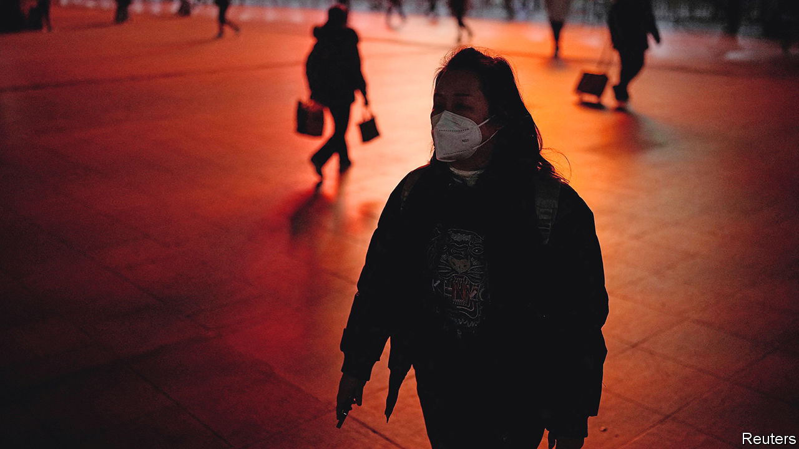

###### No worse than the flu?

# What to make of China’s claims about covid 

##### If the government had prepared properly, they might be right 

 

> Dec 15th 2022 


To hear local officials tell it, the Omicron sub-variant of covid-19 spreading across China is rather mild. According to state media, it is no worse than the flu. The virus, you see, has mutated into a less dangerous form, so lifting restrictions earlier this month was reasonable and prudent. That, at least, is what the government would have people believe. Is it right?

Two characteristics matter most when assessing the threat of a sub-variant. The first is its intrinsic transmissibility, or its ability to spread in the absence of defences. This goes a long way to determining the risk of cases overwhelming hospitals. 

The covid strain in China is a version of the BA.5 sub-variant of Omicron. In a paper published on December 14th researchers at the University of Hong Kong estimated that BA.5 is more than three times more transmissible than the original Wuhan strain, generating 8.3 new cases per infection. So the government’s argument is off to a bad start. But the Chinese people are helping it out by wearing masks and staying at home, thus slowing the spread of the virus and easing the pressure on hospitals.

The second important characteristic is severity. China claims that BA.5 is less threatening than its predecessors. In general it is true that Omicron is less severe than the Delta variant, which preceded it. Some scientists think Omicron is on the same level as the Wuhan strain. But whether the Omicron sub-variant spreading in China is less severe than previous Omicron sub-variants is another question. One study in America of the BA.2 sub-variant found that it was less dangerous than the original Omicron strain. Another in Hong Kong found that BA.2 and the Wuhan strain had similar severity. There is little evidence to show how BA.5 compares, though.

In many Western countries the death rate among those with covid is indeed similar to that for the flu. Omicron kills 35 of every 100,000 infected people in Britain, a much lower rate than that of the Wuhan strain. But this dramatic fall in lethality has little to do with how the virus has mutated. Rather, it is down to more people having antibodies against covid, acquired through some combination of vaccination and infection. China’s under-vaccinated population has fewer antibodies, and its jabs are less effective than those in the West at preventing severe disease.

The other big reason that covid has become less lethal is that there are now better treatments. Paxlovid, an antiviral drug, cuts the rate of hospital admissions among the most vulnerable covid patients by almost 90%. Dexamethasone, a cheap steroid, significantly reduces deaths among the most ill patients. Whether China has enough of such drugs, or a system for getting them to patients in need, is unclear.

Infected people in China are better off today than they would have been during the early days of the pandemic. But covid is still worse than the flu in the country. That will be true until China reaches the levels of immunity seen in the West, and until it has enough drugs and intensive-care beds to treat most who need them. ■


