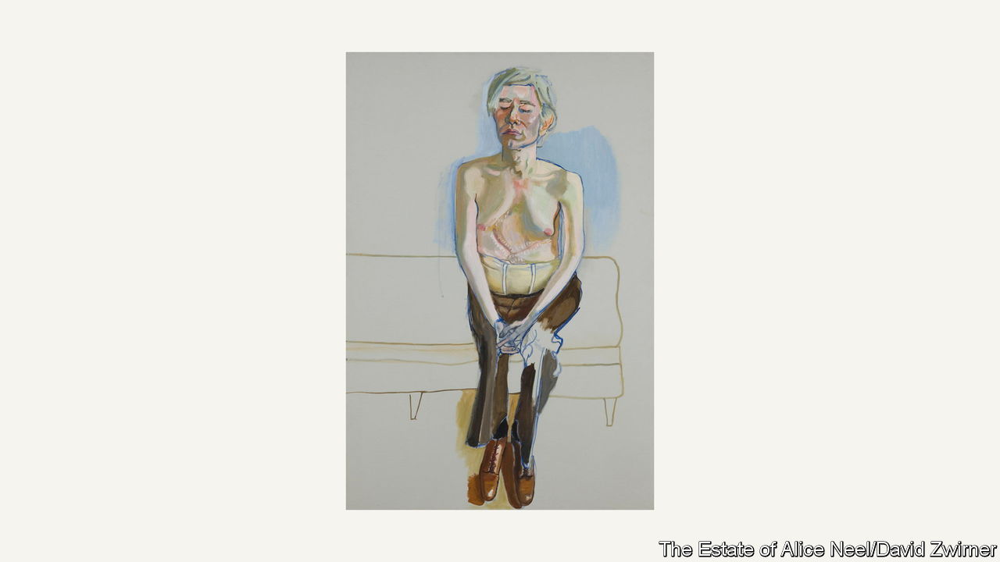

###### The naked truth

# Alice Neel’s art is at last getting the attention it deserves 

##### Her subjects’ inner worlds interested her as much as their appearances did 

 

> Dec 15th 2022 

When Alice Neel painted  in 1970, he chose to sit topless with his eyes clamped shut. Then 70 years old, Neel was good at talking people out of their clothes; she saw disrobing them as a battle of wills. Warhol loathed nudity and managed to keep his trousers on. But he could not hide the scars from an assassination attempt that were carved into his droopy torso, nor the surgical corset that held his severed abdominal muscles together. Neel painted the superstar of Pop Art as she thought he saw himself: broken and alone, but composed.

Posing for her was akin to evisceration. Yet in the mid-20th century plenty of New York’s cultural luminaries were eager to find out what she would see in them. Neel joked that if she hadn’t been an artist, she would have become a psychiatrist: the inner worlds of her subjects interested her as much as their appearances did. “She turned a person inside out,” said Joseph Solman, a fellow painter who was too afraid to sit for her. Occasionally people commissioned her and, when they saw the finished portraits, declined to take them home. In 1930 she painted Ethel Ashton, an art-school friend, as a lumpy nude with desperate eyes. On encountering the picture at an alumni exhibition decades later, Ashton fled in fury.

Despite her appeal to the cognoscenti in New York, in her lifetime Neel never won international renown or commanded top-drawer prices for her work. In old age, she refused to get offstage when giving seminars about her craft. “Don’t you dare turn the lights on,” she reportedly once snapped, then talked on. Now, almost 40 years after her death in 1984, she is drawing the attention she always longed for. 

In 2021 Neel was the subject of a retrospective at the Metropolitan Museum of Art, becoming the first female artist showcased in its prestigious Tisch Galleries. The exhibition, “People Come First”, went on to the Guggenheim in Bilbao and the de Young Museum in San Francisco. This October a separate show of her paintings opened at the Centre Pompidou in Paris; it will head to the Barbican in London in February. Some of her portraits of men are now on view at the David Zwirner gallery in Hong Kong. The Victoria Miro gallery recently presented her work in London too.

Neel’s own life was hard. Her parents found her vocation baffling in suburban Philadelphia. As a young woman in New York during the Depression, she endured poverty and torturous romantic entanglements. “All my men were freaks,” she once said; a boyfriend sliced up and burned dozens of her paintings in a jealous rage. She lost one baby to diphtheria, another was strangled to death by the umbilical cord. A daughter was taken abroad by her father. 

In 1930 Neel was hospitalised after suffering a mental breakdown. On her release she tried to kill herself and was institutionalised again. She feared her ideas would remain “grey and yellow shadows” inside her skull and would never be transferred to canvas.

I feel therefore I see

Eventually she found a kind of peace. The New Deal cultural programmes of the 1930s and 1940s, under which the federal government paid artists a stipend, helped sustain her. So did a well-off supporter who hoped she would marry him. Over 60 years, from her homes in Greenwich Village, Spanish Harlem and then the Upper West Side, she painted relatives, neighbours, children, parents, lovers, enemies, artists and activists. She painted the poor of New York as well as the wealthy. The fbi kept a file on her for more than a decade: the time she spent in Cuba with her first husband, her portraits of American communist leaders—and her sympathy with their cause—had made her a suspicious figure. 

Later she focused on pregnant nudes. These remarkable works, such as “Margaret Evans Pregnant” (1978), which portrays a woman heavily pregnant with twins, vehemently reject the “male gaze”, whereby women are cast as passive, idealised objects. The pregnant body’s plasticity fascinated Neel; with bold brushstrokes she captured a “basic fact of life”, as she put it, which had been neglected “out of false modesty” or because artists were “being sissies”. Beyond  and , unflinching depictions of pregnancy and motherhood had been . In 1932 the Catholic church complained about Neel’s “Degenerate Madonna”—a ghoulish mother cradling a cone-headed child—and it was removed from a show in Washington Square.

Neel hated to hear her work labelled as portraiture, which to her suggested ossification. “She was interested in the living”, and traditional portraits “feel like memorials to the dead”, observes Jeremy Lewison, a former director of collections at the Tate in London who advised Neel’s estate from 2003 to 2020. Abstraction dominated painting during her career, and her unwavering commitment to —representing what she saw, rather than shapes she had imagined—made her an unfashionable outsider. Some critics dismissed her work as caricature, alleging that it could be “traced directly back to the pages of ”. She was said to compromise “pictorial structure” in the service of her “most immediate feelings”. 

But feelings are the heart of her art. Without them, it would fail. An inveterate tease, Neel was riotously good company and loved to regale sitters with stories to charm them into exposing their true selves. The results—paintings of people at their most beautiful and hideous—are at bottom studies in human connection.

Collectors are catching up with her piercing vision. “The prices have definitely gone up,” says Bellatrix Hubert of David Zwirner. These days Neel’s paintings regularly sell for more than $1m; last year “Doctor Finger’s Waiting Room” went for $3m. Museum-goers are embracing her too. The show in Paris has been a hit, says Angela Lampe, its curator at the Pompidou. Attendance figures in the fortnight after it opened reached levels associated with better-known artists such as Cy Twombly or Francis Bacon. The exhibition has remained popular since.

Art-lovers are gripped by Neel’s intense humanity, Ms Lampe thinks. “We often feel uneasy looking at people face-to-face,” she observes. “We usually look away.” ■


