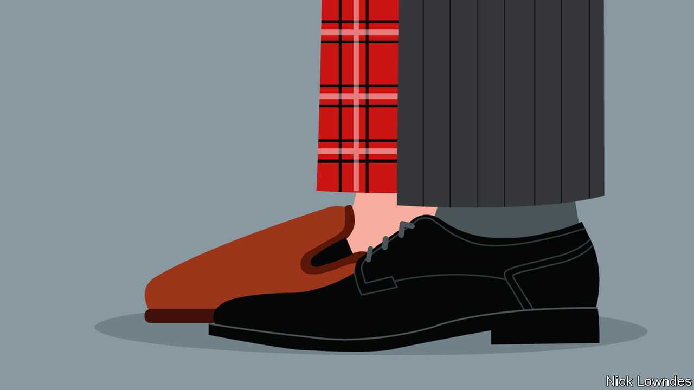

###### Johnson

# And the word of 2022 is… 

##### Johnson’s choice is neither clever nor lovely. But it is hugely consequential 

 

> Dec 14th 2022 

THE STORY of a year is sometimes easy to identify: the financial crisis of 2008, the Brexit-Trump populist wave of 2016 or the pandemic of 2020. The most wrenching event of 2022 has been the war in Ukraine, yet those earlier stories have lingered in the headlines. For language-watchers, all that meant much new vocabulary to consider. 

 obliged newsreaders to practise place-names from Kharkiv to Zaporizhia. It also introduced weapons previously known only to experts: MANPADS, NASAMS, HIMARS and the like. (Soldiers have long had a flair for acronyms, not just the official kind but in contributions like  and .) A debate also developed about whether it is culturally or militarily appropriate to refer to  or , drones being by definition pilotless.  lacks a certain snap.

The economic problems to which the war contributed brought new words too. The catchiest in that subcategory is , whereby companies hide price increases by downsizing products while keeping price tags unchanged. It is a perfect portmanteau (a word built from parts of others). It not only points to an important thing, but its component parts are transparent so that it requires little explanation. No wonder Shaquille O’Neal, a retired American basketball star, used it in a pizza advertisement—a measure of success, perhaps.

Business, economics and finance are perennial sources of new jargon, some bits more enduring than others. The slowdown of China’s economy led to increased talk of  (of Western businesses from China’s). International frictions led to a boom in : a kind of reverse offshoring in which supply chains are redirected to stable, ideally allied countries, rather than those invading their neighbours or pursuing self-harming covid policies.

Focusing on China,  might be the obvious word of this year. China’s lockdowns and crackdowns provoked rare public protests in big cities, and forced an unusual and public  of the policy late in the year. In Chinese the authorities called their policy , meaning “dynamic clearing to zero”; that sounds rather more heroic than locking millions of people into their homes.

Climate change also contributed vocabulary in 2022, a year of extreme weather and . A torrid summer saw governments set up public . Come the winter, soaring fuel prices introduced their cold-weather equivalents, . At the COP27 climate-change summit in Sharm el-Sheikh in Egypt,  took centre stage. Rich countries, whose industrialisation has largely caused climate change, promised to set up a fund to redress the harms already done, or certain to be done, in poorer ones.  becomes a new pillar in climate politics, alongside limiting further change () and making countries more resilient (). 

Facebook renamed itself Meta in 2021 and spent vast sums in 2022 trying to activate the , an online world in which people can interact via avatars and virtual-reality goggles. Instead profits drooped as the company struggled even to get its employees to inhabit its metaverse. The word was a finalist in Oxford Dictionaries’ Word of the Year contest, but was not selected. Perhaps another year. This is still a word (and a world) looking for users.

Instead, Oxford’s choice this year—based on a public vote—was , a state in which people indulge their laziest or most selfish habits. After years of covid, recession and inflation, people are tired and frazzled and finding it harder to keep up appearances. But another product of the covid era is Johnson’s word of the year.

After the lockdowns of 2020, followed, in 2021, by a slow return to the office, 2022 . Working at home some of the time has advantages (decongesting cities and fewer painful commutes), and disadvantages (fears of lower  combined with a sense of never being off duty). In the spring Twitter announced a policy of unlimited working from home for those who wanted it. When Elon Musk bought the company he promptly decreed the opposite. But most firms have not gone to either extreme, instead trying to find the best of both worlds.

As a coinage,  is no beauty. But it will reshape cities, careers, family life and free time. That is ample qualification for a word of the year. ■


