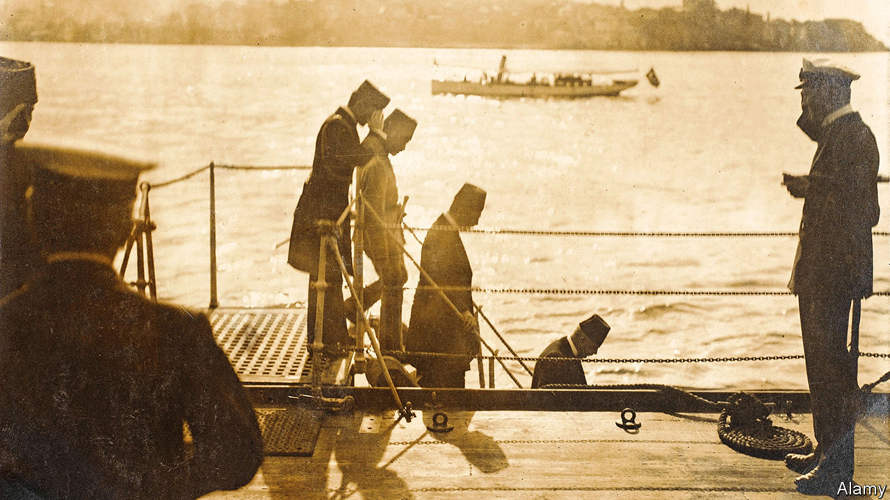

###### Turkey and the Ottomans

# The Ottoman empire fell a century ago. Or did it? 

##### Ryan Gingeras reflects on the events in his new history 

 

> Dec 15th 2022 

By Ryan Gingeras. 

As it turned out, more than six centuries of Ottoman rule ended with a whimper rather than a bang, though there had been a racket in the preceding years. The old regime was abolished on November 1st 1922 by Turkey’s Grand National Assembly, representing the nationalist forces that had triumphed in the war with Greece—reversing the humiliations that followed the first world war. The last sultan was soon spirited away on a British warship; he lived on in Italian penury.

Ryan Gingeras, a prolific American chronicler of Ottoman and Turkish history, has marked the centenary of these events with a stimulating book that traces, in rich but digestible detail, the build-up to that furtive exit by Mehmed VI, who was also , or spiritual leader, of all Muslims. Mr Gingeras sets out the : the rise of Europe’s colonising democracies—largely liberal at home but prone to heavy-handed imperialism abroad—at the expense of traditional theocracies, organised around fealty to a sovereign whose power was more than symbolic.

This culminated in a global conflict that doomed the tsars, the Habsburgs—and the sultans. The author generally admires the way great geopolitical entities adapt to new circumstances. His focus is on Turkey, but he describes other shape-shifting regimes, such as the Soviet leaders who assumed the foreign policy of imperial Russia, even as they celebrated its overthrow.

As adaptations go, modern Turkey’s was long seen as successful, albeit with terrible costs for Anatolia’s persecuted Christians. Out of the core of a ramshackle empire, the republic’s founders fashioned a more or less modern statehood, with a secular constitution, universal entitlements and obligations (at least in theory) and intermittent multi-party democracy.

Another transformation was in external policy—from a militarised, expansionist Eurasian realm into a compact state that enforced internal cohesion but mostly eschewed foreign adventures. At least, until the past decade or so, in which President  has turned Ottoman nostalgia into a style of governance and a stimulus to military braggadocio.

Informing this book is the idea that the Ottoman empire’s downfall was not predestined by backwardness, or even by defeat in a global war. Nor, it suggests, did change inevitably follow the principal catalyst: Greece’s occupation (with international support) of the great multinational port of Izmir, followed by the advance into Anatolia of a Greek expeditionary force. The republic’s founder, Mustafa Kemal, later known as Ataturk, did draw vast authority from routing that force; but that did not automatically exorcise the Ottoman order, whose supporters still resisted change, as the book recalls.

Arguments about the inevitability of historical developments, or their precise causes, often become circular. History happened because it happened. What really matters is that the empire did fall. 

Or did it? By way of continuity, some historians note that the empire was itself reforming and modernising, with contested elections and enhanced rights for non-Muslims. Others see a contrary sort of overlap in the  of modern Turkey, including the power of the army and state control over religious affairs.

For his part, Mr Erdogan has cultivated imperial sentiment in big and small ways (a television series set in medieval times depicts early Ottomans fighting heroically). For Mr Gingeras, this is more than mood music. He is, after all, a professor of national security at a postgraduate school of the American navy; he has said that a new war between Turkey and Greece is not merely possible, but probable, in view of threats by Mr Erdogan to “come one night” and challenge Greece’s islands.

Mr Erdogan may ultimately be swayed by a contest between two competing influences: the restraining power of NATO and the desire of Russia to sow discord among its rivals. In forecasting the outcome, the past—even when so well-chronicled—provides food for thought but no clear answers. History has yet to end. ■


