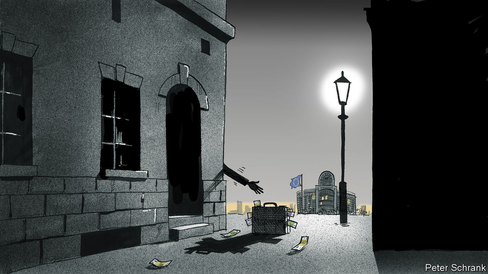

###### Charlemagne

# A corruption scandal leaves the EU reeling 

##### Suitcases of cash make good Christmas presents 

 

> Dec 15th 2022 

“Who is the most recognisable member of the European Parliament?” sounds like the set-up of a joke, along the lines of “Who is the best-dressed Boris Johnson impersonator?” Still, it has a punchline now: Eva Kaili, who started the week—but did not end it—as a vice-president of the parliament (fret not, there are still 13 left). Ms Kaili, a Greek mEP, is now the poster girl for what is arguably the worst case of sleaze in the six-decade history of the EU institutions. On December 9th Belgian police arrested six people, four of whom, including Ms Kaili, were later charged with corruption and money laundering. Over €1.5m ($1.6m) in cash payments allegedly made by Qatar have been recovered by Belgian police, who have carried out 20 raids mostly connected to sitting or former MEPs and their staff. Both Ms Kaili, a former newsreader, and her Italian partner, an aide in the parliament, languish in a Brussels jail. They deny wrongdoing, as does Qatar, which calls the claims “unfounded”. Her father, arrested after being caught lugging a cash-filled suitcase from a hotel near the parliament, was released as a mere suspected accomplice.

With the investigation continuing, a mood of nervousness, confusion and indignation has descended on Brussels (and Strasbourg, to which the parliament ridiculously decamps once a month). There are signs pointing to the possible cause of any graft. Qatar wants its citizens to be able to take holidays in Europe without a visa, a perk offered to many rich countries. This looked to be forthcoming a week ago but is now on ice. It also wanted to temper criticism of its treatment of migrant workers during the World Cup. Ms Kaili had declared Qatar to be “a front-runner in labour rights”, an unpopular opinion in Europe. Her centre-left political group seems to have worked to soften a motion criticising Qatar. Another person arrested, Pier Antonio Panzeri, an MEP until 2019, is the head of an NGO called, of all things, Fight Impunity. (He could not be reached for comment.)

If the allegations against these people were to prove true, would it be evidence of deep-seated rot in the eU? Probably not. Over 60,000 people work in the European institutions, including 10,000 or so in the parliament alone. Every political system has crooks. In America $90,000 was once found in the freezer of a congressman shortly after he had met lobbyists. The fewer questions that are asked about the financing of past French elections, the better. British MPs claimed some comically dodgy expenses before the media exposed them. The list goes on. Qatar was known to have one or two bill-counting machines at its disposal: between 2011 and 2015 Britain’s Prince Charles, as he then was, is reported to have accepted €3m in cash from a Qatari politician (entirely legally for his charities, it was pointed out). 

But sleaze scandals could damage the European Parliament—and by extension the EU as a whole—more than they do national polities. For unlike national legislatures, the Brussels parliament toils in relative obscurity. Voters in a typical European country who hear about a local politician caught grifting will weigh the story against lots of other coverage of local politics, and conclude that bad behaviour is the exception. By contrast, this story of Euro-corruption has made a splash on an otherwise blank canvas. Reports of Ms Kaili’s antics put the European Parliament at the top of evening news bulletins across the continent. That is exceedingly rare, if not unprecedented. 

Questions will be raised as to how the institutions in Brussels police themselves. Awkwardly, it was the Belgian authorities who cracked the alleged corruption ring, not the eU. Over a quarter of MEPs have second jobs, according to Transparency International, a pressure group. In theory they are not meant to act as lobbyists, but in practice few are pressed to give much detail on what they do. Rules are tighter than they once were, but sanctions are rare, though a (much smaller) corruption scandal brought down the entire European Commission in the 1990s. 

This week’s sleaze will disrupt the European Parliament’s bid to curb corruption among the bloc’s 27 member states. Ironically, around the time when police were cordoning off parliament offices as possible crime scenes, the EU scored a rare success in fighting graft. On December 12th member states agreed to suspend €6.3bn in EU subsidies to Hungary until it adheres to basic rule-of-law principles. MEPs had been among the most effective advocates of punishing corruption in Hungary, where the ruling party lavishes European taxpayers’ cash on iffy projects. Viktor Orban, Hungary’s strongman prime minister, is now gloating at the eu’s discomfort. 

More money, no problem

The European Parliament has lots of competent and hard-working members. The legislation it amends and passes (it lacks the power to propose its own bills) is often improved by its expertise. For all that, it has struggled to make much of an impression on the general public. The brightest national MPs often rise to positions of prominence in government. The brightest meps are known mainly to a few Twitter obsessives in the Brussels bubble, despite the extra powers granted to the chamber in 2009. As a result, much of the parliament’s energy is spent trying to secure more powers for itself. That is a cause few outside it find appealing.

The scandal marks a bad end to what had been a good year for the EU and its institutions. The bloc has been far more united than anyone expected in helping Ukraine: a new slug of €18bn in aid was due to be signed off at a summit of EU leaders as went to press. Tough sanctions have been imposed on Russia, and are being strengthened even as a retaliatory energy embargo has sent heating bills soaring in Europe. The European Parliament can claim scant credit for any of this. It has little weight in high politics. Its job is to provide a veneer of democratic legitimacy to the strange contraption that is the eU. Before asking for more powers, it will have to sort out this mess. ■


