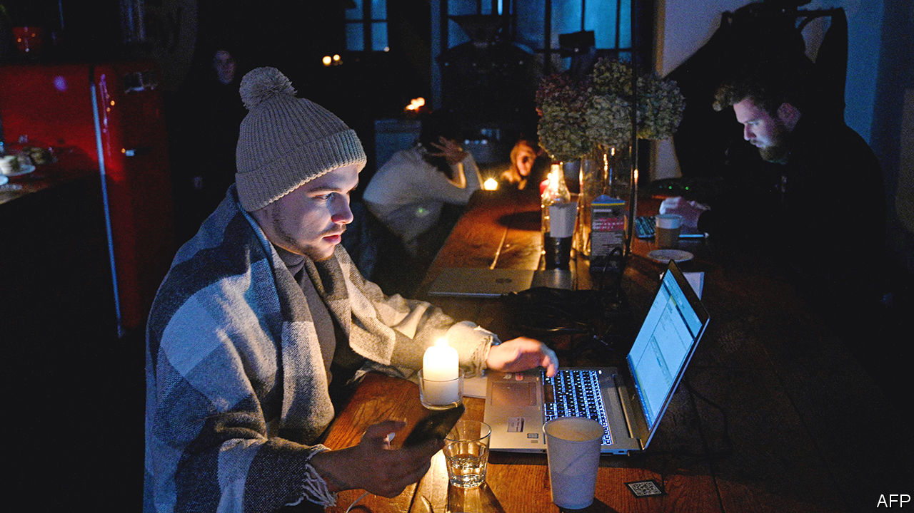

###### Survival of the blitzed

# Despite power cuts and blockades, Ukraine’s economy is coping 

##### With ingenuity and resilience, the locals are muddling through 

 

> Dec 14th 2022 

Tomas Fiala is not too fussy about his wine. But he recently opened a bottle of red that tasted particularly good. The bottle was dusty—not from a long sojourn in a French wine cellar, but from a bomb that Russia dropped on a warehouse in the outskirts of Kyiv, leased by Mr Fiala’s firm to a local distributor. The bomb smashed 1.5m bottles, but a few cases survived, were cleaned up and put on sale under the label Vyzhyvshi (survivors). “I wanted a dusty bottle,” says Mr Fiala, in a packed Italian restaurant in Kyiv.

Mr Fiala, a Czech businessman who founded Dragon Capital, now the largest Ukraine-based investment bank, has been working in Ukraine since 1996. He is a survivor, too. His investments span media, commercial property, shopping malls and agricultural machinery. “On February 24th when Russia attacked, I thought [that] was it,” he says. But he decided to stay: “You have to be on the ground to make the right decisions.” In March he recorded a 90% fall in revenue. But by September he had recovered 50-70% of that. Some of his investments, such as malls in Lviv, are back at pre-war levels. 

Then Russia started hitting Ukraine’s  The country’s electricity-generation capacity has been cut by half. Ukraine’s GDP is expected to contract by between 32% and 37% this year. But Mr Fiala, like many others, keeps on going. His plant in Poltava, in central Ukraine, which makes equipment for grain-handling and storage, turned to night shifts to avoid power cuts. When the lights go off, it switches to diesel generators (Ukraine imported $120m-worth of those in October alone). That hugely increases costs, but it keeps the machines running. 

Having failed to conquer Ukraine or erase its identity, Vladimir Putin is trying to crush its economy. First he tried to  and halt shipments of grain, its biggest export. But that hurt food-importing countries everywhere, and risked causing Mr Putin serious diplomatic damage. So he relented, and in July a deal brokered by Turkey and the UN let  from three large Ukrainian ports. In October Ukraine exported 4.2m tonnes through those ports and 2.8m by rail and road. But last month Russia started insisting on more rigorous (ie, slower) inspections of ships, so Ukraine could only export 2.7m tonnes by sea.

At the same time Russia started bombing electricity infrastructure, forcing shutdowns in the steel and iron-ore industry, Ukraine’s second-biggest exporter. Furnaces were turned off at the huge ArcelorMittal plant in Kryvy Rih, the birthplace of President Volodymyr Zelensky. It was the largest employer by far in the city, which had a pre-war population of 600,000. Kryvy Rih is now largely dark, thanks to Russian missiles and drones. But shops, cafés and restaurants are keeping their lights on with generators. In a restaurant called Fish Place, on a dark street in Kryvy Rih, aproned staff were opening oysters and serving chopped herring to local families. 

In Kyiv most small and medium-sized businesses are running at full capacity. While most residential areas go without power for hours, the centre is buzzing with the sound of generators. Customers flock to shops for warmth and light. A swanky central department store, TsUM, is heaving. Kyiv’s opera house performs Verdi to an audience limited to 462 people by the size of its bomb shelters. 

Retaining a semblance of normal life is crucial to the wartime economy, employment and the spirits of Ukrainian people, says Serhiy Marchenko, Ukraine’s finance minister: “Domestic consumption is keeping our economy afloat.” Domestic VAT receipts are 40% higher than in the early months of the war, he says. The economy is resilient because Ukrainians are, he says, and because donors have been generous. 

Ukraine has been getting $3bn-3.5bn a month  since the start of the war. America gives mostly grants; Europe, cheap loans. These funds have covered just over half of Ukraine’s deficit. The EU recently approved another €18bn ($19bn) for next year. “We have more predictability than we had a few months ago and I can plan the budget a year ahead,” Mr Marchenko says. 

Another big export-earner, information technology, depends on generators and internet connections. Software engineers cannot work from home because of blackouts. Men of military age are barred from leaving the country. So it workers huddle in co-working spaces scattered across Kyiv. Demand for desks is hotter than it has ever been, says Oleksandr Kuhuk, the sales manager at Creative Quarter, which has three different locations in Kyiv. In a pastel-coloured funky space overlooking the Dnieper river, 20- to 30-year-olds are quietly tapping away at their computers.

 “November was our record month. I don’t even need to do any marketing,” says Mr Kuhuk. His sales have grown by 200% year-on-year, he says. What makes his workspace attractive is not video-game consoles or fancy coffee machines, but back-up generators and Wi-Fi points, 1,000 bottles of water (enough for a week) and a large bomb shelter equipped with chairs and Wi-Fi, so people can carry on working during air-raid alerts. Some come with children and dogs. Many stay the night. Co-working often turns into co-living.

“The structure of our economy is changing,” says Mr Marchenko. Ukraine’s post-Soviet economy was dominated by large enterprises, most of them based on Soviet-era factories and energy pipelines that produced some 90% of output and were largely controlled by Ukrainian oligarchs. His hope is that the war will in the end make Ukraine much less dependent on oligarchs or Russia. First though, the country must survive. ■


