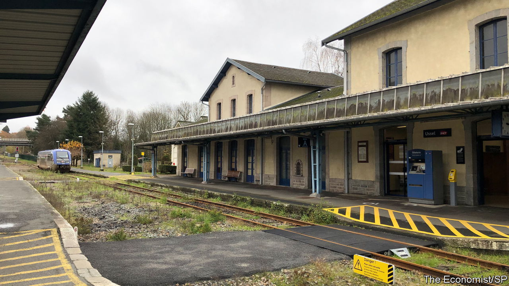
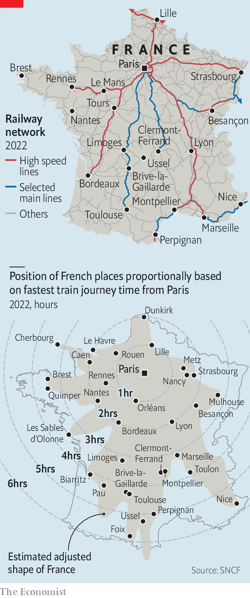

###### Two-speed nation

# France needs better slow trains, not just fast ones 

##### Some cities are hyperconnected; others feel abandoned 

 

> Dec 11th 2022 

At the end of a branch railway line that winds through wooded valleys in central France, a single carriage pulls into the little town of Ussel. The station has scarcely changed since it was built in 1880. Passengers still step over the rails to cross to the platform opposite. Clumps of grass and tall weeds sprout between the tracks.

To reach Ussel by railway from Paris, 480km (300 miles) away, there is no high-speed option. The journey can take nearly seven hours, with a change at Brive-la-Gaillarde. In the same amount of time, thanks to France’s superb network of high-speed trains (TGV), it is possible to zip all the way from the capital to Marseille on the Mediterranean—and back.

Spain today has Europe’s longest high-speed railway network. But France, which opened its first TGV line 41 years ago, has the oldest. To the French, the TGV is an emblem of national pride and technological prowess, as well as a way to shrink distance. An executive will think nothing of travelling for a business lunch from Paris to Lyon, 460km away, since the journey only takes two hours. Each year over 100m journeys are made by tgv.

Yet four decades of pouring money into the TGV has taught France another lesson, and not only about the vast cost of building and operating these lines (since 2018 the state has taken on a staggering €35bn, or $37bn, of debt from the SNCF, the state-owned national railway). It is that linking lucky hyper-connected cities to the capital has left swathes of the country at the mercy of poorly maintained railways, fostering a sense of abandonment. The TGV network, says Aurélien Delpirou of the Paris School of Urban Planning, has helped to create a “two-speed France”: superfast non-stop trains for those who can afford them; second-rate, slower trains for the rest.

 


On some secondary lines the service is worse today than in the past. Two non-TGV lines running north-south through central France have been particularly neglected: one between Paris and Clermont-Ferrand, in the Massif Central, the other between Paris and Toulouse, which passes through Brive and Limoges. The railway carriages running on the latter are veritable museum pieces, designed in the 1970s. Today it takes half an hour longer to travel from Limoges to Paris than it did back then. “We are poorly connected, and everyone finds it frustrating,” says Marianne Debuire, at the Ussel town hall.

Mindful of this divide, the French government recently decided to switch track. As part of President Emmanuel Macron’s push to cut carbon emissions, it wants more people on the railways and fewer behind the wheel. But it knows that such a strategy cannot be based only on fast trains. “The TGV is a source of pride, and for a lot of big cities has been a motor for economic development,” says Clément Beaune, the transport minister. “But we have underinvested in certain other lines. For me that’s now a priority.” The government is putting €3bn into renovating these two non-TGV lines, and buying new trains. It has relaunched slow night trains on long routes. 

Remote places like Ussel, on the “plateau of a thousand cows”, could certainly do with a boost. Since 1982 the town has lost 20% of its population, mostly those of working age. Uncertainty hangs over the future of an aluminium foundry in the town. Ussel’s Grand Hotel, the poshest in town, boasts two stars. In its grey-stone centre, amid narrow medieval alleys, lies a smart chocolate shop and a bookshop. But the  has closed, and “for rent” signs hang forlornly in boarded-up shop windows. When asked if things are always this quiet, the manager in one bar, decorated with a stuffed plastic Father Christmas suspended from the ceiling, replies: “Always at the end of the month.” 

In many ways, this town of 9,000 people on a remote plateau is lucky to have its own station, served by five direct trains a day to Limoges, and four to Brive. The single-carriage train that goes back and forth is shiny, modern and comfortable. Yet Ussel also captures the challenge of getting people to swap the car for the railway. Most locals use the car. Fully 85% of households in Ussel own at least one, and four-fifths of journeys to work are by vehicle. The pattern is common. Countrywide, 74% of French use their car to get to work. “If we really want an environmental transformation, we need to double the share of passenger train travel by 2030,” says Mr Beaune. “But we have to be realistic, the car isn’t going to disappear.”

The divide between the connected France of high-speed trains and its remoter slow-train regions has political repercussions too. In 2018 the  (yellow jackets) uprising began as a protest by the car-dependent against a rise in the carbon tax on motor fuel. Those on squeezed budgets who use their cars daily felt snubbed by a governing class in Paris well served by public transport. At the final round of the presidential election in 2022, Mr Macron won a huge share of votes in big cities linked by the TGV, such as Rennes (84%), Nantes (81%), Bordeaux (80%) or Lyon (80%). Nationwide, he was re-elected with 59%. Marine Le Pen, the nationalist-populist leader whom he defeated, secured 41% nationally—but 50% of the vote in rural parts of France. 

The new focus on improving slower trains does not mean that France is turning its back on the tGV. Regional cities still lobby hard for them; local officials consider securing a high-speed link to be a badge of recognition for their town. The SNCF plans to extend the TGV from Bordeaux to Toulouse by 2032, as well as between Montpellier and Perpignan, and Marseille and Nice. A cross-border link from Lyon to Turin, in Italy, is under construction. To encourage travel by tGV, France in 2021 banned flights between cities that are under two and a half hours from each other by train.

Nor does France have illusions about how much passenger traffic it can realistically shift from the roads to the railways, not least given recurrent strikes. But Mr Macron knows better than many leaders how explosive the mood can be in areas where people feel neglected and ignored. Better slow trains to such places may well prove more useful than more fast trains that bypass them altogether. ■

