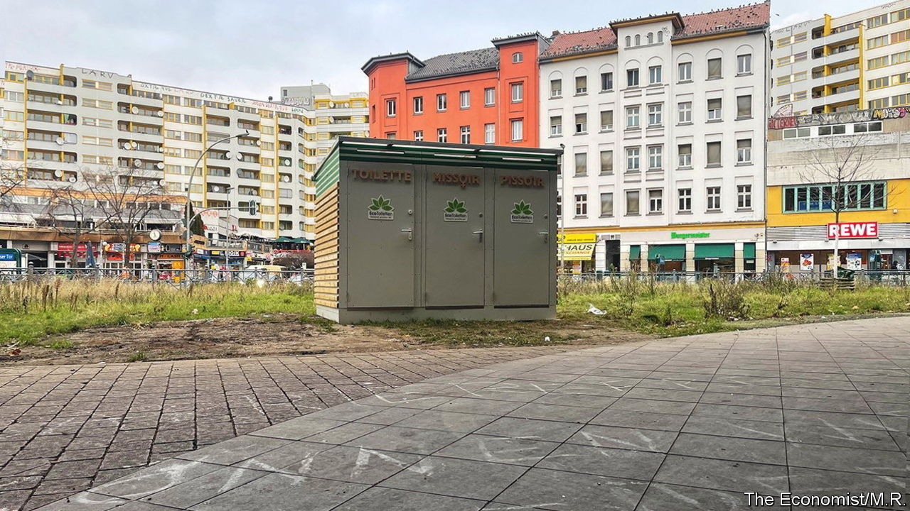

###### Unbeloved Berlin

# Germany’s capital struggles to clean up its act 

##### Europe’s first city of grunge 

 

> Dec 15th 2022 

In a city stuffed with awkward monuments, this might have been one more. Plonked in the muddy middle of a large roundabout, the big cube boasts a tin top, plywood-covered sides and a front with three metal doors. But this is no conceptual artwork to inspire or irritate passersby. A closer look reveals neat labels: , , . 

Installed this month, the public toilet at Kottbusser Tor has prompted jeers. Some scoff at its ugliness—a Twitter post calls it “liverwurst-coloured”. Others bemoan the five years it took the district government to build it—far longer than it took German boffins to invent a covid vaccine. Others note that it lacks disabled access. But the typical response seems to be eye-rolling over a doomed effort to gentrify a notoriously seedy spot. “Thanks for giving drug-pushers a new place to do business,” smirked one post.

Berlin’s reputation for scruffy dysfunction is deserved. From letters that never arrive, to rubbish left uncollected, to months-long waiting times at government offices, the city’s services poke holes in Germany’s reputation for efficiency. Berlin’s government bungled last year’s state election so badly that courts told it to it redo the whole thing. The tangles of artless graffiti that mar many walls suggest the city is afraid to grow up. 

Whereas in other countries the capital is typically the richest city, income per head in Berlin trails far behind that in Hamburg or Munich. Berliners have worse schools and fewer hospital beds than other Germans. They complain more to landlords too, with reason: in a Facebook advice group for new arrivals in Germany’s capital, a Kottbusser Tor resident asks what to do about the “50+” rats scampering in his building’s courtyard. The property manager loftily claims this is not his responsibility but the district government’s.

Berliners take a certain pride in their city’s gracelessness. At least it used to be cheap, and thus a magnet for misfits and creative minds. But demand has pushed up rents. Even Kottbusser Tor seems to be gentrifying: a full week into its life, the new toilet block bears not a smudge of graffiti.■

