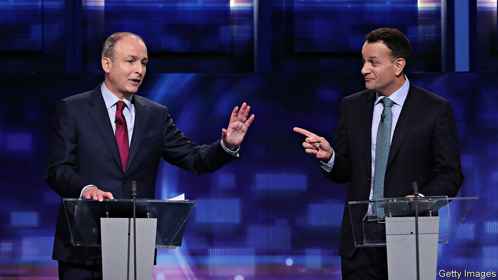

###### The job-share taoiseachs

# Ireland’s new prime minister is mocked before he starts 

##### Leo Varadkar sounds insensitive about housing costs 

 

> Dec 15th 2022 

The modern Irish state was born 100 years ago this month, yet only two political movements have ever ruled it. To outsiders, there is not much difference between them. Born out of the struggle for independence from Britain, both Fianna Fail (Soldiers of Destiny) and Fine Gael (Tribe of the Gaels) have evolved into right-of-centre, pragmatic, pro-European parties. Their mutual antipathy derives from a short but vicious civil war between factions of the Irish Republican Army a century ago. 

Another, more cultural distinction was identified by the late John Kelly, a pundit and former Fine Gael member of parliament, who reportedly said of his own party—in general a little posher, a little more self-righteous—that it couldn’t walk past a sleeping dog without feeling the need to give it a kick. Last month, after surveys suggesting that many of Ireland’s young renters are considering emigrating in order to find affordable housing, the present Fine Gael leader harrumphed that they couldn’t expect to do any better abroad. Leo Varadkar, who served as taoiseach (prime minister) from 2017 to 2020, and whose party has been in government for the past 11 years, noted that “considering emigration is not the same as actually doing it, and many do come back.” 

Mr Varadkar’s comments provoked derision on social media from Irish emigrants reporting more reasonable rents in Berlin, Amsterdam and Paris. (As ’s new  shows, plenty of cities are cheaper than Dublin.) A few days later, Ireland’s Residential Tenancies Board reported that new rents for the second quarter of this year were up by 8.2% on the previous year. “I think at times he [Varadkar] goes off on these tangents of his own,” said Gary Murphy of Dublin City University. “Fine Gael do realise the level of the housing problem, and its toxicity, but he doesn’t seem to be able to help himself.”

None of this will stop Mr Varadkar from becoming prime minister for a second time on December 17th. Under a “rotating taoiseach” deal thrashed out after an election in 2020, Fianna Fail’s leader, Micheal Martin, got to be PM for the first half of the current term of parliament. Now it is Mr Varadkar’s turn again, even though voters would rather Mr Martin stayed on. 

Until early this century, both parties could hope to rule alone, or with one or two small coalition partners. Now, their combined support is down to only 40% in a recent poll in the  and they are locked in a cold and probably doomed marriage of convenience. With 34% in that poll, the party that is likely to end up with the most seats after the next election is Sinn Fein (We Ourselves), formerly the political wing of the Provisional ira, a later and bloodier version of the Irish Republican Army. Its most cherished policy—a united Ireland—is not in its gift. But Sinn Fein has found fertile ground to the left of its rivals on health, welfare and housing. Sinn Fein’s leader, Mary Lou McDonald, says her party will control rents—a policy that has tended to make housing scarcer wherever it has been tried, but which is nonetheless popular. She also vows to build lots more public housing. Desperate young voters are willing to believe her. ■

