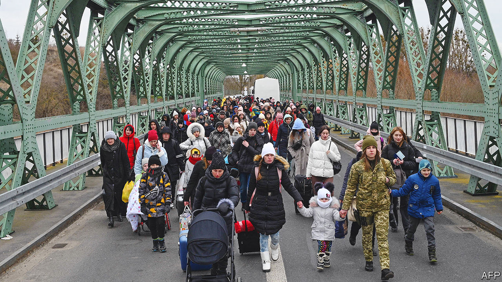

###### Missing multitudes

# The war has worsened Ukraine’s demographic woes 

##### It was already one of the world’s fastest-shrinking countries 

 

> Dec 12th 2022 

No one knows how many people have died since Russia’s invasion of Ukraine began. And because a lot of refugees have , no one knows how many remain abroad, nor how many people are in Ukraine today. One thing is sure though, says Iryna Kurylo, a researcher from Kyiv’s Ptoukha Institute, who is exiled in Prague. The “demographic price” imposed by Russia’s war will be very high.

Ukrainian  were patchy even before the invasion. Now, if there are new figures, they have been declared secret for the duration of the war. What is not secret, though, is that for years Ukraine has been one of the fastest-shrinking countries in the world; and the war is, of course, accelerating its decline. 

At independence in 1991 there were almost 52m people in the country. A census in 2001 recorded the population as 48.5m. No census has been conducted since then. In February, according to the last official estimate just before the invasion, there were 37.5m people living in government-controlled Ukraine. That figure was close to an estimate made in 2020 using sources such as pension-fund and mobile-phone data. Discussing that survey, Dmytro Dubilet, then a government official, said that 3.8m Ukrainians had left the country in the previous decade and had not returned. 

Also in February this year, Ukraine’s statistical service estimated that there were about 3.5m people in the Russian-controlled halves of Donetsk and Luhansk provinces; and Russia’s 2021 census claimed 2.4m in annexed Crimea. If roughly correct, these figures mean that within Ukraine’s internationally recognised borders there were approximately 43.5m people before the invasion, which is roughly 16% less than at independence. 

The latest figure for the number of refugees abroad is 7.8m, according to the UN’s refugee agency. However, in September another UN agency reported that some 1.2m of these had returned home. Ella Libanova, a demographer at Ukraine’s National Academy of Sciences, believes that there are now some 34m-35m people in government-controlled Ukraine. But any figures are conjectural, because many refugees are splitting their time between family at home and their country of refuge. 

In the longer term the question is how many of those refugees, who are mostly women and children, will ever come home. Since September most refugee children have been attending classes, either at host-country schools or online. The longer the war goes on, the deeper the roots they will put down in their new countries and the less likely they are to return to Ukraine. Their mothers are mostly women of working age and, when the wartime restriction on men aged 18-60 leaving the country is lifted, many of their fathers will join them rather than the flow going the other way. 

Even before the invasion Ukraine’s population was ageing fast, and men and women of working and child-bearing age were the most likely to emigrate. Every year since 1991, more Ukrainians have died than were born. In 2021, partly because of covid-19, there were 442,280 more coffins filled than cradles in government-controlled territory. Ukrainians, especially men, drink and smoke too much. Even before the war, their life expectancy was one of the lowest in Europe. In 2020 the average Ukrainian man could expect to live to 66, eleven and a half years less than the average man in the EU.

A study in March by scholars at the University of St Andrews in Scotland asked how the war might affect Ukraine’s population. It predicted that it would fall by between 17% and 33% in the parts of Ukraine controlled by the government before Vladimir Putin’s invasion. In the worst-case scenario, it said, there would be only 28m people, with the numbers of working-age adults and children falling by 36% and 56% respectively. So, not many young people, and even fewer future parents. 

Professor Kurylo notes that Ukraine has survived demographic calamities in the past, such as the famine caused by Stalin’s policies in 1932-33, which killed almost 4m people, and the loss of 7m during the second world war. For that reason she expects a revival after the war—as happened in western Europe after both world wars in the 20th century. But there are reasons to fear that Ukraine’s population could keep shrinking. In 1950 the average Ukrainian woman could expect to have 2.8 children. That had fallen to 1.16 in 2021, one of the lowest fertility rates on the planet. ■


