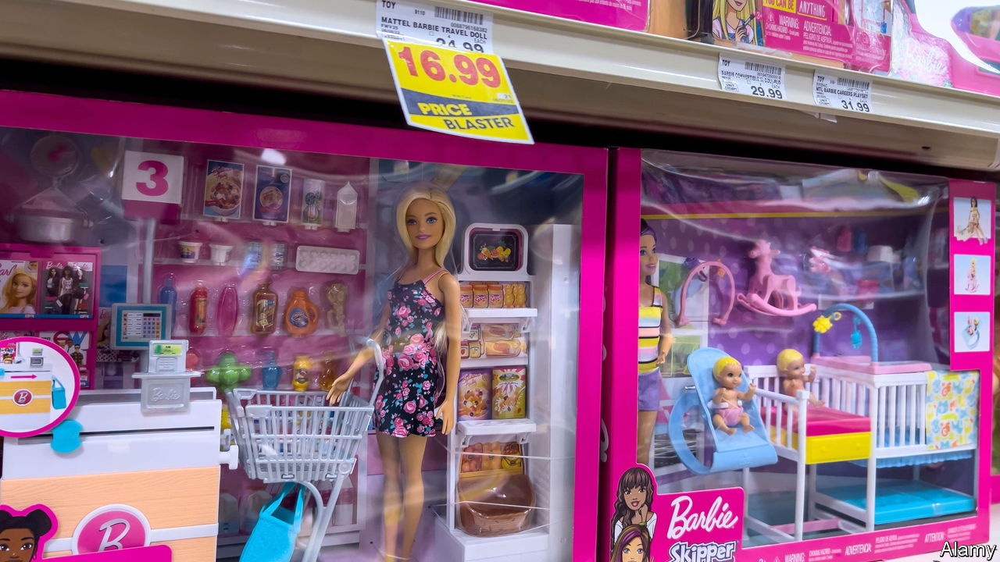
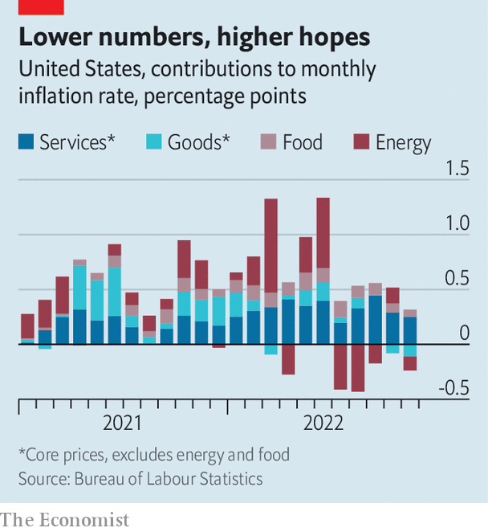

###### US economy

# America’s inflation fever may be breaking at last 

##### But the Federal Reserve is not popping champagne just yet 

 

> Dec 13th 2022 

“We will stay the course until the job is done,” said Jerome Powell, the Federal Reserve’s chairman, on December 14th, shortly after the central bank’s latest interest-rate rise. As a statement of intent, his words were both straightforward and utterly sensible. But what it means for the job to be done is becoming a matter of controversy. Inflation remains uncomfortably high. Meanwhile, the aggressive monetary tightening of the past year is only now filtering through to the economy, complicating assessments of whether the Fed has in fact done enough to rein in prices. 

 


Promisingly, after a difficult two years, inflation does appear to be easing its grip on the American economy. Overall prices increased by a mere 0.1% month-on-month in November, according to data published on December 13th, making for that rarest of recent occurrences: a downside surprise. Most encouraging was a breakdown showing that core inflation, which strips out volatile food and energy costs, had decelerated for a second consecutive month (see chart).

Investors and analysts, scarred by America’s relentless run of inflation, have learned to restrain their hopes after a single month of rosy data. Year-on-year rates of inflation remain elevated at 7.1% for headline inflation. But the disinflation in November follows a similarly cheerful batch of data for October. Optimism is on the rise, albeit still mostly of the cautious rather than the unbridled kind. Since mid-October the s&amp;p 500 index of leading American firms has recovered some of the ground it lost earlier this year. Concerns are shifting to the prospect of weaker growth. Many economists forecast a recession early next year. 

For the Fed these countervailing forces create a tricky balance. On the one hand, it has just administered the sharpest tightening of monetary policy in four decades, lifting interest rates from a floor of 0% in March to more than 4% today. With inflation ebbing, it is prudent to slow the pace of rate increases. On the other hand, a perception of Fed softening risks adding fuel to the market rally. That, in turn, would cause financial conditions to ease, thereby placing upward pressure on inflation.

The Fed has tried to resolve this conundrum by maintaining its hawkish tone at the same time as tweaking its policies. On December 14th the Fed raised rates by half a percentage point, ending a string of jumbo three-quarter-point increases. Most Fed officials believe that they will raise rates to more than 5% next year and refrain from cutting rates until 2024, according to the central bank’s latest projections. “Historical experience cautions strongly against prematurely easing,” said Mr Powell.

Strikingly, many investors think the Fed will end up being more dovish. Bond pricing suggests that rates will peak at less than 5% and that the central bank will start cutting them before the end of 2023.

Ultimately, the decision will come down to the data. Prices of consumer goods have started falling as pandemic-era shortages melt away. Housing prices are also trending lower. The big lingering concern is whether a tight labour market will push incomes and, by extension, prices higher. Investors are betting that wage increases will slow as the economy weakens. The Fed, understandably, is not popping the champagne just yet. ■


