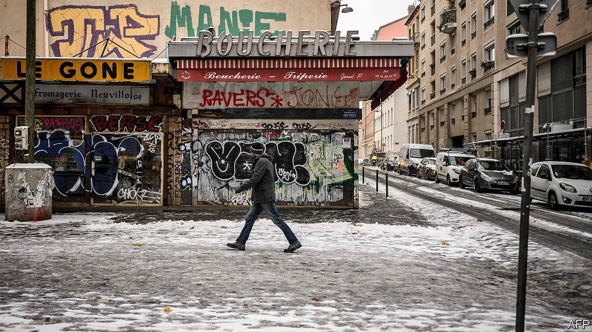
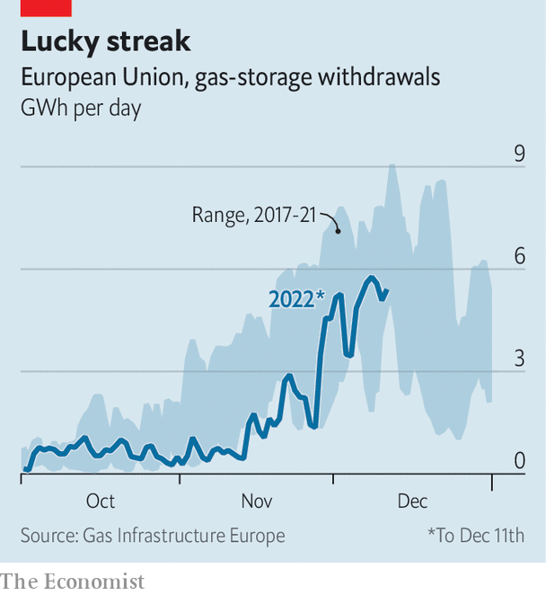

###### No time to chill

# Europe looks increasingly complacent about the winter ahead 

##### The continent has navigated the first cold spell. There are more to come 

 

> Dec 15th 2022 

“We are safe for this winter. Russia’s blackmail has failed.” Ursula von der Leyen, president of the European Commission, was in a confident mood on December 12th, speaking during the first cold spell of the season. It was a confidence born of a sure-footed start to winter. It may also turn out to have been premature.

The continent enjoyed a warm autumn, with October and November much balmier than normal. But Arctic cold arrived at the beginning of December, as temperatures dropped below zero in Berlin, London and Paris, prompting fears that gas supplies would be hit and electricity networks would falter. In France, each degree centigrade drop in temperature requires an additional 2.4gw of generation capacity, the equivalent of an average nuclear plant. 

 


So far, though, Europe has stood up to the test. Consumers have shown a willingness to cut back. According to Bruegel, a think-tank, German industry, small businesses and households reduced gas consumption by a quarter in November, compared with the three-year monthly average. Gas has been withdrawn from storage, but only at levels well within historic limits (see chart). Liquefied natural gas (lng) has flowed into Europe’s ports in record volumes. Gas futures prices for early 2023 climbed, as traders accounted for the weather, but the rise was not all that sharp. 

Backup plans have gone into action across the continent. France has called on neighbours to supply lots of power. Britain’s grid operator ordered two reserve coal plants to prepare to generate, though later decided they were not needed. One of Germany’s four grid operators, Transnetbw, asked consumers through its phone app to help reduce the need for dirty fuels. 

Yet the willingness to cut back seems to be fading. Germany’s gas regulator estimates consumption was just 17% lower last week, after adjusting for temperature. If the trend continues, it could become a problem. “The security of gas supply is not in danger in December, when storages are full. The critical period is a cold spell at the end of March,” says Andreas Schroeder of icis, an energy consultancy. Half-empty storage tanks release gas much more slowly than full ones.

Despite getting through its first cold spell of the winter, Europe therefore remains at the mercy of the weather. The International Energy Agency reckons that the mild autumn saved the continent around 10bn cubic metres (bcm) of gas. A rebound of hydropower, from last year’s lows caused by droughts, could save another 8 bcm. But a colder winter would further deplete gas storage tanks, risking rationing towards the end of the season, especially if China demands more lng.

Goldman Sachs, a bank, predicts gas prices will remain above €120 ($128) per megawatt-hour throughout next year. A group of countries led by France is now seeking to cap prices. This would be supremely counter-productive, boosting demand and risking long-term supplies. Europe has made it through winter’s first cold spell. It would be absurd for the continent’s politicians to get complacent at this early stage. ■


