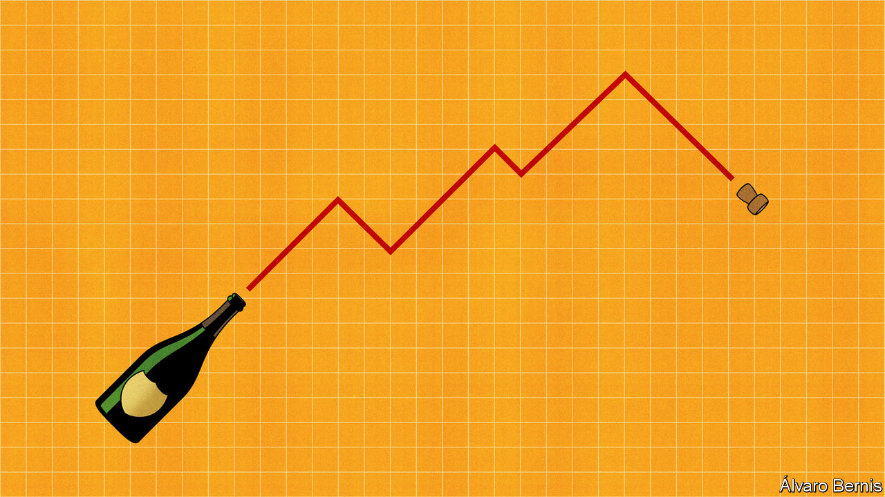
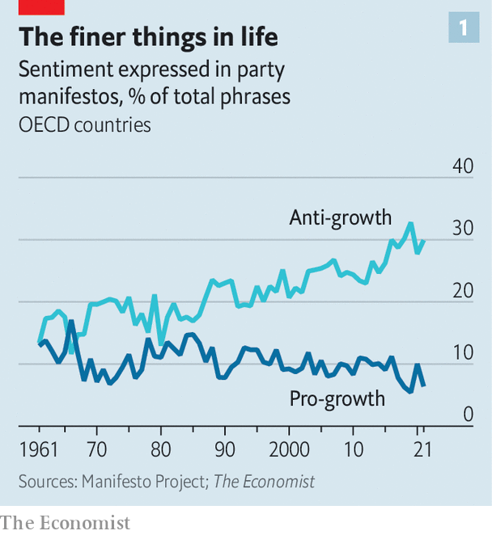
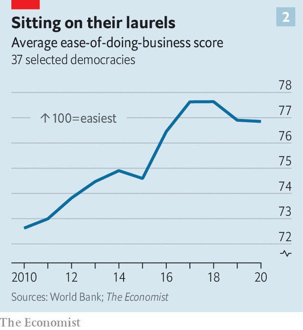
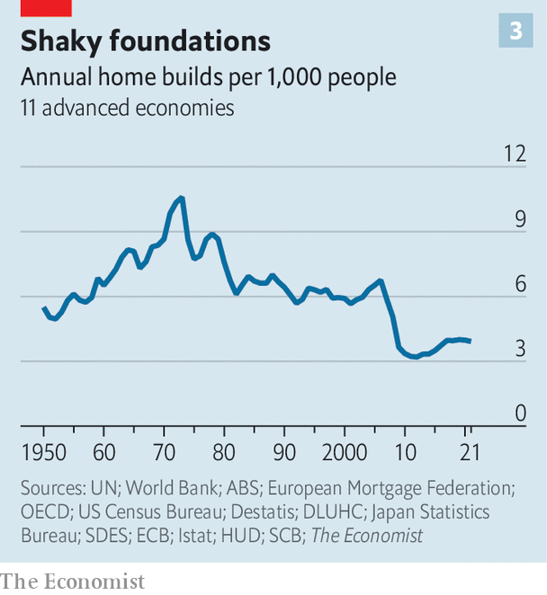

###### First-world problems

# How the West fell out of love with economic growth 

##### A serious, slow-burning malaise 

 

> Dec 11th 2022 

This year has been a good one for the West. The alliance has surprised observers with its united front against Russian aggression. As authoritarian China suffers one of its weakest periods of growth since Chairman Mao, the American economy roars along. A wave of populism across rich countries, which began in 2016 with Brexit and the election of Donald Trump, looks as if it may have crested. 

Yet away from the world’s attention, rich democracies face a profound, slow-burning problem: weak economic growth. In the year before covid-19, advanced economies’ gdp grew by less than 2%. High-frequency measures suggest that rich-world productivity, the ultimate source of improved living standards, is at best stagnant and may be declining. Official forecasts suggest that by 2027 per-person gdp growth in the median rich country will be less than 1.5% a year. Some places, such as Canada and Switzerland, will see numbers closer to zero. 

Perhaps rich countries are destined for weak growth. Many have fast-ageing populations. Once labour markets are opened to women, and university education democratised, important sources of growth are exhausted. Much low-hanging technological fruit, such as proper sanitation, cars and the internet, . This growth problem is surmountable, however. Policymakers could make it easier to trade across borders, giving globalisation a boost. They could reform planning to make it possible to build, reducing outrageous housing costs. They could welcome migrants to replace retiring workers. All these reforms would raise the growth rate. 

 


Unfortunately, economic growth has fallen out of fashion. According to our analysis of data from the Manifesto Project, which collects information on the manifestos of political parties over decades, those in the oecd, a group of mostly rich countries, are about half as focused on growth as they were in the 1980s (see chart 1). Modern politicians are less likely to extol the benefits of free markets than their predecessors, for instance. They are more likely to express anti-growth sentiments, such as positive mentions of government control over the economy. 

When they do talk about growth, politicians tend to do so in an unsophisticated manner. In 1994 a reference by Gordon Brown, Britain’s shadow chancellor, to “post neo-classical endogenous growth theory” was mocked, but it at least indicated serious engagement with the issue. Politicians such as Lyndon Johnson, Margaret Thatcher and Ronald Reagan offered policies based on a coherent theory of the relationship between the individual and the state. gdp’s small coterie of modern champions, such as Mr Trump and Liz Truss, offer little more than reheated Reaganism.

Apathy towards growth is not merely rhetorical. Britain hints at a wider loss of zeal. In the 1970s the average budget contained tax reforms worth 2% of gdp. By the late 2010s policies made half as much impact. A paper published in 2020 by the late Alberto Alesina, an economist at Harvard University, and colleagues at the imf and Georgetown University measured the significance of structural reforms (such as changes to regulations) over time. In the 1980s and 1990s politicians in advanced economies implemented a large number, making their economies sleeker. By the 2010s, however, they had lost their oomph: reforms practically ground to a halt. 

 


Our analysis of data from the World Bank suggests that progress has slowed still further in recent years, and may even have reversed (see chart 2). The American government introduced 12,000 new regulations in 2021, a rise on recent years. From 2010 to 2020 rich countries’ tariff restrictions on imports doubled. Britain voted for and implemented Brexit. Other countries have turned against immigration. In 2007 almost 6m people, on net, migrated to advanced economies. In 2019 the number was down to just 4m.

 


Governments have also become less friendly to new construction, whether of housing or infrastructure. A paper by Knut Are Aastveit, Bruno Albuquerque and André Anundsen, three economists, finds American housing “supply elasticities”— the extent to which construction responds to higher demand—have fallen since the housing boom of the 2000s. This is likely to reflect tougher land-use policies and more powerful nimbys. Housing construction across the rich world is about two-thirds its level in that decade (see chart 3). 

Politicians prefer splurging the proceeds of what growth exists. Governments are spending a lot more on welfare, such as pensions and, in particular, health care. In 1979 the bottom fifth of American earners received means-tested transfers worth less than a third of their pre-tax income, according to the Congressional Budget Office. By 2018 the figure was more than two-thirds. According to a report in 2019, health spending per person in the oecd will grow at an average annual rate of 3% and reach 10% of gdp by 2030, up from 9% in 2018. 

Politics is increasingly an arms race, with promises of more money for health care and social protection. “Thirty or 40 years ago it was taken for granted that the elderly were not good candidates for organ transplantation, dialysis or advanced surgical procedures,” writes Daniel Callahan, an ethicist. “That has changed.” Greater wealth has enabled this. Yet politicians rarely ask whether an extra dollar on health care is the best use of cash. Britons in their 90s receive health and social care that costs the country about £15,000 ($17,000) a year, about half Britain’s gdp per person. Must budgets rise year after year to meet growing demand, even as the price of providing that care is also likely to increase? If yes, where is the limit? 

People may see spending on health care and pensions as self-evidently good. But it comes with downsides. More people work in an area where productivity gains, and therefore improvements in overall living standards, are hard to induce. Perfectly fit older people drop out of work to receive a pension. Funding this requires higher taxes or cuts elsewhere. Since the early 1980s government spending across the oecd on research and development, as a share of gdp, has fallen by about a third. 

Much of the extra spending comes at times of crisis. Politicians are increasingly concerned with preventing bad things from happening to people or compensating them when they do. The enormous system of credit guarantees, eviction moratoriums and debt forgiveness introduced during the pandemic brought bankruptcies and defaults to a halt. This was radical, but also the thin end of the wedge. 

In America, for instance, the federal government has assumed huge contingent liabilities. It guarantees an ever-larger quantity of people’s bank deposits; it forgives student loans; it offers a wide variety of implicit and explicit backstops to everything from airports to highways.  that Uncle Sam is on the hook for liabilities worth more than six times America’s gdp. This year European governments have fallen over themselves to offer financial support to households and firms during the continent’s energy crisis. Even Germany, normally Europe’s most disciplined spender, has allocated funding worth 7% of gdp for this purpose.

No one cheers when a company goes bankrupt or someone falls into poverty. But the bail-out state makes economies less adaptable, ultimately constraining growth by preventing resources shifting from unproductive to productive uses. Already there is evidence that fiscal help doled out during the pandemic has created more “zombie” firms—those which are going concerns, but which create little economic value. The huge implicit liabilities of governments also mean higher spending in times of trouble, which reinforces the trend towards higher taxation. 

Why has the West turned away from growth? One possible answer relates to ageing populations. People who are not working, or are near the end of their working lives, tend to be less interested in getting richer. They will support things which directly benefit them, such as health-care spending, but oppose those that produce benefits only after they have gone, such as immigration or house-building. Their turnout at elections tends to be high, so their views carry weight. 

Yet Western populations have been ageing for decades, including during the reformist 1980s and 1990s. Therefore the change in the environment in which policy is made may play a role. Before social media and 24-hour rolling news it was easier to implement difficult reforms. The losers from a policy—a business exposed to greater competition from abroad, say—often had little choice but to suffer in silence. In 1936 Franklin Roosevelt, speaking about opponents to his New Deal, felt comfortable enough to “welcome” his opponents’ hatred. Now the aggrieved have more ways to complain. As a result, policymakers have greater incentive to limit the number of people who lose out, resulting in what Ben Ansell of Oxford University calls “countrywide decision by committee”. 

High levels of debt have also constrained policymakers’ room for manoeuvre. Across the g7 group of rich, powerful countries, private debt has risen by the equivalent of 30 percentage points of gdp since 2000. Even small declines in cash flows could make servicing the debt harder. This means politicians quickly intervene when anything goes wrong. Their focus is keeping the show on the road—avoiding a repeat of the global financial crisis of 2007-09—rather than accepting pain today as the price of a brighter future. 

Quite what would push the West in a new direction is unclear. There is no sign of a shift just yet, beyond the misguided attempts of Mr Trump and Ms Truss. Would another financial crisis do the job? Will a change have to wait until the baby-boomers are no longer around? Whatever the answer, until growth speeds up Western policymakers must hope their enemies continue to blunder. ■


