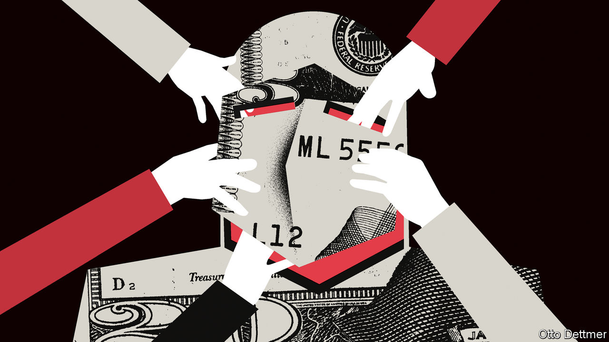

###### Free exchange

# The insidious threats to central-bank independence 

##### Meddling politicians are mostly a thing of the past, but that is no reason for complacency 

 

> Dec 15th 2022 

“Just kick ’em up the rump a little.” That was how President Richard Nixon advised Federal Reserve chairman Arthur Burns to persuade the rest of the Fed board to cut interest rates in 1971. Kicked or not, the central bankers complied. Cuts helped Nixon to re-election by boosting employment. They also contributed to double-digit inflation that would not be decisively tamed until Paul Volcker ran the Fed in the 1980s. 

On December 14th the Federal Reserve raised interest rates by another 0.5 percentage points; the European Central Bank (ecb) and the Bank of England were expected to follow suit shortly after ’s weekly edition was published. Technocrats have spent the decades since Burns making Nixon-like meddling more difficult. An academic cottage industry is devoted to numerating and ranking central bankers’ independence. In 2020 there were more than 150 central banks classed as independent by the Bank of England’s count—some 90 more than in the 1970s. The ecb’s autonomy is guaranteed by treaty. When President Donald Trump criticised Jerome Powell, the present Fed chair, for raising rates in 2018, the president appeared both backward and impotent. This year President Joe Biden has emphasised his support for the Fed. Some British politicians in the governing Conservative Party even argue that the Bank of England has not raised rates enough.

The notion that today’s central bankers might be bullied into stopping the fight against inflation is therefore harder to sustain. Yet it would be a mistake to suggest that monetary policy is completely insulated from politics. For there are forces threatening central bankers’ independence in new and insidious ways. 

The first is that central banks are less hard-nosed and keener to play to the gallery than they were. In the Volcker era economists speculated that independent central bankers might work best if they were more hawkish than society about inflation. Over time they came to reject “inflation nutters” in favour of “flexible” inflation targeting which took employment into account, too. By 2020 central bankers looked jobs-nuts. The Fed said it would not raise rates at all until the labour market was tight, an approach which left it hopelessly adrift as inflation took off. Its top brass had been on a “Fed listens” tour at which the public, having not been seriously troubled by inflation for decades, told central bankers that stimulating employment should be their priority. Advocates for making central bankers directly accountable forget that politicians’ desire to distort monetary policy comes from listening to what voters want. 

Central bankers need independence from the public as much as they do from their elected representatives. But they spend ever more time in press conferences and giving speeches. At the moment, Mr Powell and his peers use their public profile to speak hard truths about how long-term price stability is the foundation of prosperity. But their resolve is yet to be tested by a recession which could provoke a backlash like the one Volcker had to see off. Only after such a backlash will it be clear whether central bankers see their job as to lead or to listen.

The second threat stems from the new tool central bankers have deployed since the global financial crisis of 2007-09: quantitative easing, or the purchase of government bonds with newly created money. Over the past decade, central bankers have become an important force in bond markets as they have attempted to keep long-term interest rates low. They have also intermittently solved financial crises by becoming “market-makers of last resort”, buying bonds to restore calm—a job that has become more important owing to the rise of financial intermediaries outside the traditional banking system. Central-bank balance-sheets have grown much faster during crises than they have shrunk during tightening episodes. At today’s pace of quantitative tightening (qt), for example, it would take ten years for the Bank of England’s balance-sheet to return to its size before the financial crisis. 

As central bankers’ footprints in markets grow in size, they find themselves making more decisions that are ultimately political in nature. The ecb’s balance-sheet has become the conduit for a de facto mutualisation of some of Italy’s debts. The central bank has not yet started qt, but it has unveiled another bond-market “tool” to backstop indebted countries. The Fed faced allegations that its support for corporate-debt markets during the covid-19 pandemic favoured bigger firms over smaller ones dependent on bank lending. A large proportion of the rise in Britain’s debt-service costs this year has flowed via the Bank of England, which must pay interest on the reserves it has issued to conduct qe. Mission creep has put a target on central bankers’ backs. Some would like central banks to do even more by deploying their balance-sheets in pursuit of a broad array of goals, including subsidising the fight against climate change.

Take it to the grave

The final threat stems from government spending. Economists’ models say that the ability of central banks to control inflation depends on sound public finances, which Eric Leeper of the University of Virginia has called the profession’s “dirty little secret”. Should governments borrow without restraint, they undermine the credibility of monetary policy without so much as a phone call to the technocrats who set interest rates. All it takes to produce self-fulfilling expectations of inflation is a belief that the government will one day choose to inflate away some of its debts. Central bankers should thus look nervously at the increasing tendency of governments to borrow and spend, for example on vast energy subsidies, as in Europe. They should also fear the intense pressure on budgets that is forecast for the coming decades as ageing populations push up spending on health care and pensions. Politicians today are very different from Nixon. The independence of monetary policy from politics looks wobbly nonetheless. ■


