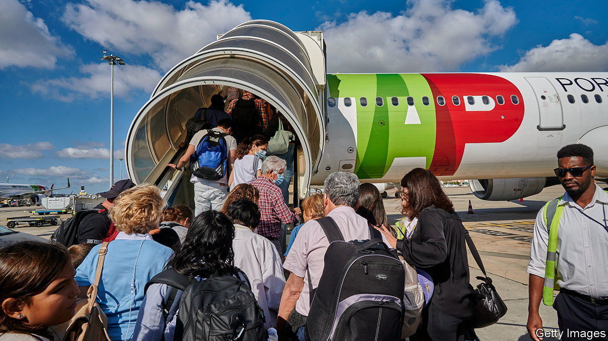

###### Stormy skies

# The struggle to put a carbon price on a flight 

##### Europe is leading the world—but still not going fast enough 

 

> Dec 15th 2022 

Few topics annoy green activists as much as air travel. Planes account for a sliver of total carbon-dioxide emissions— roughly 2.5%—but unlike heating, other transport and electricity, journeys on them are often luxuries not essentials. Air travel has also largely escaped carbon pricing, which covers a quarter of all emissions. 

Change is in the air, however. Since the start of last year, a un-backed scheme has required airlines to offset emissions above a baseline by buying credits. On December 6th the eu decided to bring airlines deeper into its carbon-trading scheme. These are steps in the right direction, even if they are unlikely to bring about fast enough decarbonisation for Europe to hit its goal of a net-zero aviation industry by 2050.

The ideal carbon-pricing scheme would apply across the economy, allowing trade-offs to be made between different activities. If society decided that flying was especially important, there would be fewer permits for steelmaking. The price of carbon would reflect both the ease of substituting a less polluting energy source and the value of the activity it fuels. The faulty logic behind excluding airlines from the eu’s scheme was that there was not yet a viable alternative for jet fuel. It was thought a carbon price on flights would simply annoy flyers and push airlines elsewhere. 

But there are ways of reducing the carbon intensity of a flight. More efficient aircraft help, as does smarter pricing to ensure every seat is used. Even without a carbon price, the carbon intensity of a passenger kilometre has fallen from around 1.4kg of carbon dioxide in 1960 to 0.1kg in 2018. Carbon prices can also change the behaviour of consumers, encouraging them to opt for a train, bus or boat where available. Handing out free permits to airlines amounted to an implicit subsidy for flying. 

The eu’s new plan will see airlines lose more of these permits each year until the industry’s special carbon allowances are phased out entirely in 2026, a year sooner than had been intended. Britain and Switzerland are included, but flights to other countries outside the bloc will remain exempt. This is mostly the result of a spat in 2012 when China threatened to stop buying planes from Airbus, a European firm, and America threatened non-compliance if the eu required all flights to take part.

International airlines will still have to hew to the un-backed scheme, which is known as the Carbon Offsetting and Reduction Scheme for International Aviation (corsia) and applies to the whole industry. Under corsia an airline must offset emissions beyond a baseline by buying credits, with the split based on the airline’s share of total industry emissions. For the pilot stage, which runs until the end of 2023, the baseline is industry emissions in 2019. 

As airlines have not fully recovered from the covid-19 pandemic, there is currently no requirement to offset emissions. From 2024 the baseline will be lowered to 85% of emissions in 2019. Yet even this will not have much impact. Credits are cheap, costing about $3 a tonne compared with around €90 ($96) a tonne in the eu. And airlines may be able to avoid buying them at all by using a bit of sustainable aviation fuel, made from waste cooking oil, which is heavily subsidised in America. 

So far nowhere has opted for a carbon-pricing scheme that operates across the whole economy. By incorporating airlines into its carbon-trading scheme Europe is at least heading in the right direction. But with the scheme’s limitations, and with the rest of the world lagging behind, the journey to a net-zero aviation industry will be a slow one. ■


