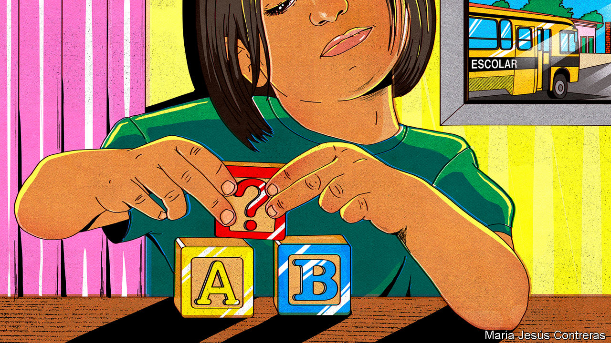
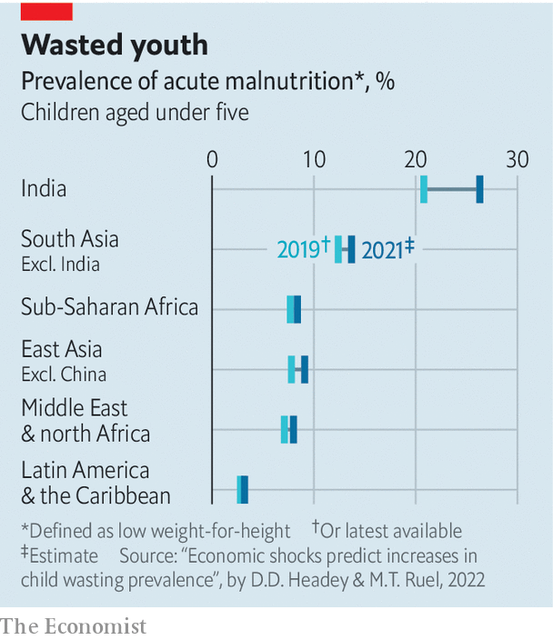

###### Covid babies

# The pandemic’s indirect effects on small children could last a lifetime 

##### Shuttered nurseries, sick parents and empty plates all harm the very young 

 

> Dec 15th 2022 

MENUMATU NALLO’s group meets beneath a tree in Kambia, a town in north-west Sierra Leone. Some 40 women (and a few men) gather on plastic chairs. Brandishing picture cards, Ms Nallo reminds her neighbours which foods are good for pregnant women to eat. She implores young mothers to feed newborns only breast milk, and to reject cups of water offered by well-meaning relatives. Ms Nallo likes to open her sessions with a Christian prayer. She ends them with a Muslim one.

Mother-and-baby groups are an important defence against sickness and malnutrition in this corner of Sierra Leone. Illiteracy makes it difficult to share messages in other ways. But for a year after covid-19 arrived in Sierra Leone, such gatherings could not happen. Mohamed Bangura, a health worker, says parents avoided bringing small children to hospitals. Many went unvaccinated; some underfed kids got no food aid. At least one of the toddlers fidgeting on laps at Ms Nallo’s meeting has the tell-tale discoloured hair of malnutrition.

In the lottery of life, well-off and supportive families and societies give children a big leg up. But random shocks during early childhood can make a big difference, too. In Indonesia, for example, children who are born in years with lots of rainfall tend to be wealthier than average in adulthood. In America, research shows that people who were in utero in late 1918, at the height of the Spanish flu, were 5% less likely to complete high school and earned a bit less as adults.

The world’s most recent pandemic, too, has dealt children under five years old a bad hand, with possibly long-lasting effects. The problems include much higher rates of malnutrition, scanter attention from stressed-out care-givers, and reduced access to pre-schools. The clearest data come from rich countries, but the worst impacts will probably be in poor ones.

The pandemic can hurt babies before they are born. Small children are much less likely than adults to get very ill if they catch covid. But pregnant women are a bit more likely than average to get severe symptoms, which increases the risk that their children will be born prematurely or have a low birthweight. The pandemic also caused many expectant mothers to undergo extreme stress, which studies show can affect unborn children. Research in Sweden, for example, has found that children of women who lose a relative while they are pregnant are more likely to suffer attention deficit disorder, anxiety or depression when they grow up.

The number of newborns getting their shots fell significantly during the pandemic. The share of small children fully inoculated against diphtheria, tetanus and pertussis—a benchmark for vaccine coverage more generally—went from 86% before the disaster to 81% last year. In the first two months of 2022 there were around 80% more cases of measles worldwide than in the same period of 2021, in part because of fewer jabs. Polio is popping up in places where it had not been seen for decades.

Diets have worsened, too. Even before the disaster more than 45m children under the age of five (around 7% of the total) suffered from wasting, the most acute form of malnutrition. Around 150m (or 22%) suffered stunting, in which prolonged malnutrition stops children’s brains and bodies developing properly. The pandemic pushed up food prices, while also forcing many adults to stop work. In 2021 a group of researchers warned that by the end of this year the number of children with wasting could rise to 60m—a roughly 30% increase since the start of the pandemic.

Stress and distraction made some parents more distant. LENA, a charity in Colorado, has for years used wearable microphones to keep track of how much chatter babies and their care-givers exchange. During the pandemic the number of such “conversations” declined. Jill Gilkerson of LENA notes that parents who had to start home-schooling older children might have had less time for little ones. But getting lots of interaction in the early years of life is essential for healthy development, so these kinds of data “are a red flag”.

Children starved of stimulation at home also had fewer chances to find it outside. In 2020 early-childhood education “went literally to zero” in many parts of the world, says Jaime Saavedra of the World Bank. Virtual schooling was hardly an option for tiny tots. In developing countries pre-schools tended to stay closed longer than grade schools because of safety worries. These were often exaggerated: though small kids are not keen on social distancing or masks (of the non-Batman sort), they are less likely to get sick from covid.

At a pre-school and crèche in São Paulo, in Brazil, toddlers are back to smearing their lunches on tables after closures that lasted far longer than in most places. But Claudia Russo, the head, says many of them went hungry during lockdowns. She laughs at the idea that they could have continued learning at home: “Can you imagine how difficult online classes are with children aged zero to three?” Even when her pre-school reopened, Ms Russo says, lots of children stayed away.

In school-age children, the pandemic’s impacts are obvious in test scores. Measuring the cost to babies and pre-schoolers is harder. Tools for tracking early child development are not as sophisticated, and the impact of shocks in early childhood can take years to appear. Researchers are focusing on detecting delays among children in the phase of early development from conception to two years of age. But they often lack good enough data from before the pandemic to make rigorous comparisons, warns Emily Oster, a health economist at Brown University. Others have been forced by covid to change how they do their studies (by donning masks when examining children, or switching from in-person tests to parental surveys). That makes changes over time hard to detect.

A study published in October weighed the findings of eight early experiments, carried out in America, Canada, China and Kuwait. It concludes that in most regards babies born or raised in the first year of the pandemic are doing no worse than infants before them. But they were more likely to score poorly on tests that measure early communication skills. One of the study’s authors, Alireza Shamshirsaz of Boston Children’s Hospital, says it is impossible to say whether lagging children will swiftly catch up, because the social changes during covid are unprecedented. As children grow up, he says, researchers may find more reason for concern.

For the millions of young children who went hungry because of the pandemic, poor outcomes are easier to predict. Children who suffer from malnutrition risk “lifelong, irreversible consequences” even after their diet recovers, says Saskia Osendarp of the Micronutrient Forum, a research and advocacy group. Hunger has a wretched impact on growing brains. A study in five low- and middle-income countries found that stunted children complete one fewer year of schooling. Another study of data from dozens of developing countries estimated that stunting reduced earnings by 22%. Women who were stunted in childhood are more likely to suffer complications during childbirth. Their own children are also more likely to be malnourished.

Suffer the little children

Perhaps the firmest evidence relates to missing pre-school. Researchers in Latin America, where nursery closures were especially lengthy, have lately found large declines in the share of children acquiring skills needed to make a good start in school. By late 2020 three- and four-year olds in Chile were performing very poorly in simple language tests, says Florencia López Bóo of the Inter-American Development Bank. She says the effect was as if their mothers had lost five years of education (children with better-educated parents tend to do much better in tests).

 


The number of pre-schoolers who would fail a benchmark test of academic, physical and emotional development rose about 13% globally in the pandemic’s first year, according to estimates by academics in Africa, America and Europe. They are likely to score lower marks during their school years; that could mean lower wages. UNICEF, the UN agency for children, thinks pre-school closures during 2020 alone could cost children $1.6trn in lost lifetime earnings, equivalent to 1.7% of global gdp.

Though widespread vaccination has made covid-19 much less lethal, conditions that harm young children persist. Malnutrition is “perhaps even worse than in 2020, when covid hit hardest,” says Ms Osendarp. Many emergency support programmes put in place during the pandemic expired just as new challenges to food supplies—such as Russia’s invasion of Ukraine—turned up. In July the WHO and UNICEF said that a combination of low vaccination rates and high rates of malnutrition threatened to “create the conditions for a child survival crisis”.

In Brazil, the share of people who cannot consistently get enough food has risen from 9% in 2020 to 16% this year, reckons Rede PENSSAN, a charity. Luciana Quintão of Banco de Alimentos, another NGO, says she recently watched in alarm as a pregnant woman filled a shopping basket with instant noodles. The global nutrition situation is “continuing to deteriorate”, says Yvonne Forsen, who leads the World Food Programme (WFP) office in Sierra Leone. Projects such as the mother-and-baby groups, which the WFP is supporting, do good. Still, “You solve one problem and then you realise there’s another problem waiting down the road.”

Renewed efforts to feed and vaccinate small children are essential. But providing more and better pre-schooling would also help. The fear is that pre-schools will henceforth find it harder to compete for funding and attention, since primary and secondary schools are demanding more resources to help pupils catch up. Investment in pre-schools had been growing, says Amanda Devercelli of the World Bank: “I worry that some of the momentum we had before the pandemic could stall.” 

The latest detailed figures, from the end of 2021, suggest that pre-school attendance in England was still only about 80% of the level before the pandemic. That may be because parents are still worried about infections, or because hard-pressed families have become less keen to pay. Enrolment in American pre-schools plummeted by 25% from 2019 to 2020, according to census data, and seems not to have fully bounced back. Some American nurseries still require small children to spend their days in masks. That does little for their health or others’. It may, however, make school less educational and less fun.

All this means that teachers in early primary grades will have a lot more work to do. In many countries lots of children were already repeating their first year, in part because they turn up wildly unprepared. This makes for big class sizes, which in turn make lessons less effective. This cycle could now grow more entrenched, worries Ms Devercelli. Small children will end up paying the price. ■


