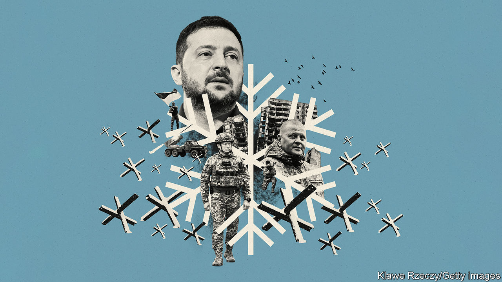

###### War in Ukraine

# A looming Russian offensive 

##### Ukraine’s chiefs, in an unprecedented series of briefings, tell The Economist about the critical months that lie ahead 

 

> Dec 15th 2022 

Russia is MASSING men and arms for a new offensive. As soon as January, but more likely in the spring, it could launch a big attack from Donbas in the east, from the south or even from Belarus, a puppet state in the north. Russian troops will aim to drive back  and could even stage a second attempt to take Kyiv, the capital. 

Those are not our words, but the assessment of the head of Ukraine’s armed forces, . In an unprecedented series of briefings within the past fortnight the general, along with , Ukraine’s president, and , the head of its ground forces, warned us of the critical few months ahead. “The Russians are preparing some 200,000 fresh troops,” General Zaluzhny told us. “I have no doubt they will have another go at Kyiv.” Western sources say that Russia’s commander, General Sergey Surovikin, has always seen this as a multi-year conflict.

This is not the view outside Ukraine. In the freezing mud, the conflict is thought to be deadlocked. There has been almost no movement for a month along the 1,000km or so of battlefront. Admiral Sir Tony Radakin, Britain’s most senior officer, this week said that, right now, a shortage of artillery shells means Russia’s scope for ground operations is “rapidly diminishing”.

The appearance of stalemate is feeding new interest in peace talks. France’s president, Emmanuel Macron, America’s Joe Biden and (for very different reasons) the Russian aggressor, Vladimir Putin, have all in recent days talked about a diplomatic solution. Many in the West, appalled at the suffering, and, more selfishly, wearying of high energy prices, would welcome this. But Ukraine’s commanders argue that it should not happen too soon, and they are right. 

If Ukraine sought to stop the war today, freezing the battle lines where they are, the Russians could prepare better for the next attack. Mr Putin’s generals have been pushing on with their programme of training and deploying newly mobilised troops and retooling industry to help the war effort—including, say Ukrainian commanders, by producing artillery shells. A freeze would repeat the mistake of the three years leading up to the invasion on February 24th 2022. In that time Mr Putin talked endlessly to the West’s leaders, who indulged him, while all the while readying his armies for invasion. 

The West’s highest responsibility is to ensure that any Russian counter-offensive fails. For that, the supply of weapons must increase, and fast. Ukraine has used HIMARS, a rocket system the Americans have been supplying since June, to devastating effect against Russian ammunition dumps and command-and-control centres, allowing the rapid advance first in the north-east and then in the south. But Russia has moved many such targets back out of range of Ukraine’s HIMARS batteries. So Ukraine needs more powerful ordnance, like the ATACMS missiles that could hit targets at least twice as far away. And it needs lots of them, as well as regular ammunition and artillery of all kinds; plus tanks and helicopters and much else, too.


Ukraine also needs help repelling  on civilian electrical, water and heating systems. These are aimed at wrecking Ukraine’s economy as well as battering the morale of Ukrainian troops on the front line, who are worried about their families back home. 

As General Zaluzhny explains, Ukraine is running low on stocks of ammunition for its existing defence systems (mostly Soviet-era anti-aircraft kit being repurposed for use against missiles). It also needs many more, and better, anti-missile defences; the American Patriots that now seem to be forthcoming will be a huge boost, but training soldiers to use them takes time and they should have been supplied months ago.

If Ukraine is to emerge from this conflict as a thriving democracy, even air defence will not be enough: it also needs to recapture more territory. Although Russian forces have seized only a small slice of Ukraine’s Black Sea coast this year, that puts them close enough to all of the big Ukrainian-held ports to menace shipping. Apart from limited amounts of grain under a UN deal, Ukraine’s exports are still largely cut off.

Taking more territory also helps avoid a frozen conflict by showing that Mr Putin risks losing even the gains he has made. With today’s frontier, Russia has a land-bridge that can resupply annexed Crimea and threaten the south of the country. By contrast, if Ukraine cuts the land-bridge and retakes the northern coast of the Sea of Azov, it can negotiate from strength, putting even Crimea within artillery range. That way it can discredit the idea in Russia that Mr Putin can prevail simply by launching another attack in a few years’ time. 

Ukraine is still willing to make the sacrifices that fighting on demands. Mr Zelensky told us that “95 or 96% of people want to de-occupy all their territory”, recapturing everything that Russia seized in 2014 as well as what it has taken this year. He argues that Western promises of security guarantees are a poor substitute for his country’s territorial integrity. After all, similar guarantees offered to Ukraine by America and Britain in 1994, when it surrendered the Soviet nuclear weapons on its soil, proved almost worthless 20 years later. 

Ukraine’s backers will have a slightly different point of view. They believe taking back everything is a maximalist aim that Ukraine will struggle to achieve, not least because it will in places mean freeing people who do not want to be liberated. Mr Putin’s nuclear threats are a reason to ensure that Russia is not victorious, but also a reason to require that Ukraine does not appear to threaten Russia’s recognised borders. Ukraine also needs to understand that the flow of military and financial aid depends on it avoiding internal rivalries that may be emerging, and on ensuring that it curbs long-standing corruption. 

That said, the entire world—including Russia—would benefit from the failure of the revanchist idea that the old Russian empire can be recreated. If Ukraine is adequately supported, its commanders can push a long way towards the coast, and possibly take back most of what Mr Putin has seized since February. The more territory that Ukraine can recover the greater the chances of its lasting success. ■


