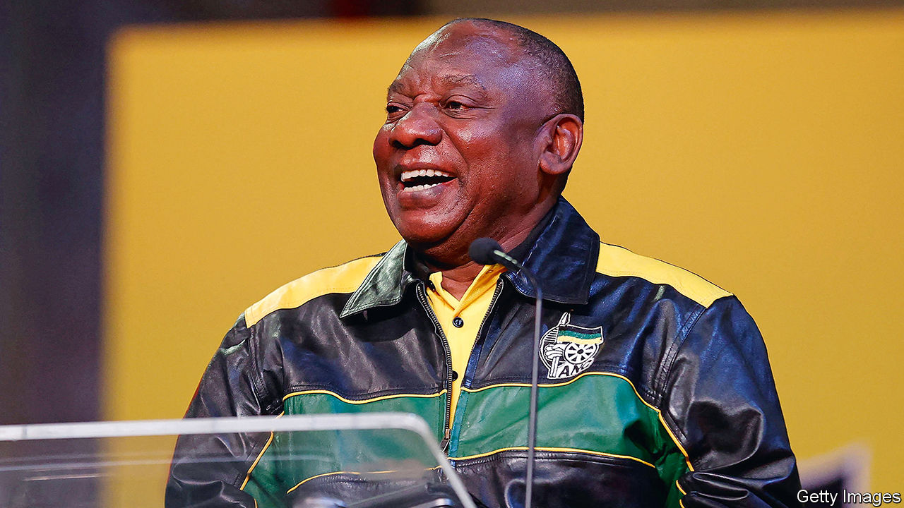

###### After farmgate

# How to save South Africa 

##### The ruling party is unreformable. The country needs a coalition of the clean 

 

> Dec 15th 2022 

No South African embodies the country’s modern history like Cyril Ramaphosa. As a trade-union boss in the 1980s he helped lead the struggle against apartheid. In the 1990s, as an aide to Nelson Mandela, he negotiated the shift to multiracial democracy. After liberation, Mr Ramaphosa grew fabulously wealthy, as the new ruling party, , pressed white-owned businesses to transfer equity to black capitalists. “Black economic empowerment”, as it was called, was legal but enriched only a well-connected few. In the 2010s Mr Ramaphosa re-entered politics, serving the disastrous Jacob Zuma as deputy president. He became president in 2018, vowing to overhaul the economy and to clean up the corruption Mr Zuma had left behind. He has failed to do so. That failure has inflicted grave harm on South Africa, and will probably lead to the party of Mandela losing its hegemony.

On December 16th  will begin its quinquennial conference, where Mr Ramaphosa is expected to be re-elected as party leader. If so, he will probably head the party in a general election in 2024. His chances have been dented by a scandal—part John le Carré, part “Carry On”—involving his handling of at least $580,000 from what he says was the sale of buffaloes to a Sudanese businessman and what his opponents say was something fishier. On December 13th he survived a parliamentary vote that would have impeached him. 

Yet there is little for the  to celebrate. Mr Ramaphosa’s caper is simply the latest sign that the party is no longer capable of governing. Those, including , who once supported the president, overestimated both his zeal and ability to drive change. Mr Ramaphosa has notched up some successes, such as revamping the national tax and prosecution authorities, which were debauched under Mr Zuma, but his graft-ridden party has blocked deeper reforms. 

For most of the past three decades the anc, as the party of liberation, won elections easily. With unrivalled power and few internal checks, it became the natural home of any South African who sought office in order to abuse it. Under Mr Zuma, the looters elbowed aside those who took governing seriously, and Mr Ramaphosa has failed to wrest back control. This has consequences. The murder rate is rising; real GDP per person is lower than it was 14 years ago; there have been more power cuts this year than any on record; water gushes from broken pipes; nearly half of black South Africans who want a job cannot find one. 

South Africans have noticed the rot and started to blame the ruling party. Pollsters expect the anc to win less than 50% of the vote in 2024, which under the country’s system of proportional representation would mean the end of its majority in parliament. A new era of coalition politics is coming. 

In an optimistic scenario, the cleaner, more moderate elements within the anc would find a way to team up with the liberal opposition, the Democratic Alliance, which has done a fair job of governing South Africa’s second-richest province, the Western Cape. The nightmare alternative is that extremists and crooks take charge. If the pro-corruption wing of the anc were to form a ruling coalition with the Economic Freedom Fighters, a black populist party that wants to nationalise everything, investors would flee in terror. 

South Africa’s previous transitions—the scrapping of apartheid and the ousting of President Zuma—were helped along by pressure from churches, NGOs, think-tanks and businesses. They should speak out again, explaining the urgency of reform, compromise and the restoration of the rule of law. Mr Ramaphosa should set an example by telling the truth about “farmgate”. He should also use the rest of his term to accelerate the reforms that he has slowly begun, such as adding renewable-energy capacity to the dilapidated electricity system. 

The end of apartheid, often depicted as a miracle, was in fact the culmination of years of work by individuals, including Mr Ramaphosa, and organisations, including the anc, who thought that South Africa deserved better. Once again, the Rainbow Nation needs leadership. The search for it should start now. ■

