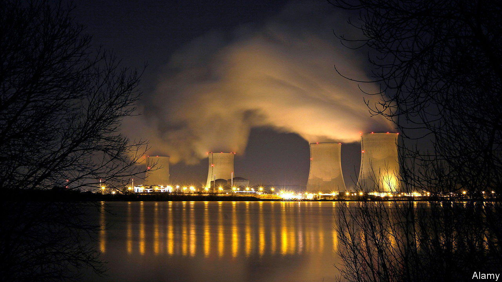

###### Nuclear energy

# The French exception 

##### As the world turns back to nuclear power, it should heed the lessons from France 

 

> Dec 15th 2022 

IT WAS BRANDED the most expensive way to boil water. Not so long ago, many dismissed nuclear power as pricey and doomed, at least in the West. Yet today nuclear energy is crucial once again. In the short run, Europe’s ability to get through the winter energy crunch depends in part on whether France’s ageing fleet of nuclear reactors can be cranked up to operate nearer full capacity. And in the long run, investment and innovation in nuclear power appear to be part of the answer to both Vladimir Putin’s energy war and climate change: an almost carbon-free way to generate a steady and controllable flow of electricity to work alongside intermittent solar and wind generation. 

As a result, countries around the world are once again embracing nuclear power, which today accounts for 25% of electricity generation in the European Union, and 10% around the world. Money is flooding into research and startups, although excitement this week over the results of a  experiment at America’s National Ignition Facility has got far ahead of itself—years’ or decades’ more work will be needed to discover whether the concept is viable. Despite the industry’s record of cost overruns, Britain and France are keen to build large new conventional plants and Germany has postponed closing its reactors this year. India’s state-controlled power firm, ntpc, is planning lots of new nuclear capacity, according to Bloomberg. Nuclear generation will have to double by 2050 if the world is to reach net-zero emissions, according to the International Energy Agency. 

As countries choose whether to bet on nuclear power, they ought to look at , the West’s leader. After the first oil shock in 1973, it built enough reactors to supply about 70% of its power. Yet its experience has been hard. Maintenance problems mean that the fleet has been operating below its theoretical capacity this year, contributing to a Europe-wide spike in power prices. The main company, edf, has accumulated a staggering $350bn of liabilities, is expected to make $19bn of pre-tax losses this year and is about to be fully nationalised. And the supply of new reactors has stalled. Of the six built since 1999 that are of the latest French design—five abroad and one at home—only the two built in China are generating electricity.

France holds lessons for nuclear planners elsewhere. One is the case for continuous investment and innovation. At first France built too many reactors too quickly and then not enough. Many now need maintenance all at once. The lull in orders led to a loss of skills and expertise, as employees retired or left. Costs ballooned and innovation flagged. To fix its plants today, edf is flying in welders from America and Canada. Only now has France opted for a well-spaced programme of three pairs of reactors to be built no more than four years apart. 

Another lesson lies in how France’s planners rammed through their ambitious nuclear programme without securing broad public support. The nuclear industry became a state within a state, with an elite corps of engineers who were not given to self-doubt or subject to enough scrutiny. That lack of support eventually led to inconsistent policy as, under pressure from the greens, the socialists reversed the expansion. For an industry charged with creating giant assets that last for at least 50 years, such volatility can be crippling. 

A final lesson is about diversification. France’s obsession with nuclear power led it to downplay renewables. Today solar and wind drive 9% of its power supply, compared with 25% in Britain. In most countries this logic of diversification works in the other direction. By boosting nuclear-power generation, alongside the growth in renewables that is already under way, they could achieve a more balanced, low-carbon energy mix. Integrating national energy markets with those of neighbouring countries—something France has been wary of—can help increase resilience, too.

Chain reaction

The loss of Western competence helps explain a loss of market share. Of the 31 reactors that started construction since 2017, 27 used Chinese or Russian designs. Now, amid an energy crunch, opinion on nuclear power is shifting. In France fully two-thirds of people now think there is a nuclear future. French elites have had an emotional, almost ideological attachment to nuclear energy, but nuclear and renewables are not enemies, as some in Paris seem to believe. The world needs both. ■

