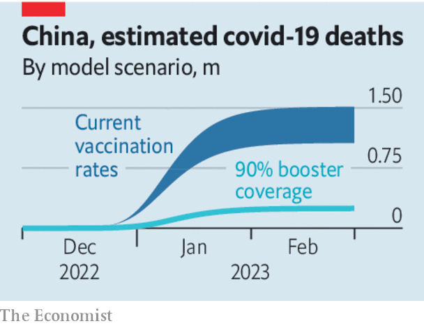

###### Little steps, many lives

# What China can still do to avoid an enormous covid death toll 

##### It must treat hospitals as a precious resource and start stockpiling drugs 

> Dec 15th 2022 

Testing stations are being removed from city streets. The enforcers of “zero-covid” are nowhere to be found. In , the state has disappeared from the front lines. For nearly three years  tried to contain the virus, calling his efforts a “people’s war”. Now he has surrendered and the people must live with the enemy.

Mr Xi is not the first leader to conclude that such a fight was unwinnable. But before ditching their zero-covid policies, other countries first took pains to administer vaccines, stockpile antiviral drugs and draw up treatment guidelines. China had ample time to do all of that. Yet more than two years after the first vaccine proved effective, the country remains ill-prepared. That has made opening up much  than it ought to be. 

 


How dangerous? In this week’s China section we publish  of how the epidemic might play out. It comes with essential caveats. Modelling an epidemic is difficult. Modelling one in China, where the data are often unreliable, is even harder. We take into account variables such as vaccination rates, the effectiveness of Chinese jabs, the lethality of covid for different age groups and the number of intensive-care beds. In a worst case, if covid spreads freely and many people cannot get care, we estimate that in the coming months 1.5m Chinese people will die from the virus.

Although that is a lower share of the population than in many rich countries, it is still a criticism of the government’s poor preparations. It is also a call to action. A vaccination drive will take months. The government has waited too long to build and staff new ICUs. But even if the state will not impose lockdowns while it prepares, it can mitigate the number of deaths.

It should start by protecting the health system. A wave of covid is breaking over China. Our model sees this peaking in January. By that time hospitals risk being overwhelmed. Beds and staff are a precious resource to be husbanded. That means keeping people who are not seriously ill away from hospitals. To that end, the state could help drug companies restock pharmacies that run out of such things as lateral-flow tests and paracetamol. Medical staff should be vaccinated first and they must be given the proper gear to minimise the risk of infection.

A second step is to ensure cheap and plentiful supplies of covid drugs. Dexamethasone, a low-priced steroid, has been shown to reduce deaths among the most severely ill patients. Antivirals, such as Paxlovid, help keep those most at risk out of hospital. These drugs have become part of the toolkit doctors around the world are using to fight the virus. They could save many thousands of lives in China. Only the government knows if it has enough of them to go around. If not, it should start stocking up. Foreign governments would surely send supplies if China asked. President Xi Jinping should not let his pride imperil China’s people, as he has done by shunning more efficacious Western vaccines. 

China’s vaccines still work. So the third priority is to get them into people’s arms. It may be too late for many in this wave, but there will be others. Less than half of those over 80 years old have had three shots, the number needed for decent protection against severe disease and death. Yet some of the elderly have gone to the clinic for a jab only to be turned away for lack of supplies. Until recently, some vaccine factories were sitting idle. Vast quantities will be needed. Six-monthly booster shots ought to become a normal part of life for older Chinese.

As the state has failed to do its job, people are helping themselves. Masks are ubiquitous in many cities and more people are working from home. Restaurants and cinemas may be open, but in cities such as Beijing they remain largely empty. All this will help slow the growth of this covid wave and ease the pressure on hospitals. But the government must also act. In a country the size of China, even small steps could save many lives. ■


