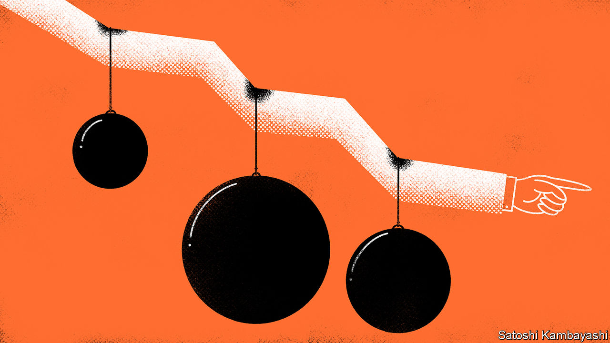
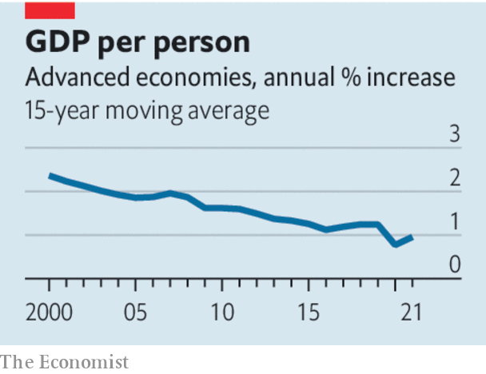

###### I say go, go, go!

# Why are the rich world’s politicians giving up on economic growth? 

##### Even when they say they want more prosperity, they act as if they don’t 

 

> Dec 14th 2022 

The prospect of recession may loom over the global economy today, but the rich world’s difficulties over growth are graver still. The long-run rate of growth has dwindled alarmingly, contributing to problems including stagnant living standards and fulminating populists. Between 1980 and 2000, gdp per person grew at an annual rate of 2.25% on average. Since then the pace of growth has sunk to about 1.1%. 

Although much of the slowdown reflects immutable forces such as ageing, some of it can be reversed. The problem is that, as we write this week, reviving growth has  lists. Their election manifestos are less focused on growth than before, and their appetite for reform has vanished. 

 


The latter half of the 20th century was a golden age for growth. After the second world war, a baby boom produced a cohort of workers who were better educated than any previous generation and who boosted average productivity as they gained experience. In the 1970s and 1980s women in many rich countries flocked into the workforce. The lowering of trade barriers and the integration of Asia into the world economy later led to much more efficient production. Life got better. In 1950 nearly a third of American households were without flush toilets. By 2000 most of them could boast of owning at least two cars.

Many of those growth-boosting trends have since stalled or gone into reverse. The skills of the labour force have stopped improving as fast. Ever more workers are retiring, women’s labour-force participation has flattened off and little more is to be gained by expanding basic education. As consumers have become richer, they have spent more of their income on services, for which productivity gains are harder to come by. Sectors like transport, education and construction look much as they did two decades ago. Others, such as university education, housing and health care, are lumbered with red tape and rent-seeking.

Ageing has not just hurt growth directly, it has also made electorates less bothered about gdp. Growth most benefits workers with a career ahead of them, not pensioners on fixed incomes. Our analysis of political manifestos shows that the anti-growth sentiment they contain has surged by about 60% since the 1980s. Welfare states have become focused on providing the elderly with pensions and health care rather than investing in growth-boosting infrastructure or the development of young children. Support for growth-enhancing reforms has withered.

Moreover, even when politicians say they want growth, they act as if they don’t. The twin problems of structural change and political decay are especially apparent in , which since 2007 has managed annual growth in GDP per person averaging just 0.4% (see Britain section). Its failure to build enough houses in its prosperous south-east has hampered productivity, and its exit from the European Union has damaged trade and scared off investment. In September Liz Truss became prime minister by promising to boost growth with deficit-financed tax cuts, but succeeded only in sparking a financial crisis.

Ms Truss fits a broader pattern of failure. President Donald Trump promised 4% annual growth but hindered long-term prosperity by undermining the global trading system. America’s government introduced 12,000 new regulations last year alone. Today’s leaders are the most statist in many decades, and seem to believe that industrial policy, protectionism and bail-outs are the route to economic success. That is partly because of a misguided belief that liberal capitalism or free trade is to blame for the growth slowdown. Sometimes this belief is exacerbated by the fallacy that growth cannot be green. 

In fact, demographic decline means that liberal, growth-boosting reforms are more vital than ever. These will not restore the heady rates of the late 20th century. But embracing free trade, loosening building rules, reforming immigration regimes and making tax systems friendly to business investment may add half a percentage point or so to annual per-person growth. That will not put voters in raptures, but today’s growth is so low that every bit of progress matters—and in time will add up to much greater economic strength. 

For the time being the West is being made to look good by autocratic China and Russia, which have both inflicted deep economic wounds on themselves. Yet unless they embrace growth, rich democracies will see their economic vitality ebb away and will become weaker on the world stage. Once you start thinking about growth, wrote Robert Lucas, a Nobel-prize-winning economist, “it is hard to think about anything else”. If only governments would take that first step. ■

For more expert analysis of the biggest stories in economics, finance and markets, sign up to , our weekly subscriber-only newsletter.

