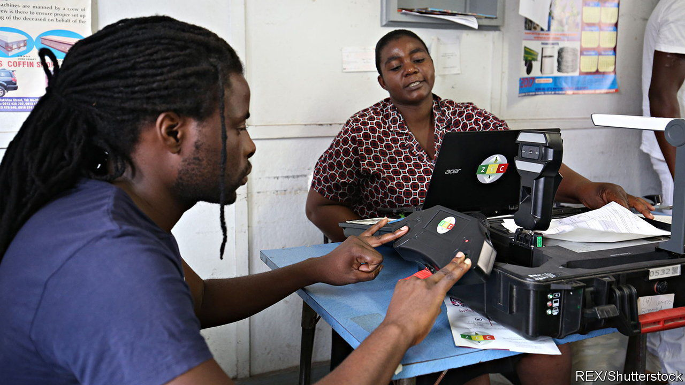

###### Big brother will see you now

# China is helping Zimbabwe to build a surveillance state 

##### Oppressive regimes stick together 

 

> Dec 15th 2022 

REGISTERING TO vote in Bulawayo, Zimbabwe’s second city, isn’t easy. The only registration centre is two bus journeys from the most populous suburbs. Nationwide there are just 71 voter-registration centres, or one for every 216,000 people (though some mobile ones are operating ahead of a general election next year). 

And this is not the only worry. Since 2018 Zimbabwe has collected fingerprints, photos, addresses and phone numbers to clean up the voters’ roll, which was reportedly full of “ghost voters”. This frightens many Zimbabweans, especially those belonging to the minority Ndebele ethnic group, much of which is concentrated near Bulawayo. In 1983 some 20,000 mostly Ndebele people were massacred by the army. Emmerson Mnangagwa, now the president, was head of the security services at the time. Now, people fear data collection “is a way to re-identify and target us,” says Rodwin Sibanda of the Habakkuk Trust, an NGO in Bulawayo.

The ruling party, Zanu-pf, is not about to perpetrate another genocide. But it has shamelessly rigged elections for two decades, and many Zimbabweans fear it could abuse their data to intimidate them. Before an election in 2018 party thugs forced people to hand over their registration slips, telling them these would reveal whom they voted for. The same thugs have in the past burned the homes of those who voted the wrong way.

Zanu-pf has so ruined Zimbabwe’s economy that it cannot pay teachers or nurses, or provide food to the almost four-tenths of people in the countryside who are at risk of starving. Yet it has found the wherewithal to build a snazzy surveillance apparatus with the help of China’s communist regime. Since 2013 China has provided loans and grants worth at least $239m to help develop NetOne, Zimbabwe’s state-owned telecoms network. “There is a huge perception that because of the proximity of the Zimbabwean government to China, much of our critical infrastructure is run by China,” says Otto Saki, a human-rights lawyer. Technicians for Huawei, a Chinese firm, have reportedly helped state-security agents in Uganda and Zambia snoop on government critics.

The government is keen to promote the idea that it is all-seeing. Take the case of Joana Mamombe, an opposition MP, and Cecilia Chimbiri, an activist, who say they were abducted and tortured by state-security agents. Mr Mnangagwa claims they are lying, arguing that the government was “able to trace where they walked, slept and who they talked to”. Such claims are “a clear example that the government has the necessary tools and the capacity to monitor people,” says Nompilo Simanje of the Media Institute of Southern Africa Zimbabwe, an NGO in Harare, the capital. Moreover, the Citizen Lab at the University of Toronto has alleged that Zimbabwe used phone-snooping software from an affiliate of nso Group, an Israeli surveillance firm. nso says its software is meant to be used against terrorists, not activists.

Police and spies in many countries use similar tools. But in most democracies, which Zimbabwe still purports to be, their power to do so is constrained by privacy laws and independent judges. Zimbabwe has neither. A purported privacy law passed by the parliament last year established a snooping centre in the president’s office with the authority to issue warrants to intercept communications. Mr Saki’s research suggests that the centre was designed by Huawei, which did not respond to questions about its involvement. 

Even bodies that are notionally independent have ties to the government. The electoral commission, which is run by a retired army general, has been accused of giving voters’ data to Zanu-PF, which then urged them through text messages to vote for Mr Mnangagwa. 

The government’s ambitions coalesce in a huge new data centre, which was built with China’s help. Its purpose is to suck up information from the government and from private firms, including banks. What this means in practice is murky. So far the state “is not technologically savvy enough” to implement wholesale China-style spying on dissidents, says Freeman Chari, a Zimbabwean activist. But, says Mr Chari, “this is where we are heading.” ■

