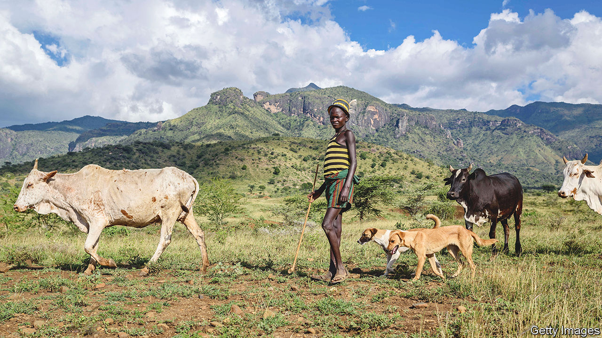

###### Zilch cows

# Commercial cattle-raiding is impoverishing Uganda’s herders 

##### Without cows, they have no safety net when the rains fail 

 

> Dec 15th 2022 

In bad years, when the rains fail and the sorghum wilts, Maria Lodia would usually sell an animal to survive. But in January gun-wielding thieves stole her three cows, leaving her destitute. Since 2019 cattle-raiding has returned to the dry plains of Karamoja, home to 1.2m people in north-east Uganda. Robbed of their livestock and frightened away from their fields, the  had no safety net during dry spells this year. Local officials say that more than 2,400 people have died of hunger.

Like many of , Karamoja is going through an uneven transition. Elders recall a time when cows were plundered for prestige or bride wealth. But in recent decades cattle-raiding has become big business. Stolen animals are trucked to distant markets, since urban demand for beef has grown. On the grasslands the ownership of livestock is becoming more unequal, as the big owners get bigger and poorer ones struggle—and go hungry. “In Karamoja your bank is a cow, it’s a goat, it’s a sheep,” says Paul Komol Lotee, chairman of Kotido, one of the districts worst hit by violence. “If you don’t have the three you will not survive.”

In the 1990s and early 2000s raiders ran rampant in Karamoja. Thousands of cows were stolen. Others died of disease after being crowded into kraals (stockaded enclosures). The army eventually bludgeoned the raiders into submission. By 2010 cattle-keepers began to restock. Now the raiders are back. In Kaabong district they have emptied 32 of 34 kraals, where cattle are meant to be kept safe. Locals blame several factors: the flow of guns across the porous border with Kenya; a covid-19 lockdown and a foot-and-mouth outbreak, both of which disrupted legal trade; and the failure of the police and army to recover stolen cattle, which made young men take the law into their own hands. Hundreds of people were killed. 

In the search for illegal guns the army has rounded up thousands of young men, often on flimsy pretexts. In March a spokesman said it had killed more than 300 “warriors” during disarmament operations. The UN and the government’s own human-rights commission have accused soldiers of extrajudicial killings. Former captives describe being tied to trees and flogged. Locals wonder whether some officers are profiting from the raids. How do truckloads of stolen cattle elude checkpoints? Why are army-issue cartridges sometimes left behind after raids? The army insists it is not involved.

The raids are starting to abate again, partly because of the army campaign, partly because there is little left to steal. In the 2018-19 season Karamoja’s livestock provided $444m of value to their owners, estimates the Karamoja Resilience Support Unit, a research group. Those benefits include meat, milk, ploughing and informal insurance (in an emergency you sell your last cow). Yet even before the latest wave of raiding, most households owned fewer than 3.3 “tropical livestock units” per person, equivalent to about five cows or 33 sheep. Below that threshold a family struggles to get enough calories from livestock, even if it grows some crops on the side.

Many Karamojong instead find casual work on farms, brew beer or drive motorbike taxis in the towns. Others scrape by in the economy of petty extraction, burning trees for charcoal or tunnelling for gold. Auda Lokwang leaves her children at home from sunrise to sunset while she gathers firewood in the scrubland, exchanging it in Moroto town for , the edible residue left after brewing sorghum beer. “You just have to endure,” she says.

For generations, the Karamojong survived a capricious environment by balancing cattle-herding and crop cultivation. “Should the cattle die, there are crops,” runs a traditional invocation. “If the crops do not grow, there are cattle.” Without cows, they are now more vulnerable to rising food prices, voracious pests and a changing climate, which is making rainfall more erratic. Perhaps cattle-raiding has angered the gods, muses Loita Kume, an elder in Moroto district. Only when the bloodshed stops will the rains return. ■

