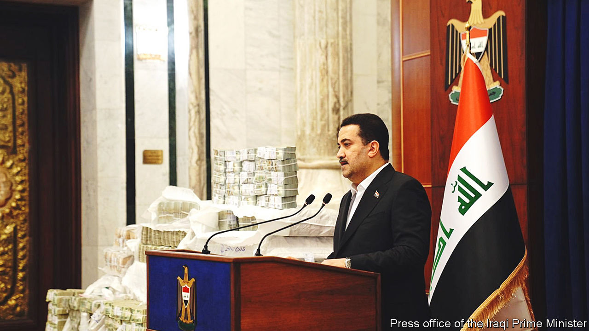

###### The elusive looters

# Iraq’s new prime minister vows to clean up the country 

##### Few think he will succeed 

 

> Dec 15th 2022 

The puzzle for Iraq’s kleptocrats was always how to spirit their stolen billions out of the country. Foreign banks have been wary of accepting large transfers from Baghdad. Taking piles of cash out by land is risky; Kurds closely watch the frontier with Turkey. Now there is a new conduit. A British security company, G4S, used to scrutinise cargo leaving Baghdad airport. But in his last weeks as prime minister, Mustafa al-Kadhimi approved its replacement with Biznis Intel, a company with no apparent experience of airport security. “It’s very easy now to bring things in and out,” says an airport employee. “A big amount of money is being smuggled out.” 

Iraq has long suffered under greedy rulers. Saddam Hussein treated the state’s resources as his own. Since he was ousted by American troops in 2003, successive elected governments have been riddled with graft. Officials take cuts from contracts or hire ghost workers and pocket their salaries. Even so, a recent alleged theft is hard to top. Since September 2021 the country’s tax deposits have been raided to the tune of 3.7trn Iraqi dinars ($2.5bn), according to an investigation by the finance ministry cited by Iraq’s new prime minister, Muhammad al-Sudani. Corruption on this scale helps explain why many of Iraq’s 41m people do not have reliable water or electricity, even though their country is the second-largest oil producer in the Organisation of the Petroleum Exporting Countries (OPEC).

On paper the funds handled by the tax commission were paid out through five shell companies, some set up by an Iraqi businessman, Nour Jassim. Investigators believe the funds were then distributed among a variety of politicians and officials demanding hush-money and bribes to facilitate the scam and to frustrate investigations. Such were the volumes traded that the dinar weakened against the dollar, while the cost of property in Baghdad’s posher quarters rose. MPs and people in the then prime minister’s office failed to sound the alarm. 

“Vast underground networks of senior officials, corrupt businessmen and politicians operate in the shadows…and siphon off literally billions of dollars from the public purse,” wrote Ali Allawi after resigning as finance minister in August in protest against government shenanigans. Since leaving office, Mr Kadhimi is thought to have moved to Europe. He and officials in his office have denied any wrongdoing.

Mr Sudani, the first Iraqi prime minister to have lived in Iraq continuously since the American invasion in 2003, has vowed to root out corruption. One investigator, suspecting that more shell companies will be uncovered, reckons that between a third and a quarter of last year’s government budget of $92bn has gone astray. Last month Mr Sudani spoke on television (pictured) between two pallets piled head-high with cash, which was in part recovered from Mr Jassim as he prepared to fly out of Baghdad in a private jet. 

Mr Sudani has promised to recover the remaining cash. His advisers say he will seek to extradite former officials suspected of corruption who are now abroad, including some in America. After six weeks in office he is said to have purged around 900 officials, including civil servants and security officers. Friends of Mr Kadhimi say Mr Sudani is seeking to tighten his grip on his office by throwing allegations of corruption at his predecessor’s circle. 

It tends to start at the top

Few believe this will stop the rot. The legitimacy of Mr Sudani’s new government is debatable, since it consists of factions that lost the general election in October last year and includes many of the groups that supped at the previous government’s trough. The same MPs who voted to endorse Mr Sudani as prime minister also voted to remove Mr Allawi’s successor as acting finance minister when he sought to publish the results of the investigation into the theft of tax revenues.

Mr Sudani has also launched a state-financed company to administer government projects. It is run by a caucus of pro-Iranian Shia militias known as the Hashd al-Shaabi (Popular Mobilisation Forces), whose political wings dominate Mr Sudani’s coalition. After helping to defeat the jihadists of Islamic State, who conquered a swathe of Iraq and Syria in 2014, the Hashd insists that its mission is to rebuild Iraq.

It has been allowed to create its own commercial firm. This is called al-Muhandis, after the deputy commander of the Popular Mobilisation Forces who was killed by the Americans in a drone strike at Baghdad airport in 2020, along with Qassem Suleimani, the commander of Iran’s Islamic Revolutionary Guard Corps (IRGC). 

Having won the upper hand in Iraq’s factional fights over politics and security, the Hashd’s leaders hope to gain sway over a chunk of the economy, including the oil industry and house-building, much as the IRGC has done in Iran. Al-Muhandis is bent on winning a string of fat government contracts. “It will kill what remains of the private sector,” says Muhammad Koperly, a lawyer based in Baghdad. Some fear that the new company will bind Iraq’s economy ever closer to Iran’s. Others doubt it will be effective. “It will be just another crazy fund for corruption,” says a former official.

Mr Sudani seems loth to let the probe into the gigantic tax swindle extend to the upper echelons of his own government. On his watch Mr Jassim has been freed on bail and is thought to have fled abroad. Several of the tax-authority officials overseeing the transfers were appointed by Badr, a pro-Iranian party that is in the vanguard of Mr Sudani’s ruling coalition, yet none of them has so far been charged. A former official doubts the new prime minister’s sincerity. “They can’t follow the leads because the whole house would come crashing down,” he says. ■

