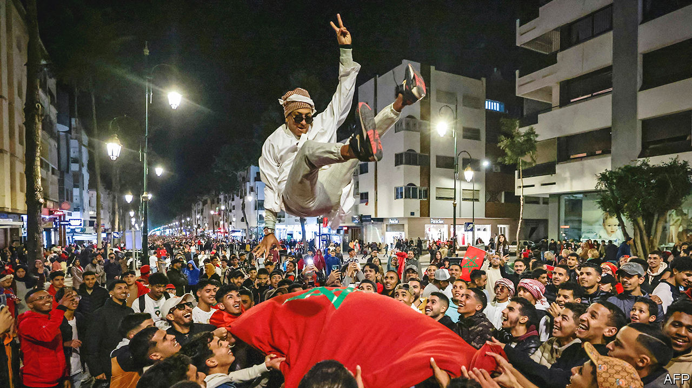

###### Of lions and pride

# Morocco’s World Cup success sparks a debate about Arab identity 

##### A country that was the butt of jokes a month ago is now a regional hero 

 

> Dec 13th 2022 

THE SYMBOLISM was almost too much for a single football match. A former colonial power defended its title against the country it once occupied. Some members of one squad could just as well have played for their opponents in a clash of hyphenated identities. The underdogs embraced a symbol of regional struggle as their own, even as their countrymen argued about whether they truly belonged to that region.

In the group stage, this was a World Cup full of surprises. Saudi Arabia defeated Argentina; Japan beat Spain and Germany to emerge atop their bracket. By the semi-finals, though, the remaining teams looked mostly predictable: defending champions France, two-time winners Argentina, and Croatia, the runners-up in 2018.

Mostly predictable—but not entirely. Morocco won four of their first five games, becoming the first Arab or African squad to reach the semi-finals. Though they fell to France on December 14th, they played with passion befitting their victories, which sparked raucous celebrations in the Arab world, Africa, and among émigrés in Europe—but also curious arguments.

Most of Morocco’s 26-man squad were born abroad. Achraf Hakimi grew up in Madrid to poor Moroccan parents. He chose to play for the squad of his heritage and on December 6th netted the winning penalty kick against Spain. European football has become so diverse that most fans barely notice. Now Morocco has created its own squad of players with complex identities.

Morocco’s Africanness is obvious if you look at a map. But it comes with subtle tensions. Some sub-Saharans sniffed that north Africans look down on them. 

As for Morocco’s Arabness, that has been the subject of debate in cafés, fan zones and on social media. For the affirmative: Morocco is a member of the Arab League, Arabic is an official language, and its rich culture has contributed much to that of the broader Arab world. Many Moroccans identify as Arabs, and their victory was celebrated across the region.

Yet some Moroccans are uncomfortable with the label. A plurality (perhaps even a majority) are of Berber descent, and Arabism can imply an erasure of their identity. Tamazight, the Berber tongue, was long relegated to second-tier status. It was only made an official language in 2011, part of a package of reforms rushed through to placate the public during the Arab spring.

It is a strange debate. If it had been Egypt, another north African country, that reduced Ronaldo to tears, no one would have hesitated to call it an Arab victory. Perhaps distance explains some of the disagreement. In Riyadh on the night of Morocco’s knockout-stage victory, one Saudi called it a win for the entire Arab world, while another said he felt little affinity for a country as far away as Thailand.

Prejudice plays its part. The Moroccan dialect, known as , is widely mocked by other Arabic-speakers for being hard to understand. Moroccan women are often crudely maligned as prostitutes. A long-held stereotype in the Gulf suggests they use witchcraft to seduce innocent men: “Moroccan maids may spell trouble, warn some women,” read one decade-old headline in a Saudi newspaper.

Modern Arab nationalism, which took form as the region emerged from centuries of Ottoman and European rule, has always been rooted in politics. It appeared on the pitch as well. The Moroccan squad unfurled a Palestinian flag after beating Spain. The gesture won an outpouring of support from many Arabs, for whom Israel’s half-century occupation of Palestinians’ land remains an injustice. It probably looked less noble to the people of Western Sahara, who have been occupied by Morocco for 46 years: a former victim of colonialism can also be a colonial power (and was once part of a Muslim empire that ruled much of what is now Spain and Portugal). 

Israelis have been free to attend the tournament, though they are not normally allowed to visit Qatar. A fair number have expressed surprise at their frosty treatment from Arab fans. Since four Arab countries (Morocco among them) agreed in 2020 to normalise ties with Israel, many hoped the region had forgotten about the Palestinians. The World Cup has been a reminder that, even if many Arab rulers no longer care, many of their subjects still do.

Add one more contrasting note: the celebrations in Israel, by Jews of Moroccan descent, a reminder that the kingdom once had a vibrant Jewish community—and that less separates Israelis from their Arab neighbours than many wish to admit.

Talk of pan-Arabism can often feel dated, as it harks back to the heady nationalist days of the 1950s, or the grand caliphates of yore. Yet enthusiasm for Morocco’s unlikely success shows that a cultural affinity still binds people in the region. Equally, though, the arguments over Morocco’s place in that region show how identity is still used to divide rather than unite. ■

