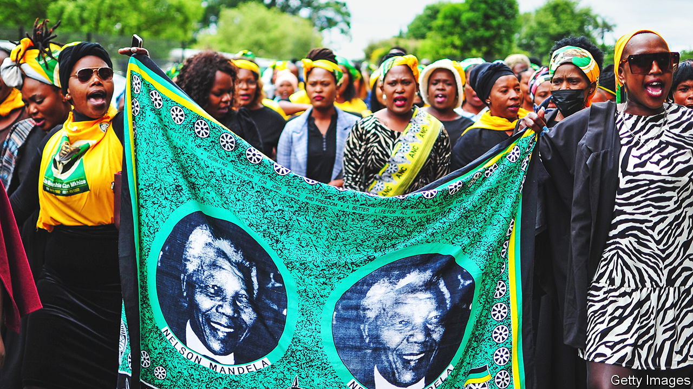
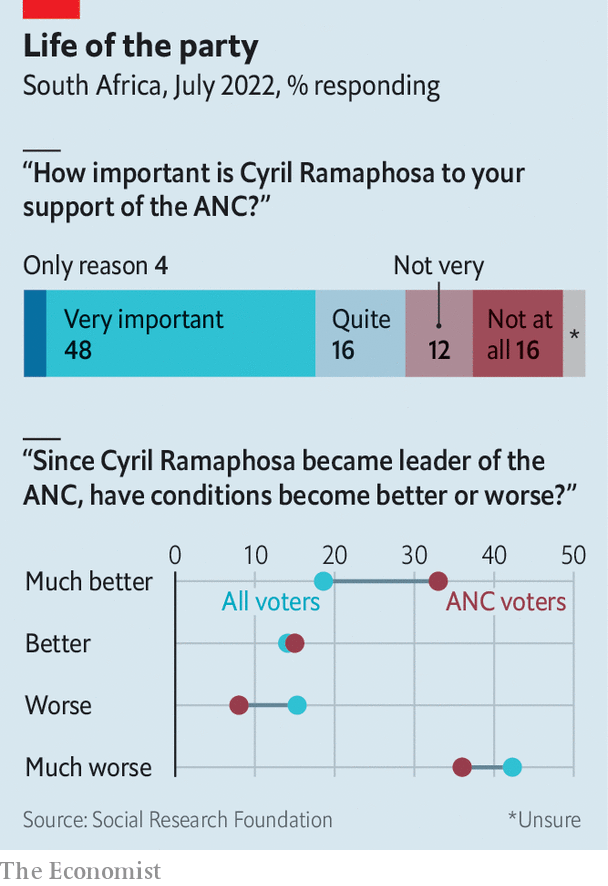

###### A bitter life for all

# The party of Nelson Mandela is imploding 

##### The collateral damage is destroying South Africa 

 

> Dec 13th 2022 

Londiwe Mkhize walks through her unfinished home in Cato Crest, a poor part of Durban, South Africa’s third-largest city. Concrete blocks lie wet from the rain that has fallen through roofless rooms. Completing the half-built house was the task of her husband, Siyabonga Mkhize. But he was shot dead in October 2021 when out campaigning to be a councillor for the African National Congress (ANC), ’s ruling party. It was too late to take his name off the ballot, so he was posthumously elected. In March the by-election to find a living replacement was won by another ANC candidate, Mzi Ngiba. Two months later Mr Ngiba was one of four people arrested for his predecessor’s murder. (All deny the charges.) “He was a kind person,” says Ms Mkhize of her husband. “But he was murdered for his choice of becoming an ANC politician.” 

Stories like Mr Mkhize’s are surprisingly common. From 2000 to 2021 at least 418 political assassinations took place, most of them in the past seven years. These typically involve competition for positions within the anc. The murders are an extreme consequence of what it—and the country it governs—have become. The party that fought apartheid is now a patronage machine draped in revolutionary rhetoric. In a state where almost half of black South Africans are unemployed and where crime goes unpunished, it is grimly rational to kill to get a lucrative political job. 

Over the past fortnight South Africans have been gripped by questions over the future of Cyril Ramaphosa. The president, who took office in 2018 pledging to reduce graft, was briefly on the brink of resignation after a report by a panel of judges concluded there was enough evidence of his misconduct for MPs to consider impeaching him. The scandal in question is related to the theft of at least $580,000 from Mr Ramaphosa’s game farm, by unknown criminals. Questions have been asked about where the money came from and why it was hidden in a sofa. Mr Ramaphosa has a large fortune, legally earned, but the presence of so much cash on his property struck many as odd. The president says he has done nothing wrong, and on December 13th a majority of MPs voted against impeaching him, with all but a few ANC parliamentarians toeing the party line. 

“Farmgate” is a plotline in a broader story, the next chapter of which begins on December 16th, when the ANC meets to elect its leaders. That story is the self-destruction of the ruling party and the collateral damage to South Africa. 

The ANC was founded in 1912 to campaign against the exploitation of black Africans and the expropriation of their property. In 1948 its nemesis, the National Party, took power and introduced apartheid, a system of overt racial discrimination favouring whites. ANC leaders, including Nelson Mandela, organised occasionally violent opposition. In 1960 the party was outlawed and its members were driven underground or into exile. Three decades later, as white South Africans tired of being global pariahs, the apartheid regime unbanned the anc. As soon as black South Africans were given the vote, the party became the government. Mandela preached reconciliation and “a better life for all”.

Some trace the ANC’s misgovernance to its past. During the dark years when it was operating underground or in exile and was vulnerable to penetration by apartheid spies and assassins, it developed a culture of secrecy, paranoia and unaccountability as a survival mechanism. These traits are hardly a recipe for governing well or cleanly. “We thought the ANC would be the torch-bearer of revolution, and clean up the mess of apartheid,” says Protas Madlala, an anti-apartheid activist. “Instead they’ve just looked after themselves.”

But “the rot was not inevitable”, argues Kgalema Motlanthe, an ANC veteran who briefly served as president between Thabo Mbeki and Jacob Zuma. Leaders after Mandela—including Mr Mbeki, Mr Ramaphosa and himself—did not do enough to stop graft, he concedes. Mr Mbeki lambasted looting in abstract terms, decrying the materialism of newly rich blacks, but did too little to stop it. His desire to create a black middle class by the “deployment” of party members into public jobs encouraged it. Once Mr Zuma became president, corruption hit new heights. Pundits spoke of “state capture”: the systematic looting of public money by anc bigwigs. 

The rot that started at the top has spread downwards. Lethal battles rage over political jobs because they offer power to award tenders to cronies. “People who join the ANC now do so not because they want to help people, but to pursue their personal ambitions and business opportunities,” says Nhlakanipho Ntombela, who, as head of elections for the ANC in the province of KwaZulu-Natal, is in charge of asking people to vote for the party. 

For a while corruption happened alongside an improvement in the lives of ordinary South Africans. The murder rate, a proxy for violent crime, fell by more than half between 1995 and 2011. Unemployment fell for most of the 2000s. The ANC built a basic welfare state that provided millions of homes, as well as cash grants for mothers and old people. 

But over the past decade corruption has exploded and living conditions have got worse. Real incomes for the top 5% grew more than twice as fast as the . For everyone else they were stagnant or rose only slightly. The murder rate is ticking up again. South Africans have spent twice as long in the dark because of blackouts in 2022 as in any previous year. Half of all running water is lost through broken pipes. The state has all but given up on many of its responsibilities. Those who can afford it generate their own electricity and pay for private schools, health insurance and security guards. Or they emigrate. “Today the general public has very little faith and trust in the ANC,” says Mr Motlanthe. “Slogans and ideologies only count if basic needs are being taken care of.”

Mr Ramaphosa’s supporters argue that, if re-elected as ANC president, he will lead a “renewal” of the party. They also point out that his narrow victory at the previous party conference hampered his presidency from the start; he had few allies in the ANC’s National Executive Committee, including among its “top six”, a sort of politburo (with all of the ruthlessness but none of the efficiency that word implies). If he wins convincingly this time, goes the argument, the president will have more time to govern. Allies say his strengthening of institutions such as the National Prosecuting Authority show he is a reformist at heart.

Mr Ramaphosa, for all his faults, is the best ANC leader the country can hope for. His main rival for the job, Zweli Mkhize, is implicated in an alleged scam involving the theft of money meant to fight covid-19. Paul Mashatile, who is running for deputy president of the party, has done little to suggest he would be an improvement. 

Yet “renewal” is unlikely, for several reasons. Mr Ramaphosa is a cautious man, who would set up a committee to decide what to have for breakfast. Although Mr Zuma’s acolytes are weakened, several nominees for the NEC are facing graft charges. The top six jobs will not be won by serious reformers, for such people are nowhere to seen. They will probably be filled by nominees of provincial power barons. 

Their growing influence reflects how the ANC is increasingly a rural party. As a result it has indulged “traditional leaders” and placated provincial party bosses. In return these bigwigs want policies that will favour them (“special economic zones” are popular) and senior positions. They do not want renewal; they want deals. 

 


Perhaps most important, the ANC is increasingly at odds with modern South Africa. It lacks an internal culture of democracy and individual accountability for its leaders. It seldom distinguishes between the party and the state. “The party’s history left it ill-equipped to govern a liberal democracy,” argues Ralph Mathekga in his book “The ANC’s last decade”. In it he argues that “bluntly, the ANC in its current state and South Africa’s constitution are just not a very good fit.” 

The ANC is in decline. Its vote share fell from 66% at the general election in 2009 to 58% in 2019. Last year it won less than 50% of the vote nationwide at municipal elections. Asked how the party has done in by-elections since then, Mr Ntombela pauses and says: “We’ve been walloped.” Mr Ramaphosa is still more popular than his party. If he does not lead the ANC into the next election, it would probably hasten the party’s decline. In a recent poll by the Social Research Foundation, a think-tank, 48% of ANC voters said that Mr Ramaphosa was “very important” to their support for the party (see chart). Even if he does lead, the party may well win less than half of the vote in a general election for the first time. 

The party’s over

The decline of the ANC evokes mixed feelings among South Africans. Few will mourn its collapse. Yet many worry about what comes next. There are two main risks. The first is that in the short term, if Mr Ramaphosa is ousted, the pro-corruption faction of the party will use what time it has to loot without restraint. The second, over the medium term, concerns what might happen as South Africa enters a new era of coalition politics. (Under its proportional-representation system, if no party wins a majority of the vote, this is all but inevitable.) Coalitions could mean compromise and pragmatism. But, as is the case already in many city governments, they could also mean even more mouths at the trough. 

Back in Durban Mr Madlala, the analyst of political killings, explains his sadness over the demise of the ANC. In the 1980s he was the first black man in South Africa legally to marry a white woman, an American he met when studying in Washington. Hundreds gathered near the church to wish them well. The next years were tough: the couple were forced to live in a shack in a “black area”. When their first child was born his wife had to wrap the baby in blankets to obscure its dark skin if she went to places reserved for whites. But it seemed like the start of a new era, both personally and politically. “It’s no longer there—the party we used to have,” he now says. “Let them lose. I won’t shed a tear.” ■

