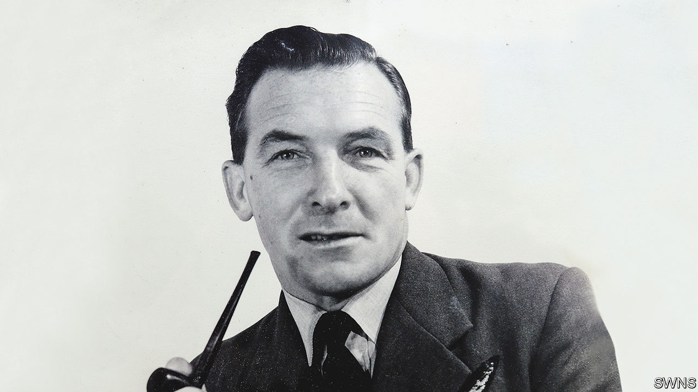

###### To breach a wall

# Squadron Leader Johnny Johnson longed to give Hitler a bloody nose 

##### The last of the Dambuster crew died on December 7th, aged 101 

 

> Dec 15th 2022 

The oddest thing, thought Johnny Johnson—once it was nose up, and they were racing for the Dutch coast—was that there had been no one there. They had set off late on this mission, on May 16th 1943, well after the two other formations of Lancaster bombers in 617 Squadron had gone. But at their target, the Sorpe dam at the heart of the German Ruhr, the skies were empty. In the brilliant moonlight the dam shone, intact. Not only was no one else attacking it at the time, but clearly no one had started. 

Of course he had been busy in his “office”, lying on his stomach on a padded bench at the front in that sweet aroma of engine oil and aircraft fuel, eyes switching from markers to target to the ground that tore past under him beyond the Perspex nose-cone, ready to shout to the pilot “Right—right—steady” if the perfect spot appeared. At that point, the pilot would throw the master switch; the bomb-release button in his own hand became live; when he pressed it, the bomb would fall. All through, he could concentrate only on the job he had to do. 

Besides, he loved doing it. He doubled as a spare gunner, manning a Browning .303-calibre machinegun, but nothing matched the thrill of the bomb-aimer’s work. It paid better, too: 12/6d a week, against 7/6d for a gunner. He naturally watched the pennies, because he had grown up poor. His father was a farm worker, ignorant and brutal, who would beat him with a leather razor-strop when something hadn’t been done right. His mother died before he was three, and his older sister Lena became the one source of kindness in their run-down cottage. For years his horizon was nothing but the dull, flat fields of Lincolnshire until he went away, despite his father, to boarding school, scraped his School Certificate and, at 18, volunteered for the RAF to give Hitler a bloody nose.

The May 16th raid had potential to be the bloodiest yet. It was a mystery, though, right up to the last minute. For a couple of months his crew, then known as Squadron X, had been training for a “special” job over lakes in the English Midlands, learning to drop bouncing bombs that had to be released at precisely 60 feet and 200 knots. They bounced because they were set spinning in the bomb bay beforehand. It was all top secret, and none of the crew knew what the target was. On the night before the raid they learned they were to attack three dams, the Möhne, the Eder and the Sorpe, to flood the industrial centre of Germany. Bouncing bombs could breach the defences of the first two dams. But his crew’s target, the Sorpe, built of earth-banked concrete and set among hills, defied any bomb-sight and couldn’t be flown at directly. They would have to skim very low along the dam and drop an inert bomb, with 6,600lb of explosives, at the estimated centre of it. They had not practised that.

By this stage in the war Johnny Johnson had done two tours, and was eager to do more. Being in the RAF was not just his way of getting back at Hitler. It had also, for the first time, given him a family: a band of brothers who smoked and ate together and actually talked to each other, unlike his own brothers. He was still a bit of a loner, not liking to drink or lark about and embarrassed by his Lincolnshire accent (“How do me duck? Are you alreet?”). The love that bound them was for Chuck-Chuck, the crew’s usual Lancaster, named after the patriotic panda painted on her nose: a beautiful, inspirational machine, making music as she flew with her Rolls-Royce Merlin engines. If Lady Luck played a prominent role in his military life, heaving him out of scrape after scrape, Chuck-Chuck made him believe he would always get home again. 

On May 16th, though, their aircraft was a different one. It was touch and go. On the way, one gunner tried a Browning burst on an armoured train; the shell sent in reply burst a tyre and pierced a wing. On the way back, they ran into fierce flak above the Hamm railway yards. As for the bombing, it was lucky he was blessed with patience. Nine times they flew the length of the Sorpe dam, but failed to make the drop at the right spot at the exact time. “Dummy run,” he would shout, and Flight-Lieutenant Joe McCarthy would take the Lanc lower, until they were only 30 feet above it. On the tenth the drop was perfect, as it had to be. The explosion sent water 1,000 feet above them. Yet they had cracked the parapet for only six yards or so. The other dams, massively breached by other crews, had flooded the fields around them into an inland sea. 

They were all, however, Dambusters. The raid brought a surge of morale to battered Britain, and made them all heroes. In time there was a film with a catchy marching theme in it, though sadly no mention of the Sorpe. For him the raid brought a Distinguished Flying Medal and, in time, an MBE. Not bad for a lad whose only prospect had been milking and haying and the Lincolnshire wind, cold as a witch’s tit. 

It was harder to talk about the raid itself. For a single operation, the losses were terrible. Around 1,600 people had drowned, mostly Soviet slave labourers. He would rather they were Nazis, but his focus was on his own side. Of 19 planes sent, three had turned back and eight had been lost. Of the 133 crew, 53 had not returned. In the bars back at base the mood of 617 Squadron was commiseration rather than celebration. He now knew why, as they had neared the Sorpe dam, there had been no sign of anyone else around. 

His post-war life filled up quickly with navigator training, family life with Gwyn and the riotous Welsh in-laws, and then, after the RAF, teaching psychiatric patients and dipping into local politics. If anyone criticised the raid he would simply ask: were they there? Did they understand the circumstances of the time? If not, they should keep their bloody mouths shut. 

After Gwyn’s death in 2005, his children persuaded him to speak out himself. Soon, as the last Dambuster left, his was the only voice that could relate the thrill of that low, searching flight, the fear of a hill crash, the rear-gunner’s shout of “Thank Christ!” as the bomb finally fell—and could keep alive the sacrifice of those who had not made it back. He could firmly call it a great raid, and know that this job was the one he now had to do. ■

