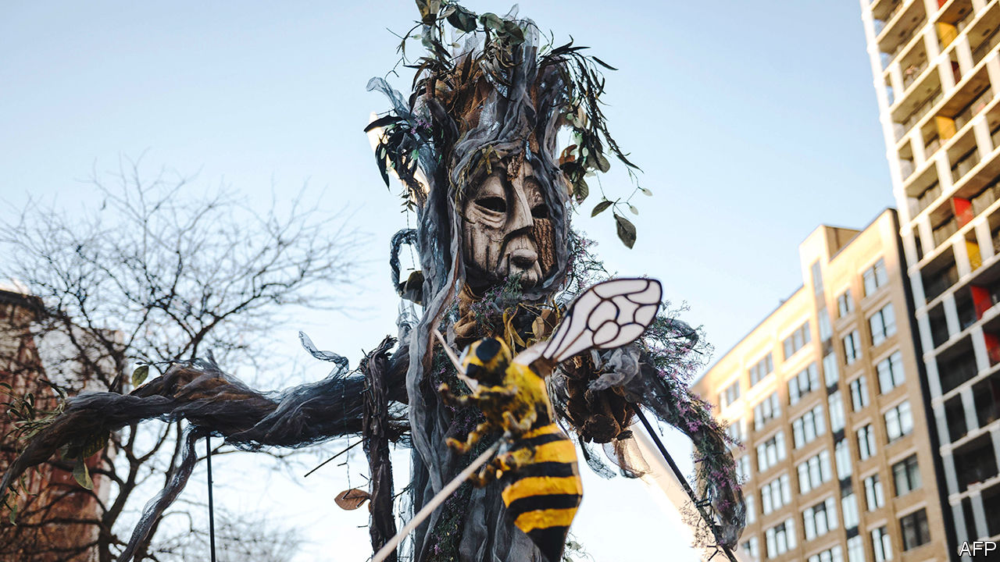

###### COP15

# A UN biodiversity meeting is slugging it out in Montreal 

##### Reaching an agreement will be even harder than it was over climate change 

 

> Dec 14th 2022 

António Guterres, secretary-general of the UN, seems to spend most of his time delivering dire warnings. Recently, he has, Cassandra-like, presaged “nuclear annihilation”, a “raging food catastrophe” and “climate hell”. His speech on December 6th at the opening of the 15th conference of the parties to the ), in Montreal, was characteristically catastrophic. In “treating nature like a toilet”, he said, “we are committing suicide by proxy”. 

Healthy ecosystems purify water and help to regulate the climate by absorbing roughly half of the carbon-dioxide emissions which people generate. They also provide food (particularly fish and other seafood) and materials (particularly timber). Yet habitat-destroying changes of land use, the exploitation of resources, global warming and pollution mean that three-quarters of the land and two-thirds of the oceans are now “severely altered”, according to the Intergovernmental Science-Policy Platform on Biodiversity and Ecosystem Services, which assesses such matters for the UN. 

Negotiators at COP15 are trying to draw up an agreement (akin to that hammered out in Paris, in 2015, at a meeting of biodiversity COP’s big brother, the COP on climate change) to stop this getting worse. But that is hard—and not just for political reasons. Humanity’s influence on the climate can be boiled down to one big cause, the amount of greenhouse gases (particularly carbon dioxide) being released into the atmosphere, and one main effect, rising temperatures. By contrast, the intricacy of ecosystems composed of vast networks of organisms means they are difficult to comprehend, let alone quantify. 

The simplicity of cause and effect made agreement on climate change at Paris easier for both the goal (stop temperatures rising more than 1.5-2°C above pre-industrial levels) and the way to get there (make greenhouse-gas emissions peak as soon as possible). No similarly straightforward deals for preserving habitats are possible. A previous biodiversity COP, held in Aichi, Japan, in 2010, yielded targets that were qualitative at best and woolly at worst—invoking nebulous promises like, “implementing an effective, participatory and updated national biodiversity strategy and action plan”. And there were far too many of them: 20 main goals (none of which has been achieved) and 60 subsidiary ones. 

The proposal most discussed and supported at COP15 is a hypothetical pact to protect 30% of the planet’s land and seas by 2030. This aspiration, dubbed “30x30”, has the virtue of being succinct and symbolic—precisely the qualities that helped the Paris temperature target gain traction. 

What actually constitutes adequate protection for ecosystems, however, differs between habitats, depending on which specific threat they are facing. Indeed, it sometimes varies within them. And many interests will have to be squared. Of particular concern is that giving priority to conservation will curtail development in places with more intact ecosystems, which tend to be poorer, while the rich world sails merrily on, having already felled its forests, ploughed its grasslands and emptied its fisheries. 

Money will certainly help. On December 14th poor-country delegates walked out of one set of negotiations, saying their wealthier counterparts were refusing to stump up the cash they needed to implement their biodiversity plans. A group led by Brazil and several African countries wants a new fund worth $100bn a year until 2030. Others seek reform of an existing funding mechanism, the Global Environment Facility, to ease access to it. Rich countries, meanwhile, champion redirection of subsidies for activities that damage nature (fossil-fuel use and some types of agriculture, for example), and boosting private investment through biodiversity credits and debt-for-nature swaps.

Another good outcome would be to spread the idea that ecosystems are important. Felling a rainforest and planting oil palms sounds sensible. You get a profit from the timber and recurring income from the palm oil. And for absorbing CO and regulating water flow, surely a plantation of trees is as good as a forest? 

Well, it isn’t. The complexity of a forest can absorb far more CO than the simplicity of a plantation. And if the forest is replaced by farms or bare land, things can be worse. Recent floods in Pakistan were laid by some at the door of climate change. They might equally have been laid at the door of the deforestation of that country’s hills, which stripped them of vegetation that previously regulated the flow of water.

Change minds and you might change behaviour. That is the lesson of Paris. If the Montreal talking shop can do something similar for biodiversity, then the jet-fuel burned taking the delegates there, and the consequent CO emissions, may actually have been worth it. ■


