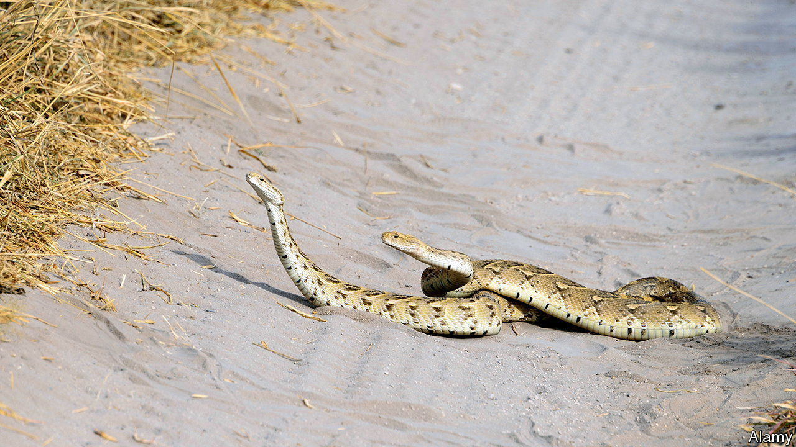

###### Snake sex

# A study of ophidian clitorises suggests snakes are highly sexed 

##### They have a great diversity of forms, and are well equipped with nerves and erectile tissue 

 

> Dec 14th 2022 

Female genitalia of all species, included, have long been overlooked by biologists. This may reflect a past tendency for biologists to be male. No longer. Biology has become an equal-opportunity discipline and that history of oversight is being corrected. A study released in October, for example, showed that the human clitoris is more richly innervated than thought. Now it is the turn of female snakes to have their genitalia scrutinised. 

This latest investigation is by Megan Folwell, a herpetologist at the University of Adelaide, in Australia. She challenges previous wisdom that the clitorises of reptiles in general, and snakes in particular, are vestiges there merely to stimulate males, rather than stimulating the female in any way. Ms Folwell, a doctoral candidate, took as the thesis for her thesis, as it were, that this belief is snake oil.

She and her colleagues studied nine species from the four main branches of the snake family tree. From the elapids, they picked the common death adder, Collett’s cobra, Ingram’s brown snake and the pygmy mulga snake. From the vipers, the puff adder and black moccasin. From the colubrids, the Guatemalan milk snake and Norman’s keelback. And from the pythons, the carpet python.

As they describe in the , they found a clitoris in every snake they studied, and discovered tremendous variation between those of different species. Some were large and conspicuous, others, small and hidden. Some were thin, and laid over the top of scent glands, others had two empty soft tissue pouches or pockets above them, which Ms Folwell speculates might give males easier access to them. Crucially, the researchers spotted nerve bundles in some clitorises, and also erectile bodies that looked as if they could easily become engorged with blood.

Ms Folwell thus sees her thesis proved. If clitorises were vestigial, they would not vary so much in form. Neither would erectile bodies—which are almost certainly responding to the actions of male snakes—have evolved. Nor would nerve bundles that are, presumably, sending signals to the animal’s brain during intercourse. 

The precise nature of those signals remains a mystery. But clitorises are associated with pleasure in just about every species in which the matter has been investigated, so the chances are good that they are associated with pleasure in snakes, as well.

All told, these findings suggest female snakes feel a great deal of what is going on during courtship and copulation, and that this encourages them to reproduce. A brave new world of investigation of snake sexual behaviour now beckons all who want to know how the common death adder and its kin get it on. ■


