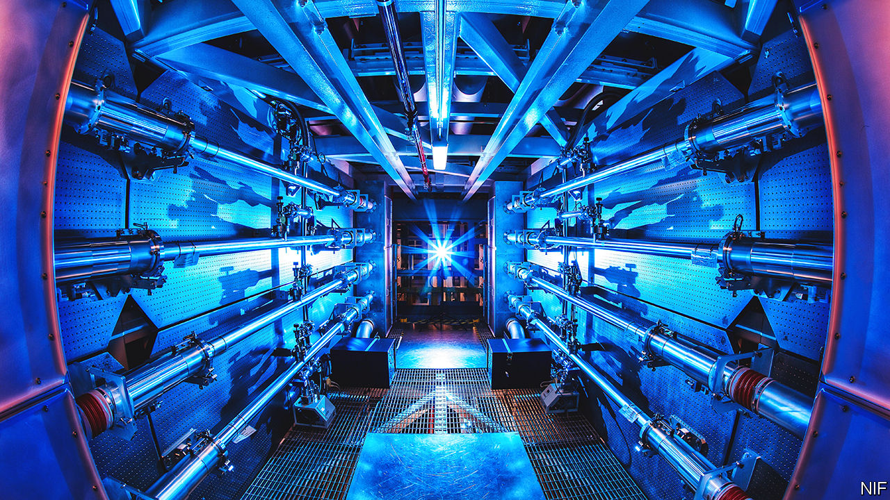

###### A brouhaha about fusion

# Controlled fusion is little nearer now than it was a week ago 

##### Despite excited reports, the NIF’s announcement will not lead to civil fusion reactors 

 

> Dec 13th 2022 

On December 13th America’s energy secretary, Jennifer Granholm, announced that the country’s National Ignition Facility (NIF) had lived up to the “I” in its name, by achieving ignition. The stuff ignited was some pellets of a frozen mixture of deuterium and tritium—isotopes of hydrogen that have, respectively, one and two neutrons in their nuclei in addition to the single proton that is hydrogen’s nuclear characteristic. 

That an American cabinet member should make time in her diary to grace the announcement of an arcane result in physics is odd. But so is the whole episode. For the result in question has been the centre of a media storm, starting on December 11th with an article in the , based, apparently, on a leak from NIF, and followed by a hurricane of publicity when the actual moment came. 

“US researchers have overcome a major barrier to achieving low-carbon nuclear fusion,” gushed the BBC’s website, leaving the reader wondering if there is also a high-carbon variety of fusion. The  went with, “Nuclear-fusion breakthrough accelerates quest to unlock limitless energy source.” , one of Sweden’s leading dailies, wrote, “We are one step closer to unlimited energy.” , one of Italy’s, pronounced that, “The dream of a clean, renewable and safe source [of energy] is approaching.”

Well, we aren’t. And it isn’t. Or, if it is, that has little to do with recent events in Livermore, California, where NIF is located. The result Ms Granholm attached herself to is interesting. But a useful step towards electricity generation by fusion it is not.

NIF is part of Lawrence Livermore National Laboratory, the main purpose of which is to investigate the physics of hydrogen bombs. These work by compressing deuterium and tritium atoms together so tightly that their nuclei fuse to create a helium nucleus, a neutron and some energy. Do this to enough pairs of atoms and you get a lot of energy—and a big bang.

Some years ago, therefore, in the wake of America’s abandonment in the 1990s of the testing of nuclear weapons, a group of bright sparks at Livermore thought useful experiments might still be carried out by developing a technology called inertial confinement, to do something similar on a far smaller scale. Thus was NIF born.

Ignition sequence start?

In a bomb, the compression is done by a fission explosion involving plutonium. In one of NIF’s pellets it is done by the convergence on the pellet of 192 beams from a powerful laser. In both cases the aim is to overcome the mutual electrical repulsion of the positively charged nuclei of the atoms, and push those nuclei close enough to one another for a different fundamental force, the strong nuclear force (which operates only at short ranges) to take over. 

The strong force is attractive, not repulsive. It pulls the protons and neutrons of the parent nuclei together into a heavier, daughter nucleus. That daughter requires less energy to bind it than do the parents, so the surplus is released—80% of it as kinetic energy of the departing neutron and 20% as kinetic energy of the helium. 

The basis of the razzamatazz is that the NIF’s researchers have released more energy from an imploding pellet than was inserted by the laser beams. They have, in other words, ignited a nuclear spark which burned for a while through the pellet in a self-sustaining way—something never before achieved. And that might be scaled up to release a far bigger fraction of the potential energy in the pellet’s contents. 

Neat, in principle. And no doubt important for understanding hydrogen bombs. But this approach can be a power source only if the energy released exceeds not merely that incident on the pellet, but rather that employed to generate the beams. Unfortunately, the huge inefficiencies involved in creating those beams mean only a tiny fraction of the generative energy behind them arrives at the pellet. Not really the basis for a workable reactor. And that is before you factor in all the other engineering difficulties involved in transducing the kinetic energy of the fusion products into electricity.

Too cheap to meter?

Fusion, though, presses odd buttons in people’s psyches. The supposedly limitless supply of fuel (for deuterium occurs naturally in a small fraction of water molecules) is touted as a benefit—conveniently ignoring the fact that tritium, which is radioactive and has a half-life of 12 years, has to be synthesised. And the observation that it releases no CO is true also of nuclear fission, solar energy and wind power, all of which are actual, developed technologies.

Yet, in this case, things are even odder. After decades when, to quote an old joke, “fusion power is 30 years away—and always will be”, there are now real ideas and real firms with real money pursuing it in the private sector. Few of these projects involve the fiddly technology of inertial confinement by laser. Even lasers more modern than that used by NIF (which opened in 2009) have not overcome the inefficiencies inherent in the process of “pumping” the device to create the beam. 

Instead, many commercial projects are based on tokamaks—an established approach that goes back to the 1950s. This heats the deuterium-tritium mixture into a plasma rather than freezing it into a pellet, and does the compressing magnetically. Breakthroughs in magnet technology, in particular, have enabled this renaissance. 

The private sector being what it is,  still are out there, too—from different fuel cycles involving different nuclei to a form of inertial confinement that works by firing a projectile into a fuel-rich target, rather than aiming laser beams at it. In light of all this, it seems inconceivable that the future of commercial fusion power, if it has one, lies with inertial-confinement by laser. Remember that, next time the headline writers get carried away. ■


