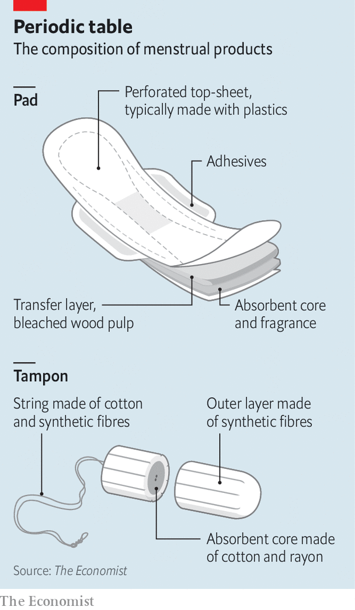

###### Menstrual products

# Not enough is known about the science of pads and tampons 

##### Why more research into the safety of menstrual products is needed 

 

> Dec 14th 2022 

The female reproductive system has an entire branch of medicine, gynaecology, devoted to it. Yet all that effort has more or less neglected a quotidian matter that that really ought to be investigated properly. Or rather, not a quotidian matter, but a menstrual one. At any given time, about 300m of the world’s women are menstruating. Of these three-quarters will be using some sort of menstrual product—tampons, pads, pantyliners, cups, period underwear, discs and so on—to regulate their flow. An average woman who employs such devices will use around 15,000 of them during her life. Someone with abnormally heavy periods might need thousands more. And many women wear several products simultaneously, for extra protection. 

Moreover, the skin of the vulva, the vagina’s external protection—which comes into direct contact with pads and pantyliners—is one of the body surface’s most sensitive parts. It is more permeable than the rest of the epidermis, and becomes still more absorbent when irritated. And the vaginal canal, where tampons sit, is lined by mucous membranes supplied by blood vessels that absorb chemicals into the bloodstream without metabolising them. 

These would, it might be thought, be reasons for scientific investigation of the composition of menstrual products, and regimes of regulation capable of responding to the findings of such investigation. That is what happens with drugs and foodstuffs, two other classes of product routinely inserted into the body. But scientific investigations are patchy, and regulation is variable between jurisdictions. And, though the sheer numbers involved mean that a serious health hazard would probably have come to light by now, it is conversely true that even a small risk would affect a lot of people. In addition, both what science there is and women’s own experiences, now easily shareable over social media, suggest all may not be well.

Product moment

There have certainly been problems in the past. In 1980 hyper-absorbent tampons were linked in America to 55 cases, some fatal, of toxic-shock syndrome—a sudden fever-like condition caused by toxins released by bacteria as they multiply. That led to a tightening up of regulations in America, where tampons are now treated as medical devices (though, surprisingly, firms that make them are neither required to do so in a sterile environment nor to test samples from each batch). Other jurisdictions take a more relaxed view. In Japan, menstrual products are described as “quasi-drugs”. In the European Union they are uncategorised general products. 

Official reports see menstrual products as safe. A study of 666 of them by the Ministry of Food and Drug Safety of South Korea, published in March 2017, picked up on potentially harmful compounds, but at levels within established safety margins. A report released in 2018 by France’s agency for food, environmental and occupational health and safety also ruled them safe. And one by the Swedish Chemicals Agency, published in the same year, concluded that there was “no reason for concern”. 

In some parts of the world, though, women’s experience suggests all is not entirely well. In the same month that the South Korean government published its report, a campaign group called the Korean Women’s Environmental Network released testimony from over 3,000 women who had experienced symptoms including shorter periods, worsened cramps and considerably less bleeding while using certain pads. It also published the results of a scientific study which claimed that the country’s ten most popular menstrual pads collectively contained 200 chemicals of concern, including 22 known carcinogens. 

In France, too, women have had worries. Among the safety agency’s findings were that 81% of respondents felt at least one kind of feminine-hygiene product (mainly tampons) involved a health risk.

In Kenya, meanwhile, a Twitter handle, #MyAlwaysExperience, became a rallying point, in 2019, for thousands of Kenyans who used it to share how their Always pads—a product so popular in Kenya that “Always” has become a generic word for pads—were causing itching, burning and rashes. Many Kenyans had put their incessant itching down to the hot climate and ignored it, but noted significant improvements after switching products. 

In America, too, according to the country’s Food and Drug Administration, hundreds of women have complained about menstrual products over the past decade. With pads and pantyliners, they have reported rashes, cellulitis and chemical burns. Aside from toxic-shock syndrome, which is still happening, adverse effects from tampons have included infections caused by disintegrating tampons, sepsis, worsened cramps and heavier periods. 

The two largest makers of period products say they give priority to safety. Procter &amp; Gamble, makers of “Always” pads and also owners of Tampax, a popular brand of tampon, says it conducts more than 1,000 quality tests a year on its raw materials and that independent laboratories likewise run over 20,000 tests on its pads, tampons and their components. Kimberly-Clark, which makes Kotex pads, says: “Our feminine care products undergo thorough internal and independent safety evaluations by product safety and medical professionals that support our confidence in the quality and safety of our products.” Both firms deny adding chemicals that have been linked to problems. 

Two matters of particular concern to those who worry about menstrual products are skin-sensitising and hormonal effects. Surprisingly, both the French and the Swedish studies ignored these. Skin sensitisation might be caused by fragrances and adhesives. And MDBGN, an antimicrobial preservative considered a dermatitis-causing allergen by the EU, and banned by them from many cosmetics, was detected on the sticky tabs of a pad’s surface in a study carried out in Australia in 2007. (Both P&amp;G and Kimberly-Clark deny adding MDBGN to any of their products.) 

Hormonal effects might be caused by so-called endocrine disrupters. These mimic oestrogen, a hormone essential to a host of functions including regulating the menstrual cycle. They also pose a theoretical risk to developing embryos. Though periods end when pregnancy starts, some women still wear light pads and liners for bleeding and other discharge when pregnant. Anna Pollack, a professor of public health at George Mason University, in Virginia, observes that endocrine disrupters, “have consistently been linked with changes in pregnancy outcomes, whether that’s lower birth weight or preterm birth”. 

Bisphenols (used to make certain sorts of plastics), parabens (employed as antimicrobial preservatives) and phthalates (often added to plastics to soften them) are all groups of chemicals that include known endocrine disrupters. In 2020 Kurunthachalam Kannan, an environmental chemist at the New York University School of Medicine, tested 43 pads, tampons and pantyliners from a local shop and found three bisphenols, five parabens and five phthalates. There are hardly any studies on the risks of vaginal exposure to these molecules, but they were present at levels Dr Kannan considers “really high for a consumer product”. (He did not disclose which brands he tested.) P&amp;G and Kimberly-Clark say that, though they do not intentionally add chemicals such as phthalates to menstrual products, these may be found in trace amounts.

 


Decades of use as plastic-softeners do now mean that phthalates are widespread in soil and water. It would thus be possible for them to appear unintentionally in menstrual products. And improved scientific instruments and tests can nowadays find ever smaller quantities of substances, which could explain the detection of some of these chemicals in Dr Kannan’s tests. But even trace amounts might affect someone’s hormonal balance. 

Discovering the truth here is hard—not least because the relevant tests are difficult to perform. Toxicity tests, which can be carried out only on animals, generally look for extreme responses, such as cancers or death. Checking for symptoms like itchiness, disrupted cycles or worsened cramps would require specific human tests. 

On top of all that, existing studies of chemical safety often rely on administration by mouth. These are a poor basis for estimating the impact of vaginal exposure, since substances ingested orally have first to pass through the destructive chemical furnace that is the gastrointestinal system before they are absorbed into the body. Similarly, drawing conclusions from skin exposure in areas like the forearm may be a flawed approach, because this skin is far less permeable than vulvar skin. 

As Kabrena Rodda, a forensic toxicologist at the Pacific Northwest National Laboratory, in Washington state, observes, “We just don’t know very much about either the short or long term effects of chemicals from vaginal exposures.” But without official standards on what is a safe dose of chemicals to be exposed to routinely, vaginally, firms are left having to choose their own testing methods and thresholds.

One possible reason for problems may be that small, rogue manufacturers are producing substandard goods. Some complaints coming from America concern products from less-well-known companies, which could skip independent testing and exploit gaps in regulations.

Another could be inconsistent manufacturing practices between countries, brands and even batches. Some Kenyan women tweeting about their experiences noted that irritating symptoms went away when they used pads imported from America or Britain. P&amp;G initially denied any differences between their products. It now says that “Our product composition may slightly vary from region to region, due to different material supply chains, different production sites, different consumer preferences and local legislation.” Tweeters on #MyAlwaysExperience also noted that locally produced “cotton-feel” pads seemed to have a rougher perforated top-sheet than imported versions. 

Test of reason

The Swedish Institute for Standards, a think-tank, has proposed creating a worldwide standard for menstrual products. This would include guidance on limits for various chemicals in them, on acceptable testing methods, and on materials. This idea passed an initial vote at the International Organisation for Standardisation, a confederation of national standards bodies also known as the ISO, this year. The ISO hopes that, by taking cues from existing standards on products such as condoms and sex toys, it can establish guidelines which could reduce inconsistencies between brands, products and batches. 

Some smaller firms are popularising replacement products which they claim are safer, though none is perfect. Period underwear, made out of moisture-wicking material such as polyester, is an environmentally conscious alternative to pads since, as long as clean running water is available, it can be washed and reused. Menstrual cups are small, flexible receptacles, also usually reusable, that supplant tampons by collecting a woman’s flow rather than absorbing it.

Other companies are trying to make existing products safer. For example Daye, a British firm, is voluntarily certified under ISO 13485, a stringent standard for medical-device makers. It hopes thus to set a higher bar for the entire industry. 

The onus now, though, is really on scientists, regulators and public-health agencies to fill the gaps in knowledge about period products. Safe thresholds for chemicals are useful only in the contexts in which they have been developed, so may be unsuitable, given the vagina’s unique permeability. Drawing up specific tests for vaginal exposure would be a labyrinthine task, but without it regulators are unlikely to find satisfactory answers. In absence of these data, women have little choice but to hope sanitary products are safe. ■


