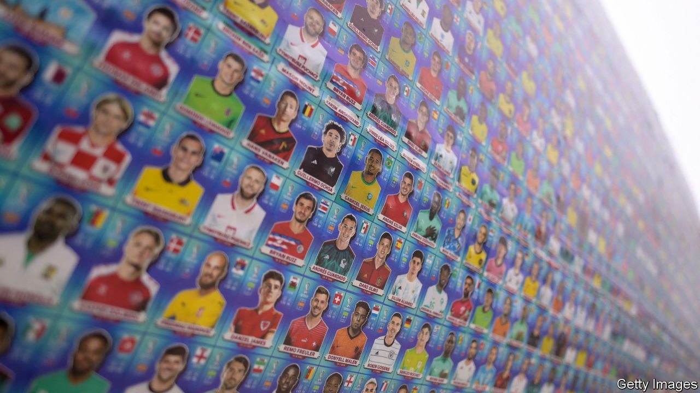

###### The Economist explains

# How to design a perfect World Cup 

##### Balance fairness, global representation and opportunities for drama 

 

> Dec 14th 2022 

THERE MAY never be another World Cup as intimate as this one. Since 1998 each tournament has featured 32 teams. In 2026, 48 will compete. Not everyone is keen: many fans and pundits fear that the expansion will dilute quality; others question how the entrants can be fairly winnowed down without making the tournament too long. FIFA, football’s global governing body, says it is still considering the structure of the competition. How could it design the perfect tournament?

The first problem is deciding which teams can compete. The primary goal of the World Cup is to find the best team. But FIFA also sees it as an opportunity to develop . That is why Europe has only 13 of the 32 current spots, despite having 16 of the world’s top 32 teams. In the expanded line-up the balance will tilt further towards global representation, with the number of Asian and African teams nearly doubling. Europe will get three more spots, but its share will fall from around 40% to a third.

Next FIFA must decide how to determine the best team among the 48. The fairest solution is the round-robin system used in domestic football leagues: every team plays every other, yielding a full ranking from first to last. But that would be impractical for a one-month competition: 48 teams would play 1,128 matches (meaning 36 each day). It would also deny fans the drama of a marquee final.

The other extreme, a straight knockout tournament, would require far fewer matches. A 32-team event would need 31 matches to identify a champion (compared with 64 games in this year’s cup, including the third-place playoff). But it would waste time and money for half of the teams—and their fans—to travel to the tournament to play a single match. And great teams that have bad matches early on deserve a reprieve. One of this year’s finalists, Argentina, . That is why World Cups in most sports feature a group stage, where teams are sorted into mini-leagues, with a certain number then qualifying for knockout matches. This reduces randomness while allowing  (see  run to the semi-final at this year’s World Cup). 

The problem with FIFA’s planned expansion is that 48 is an unwieldy number. With 32 teams the maths are easy: eight groups of four each yield two qualifiers for the knockout stage. But with 48 it will be hard to arrive neatly at the required 32 or 16 (both powers of two). FIFA’s current thinking is to have 16 groups of three, with the best two from each qualifying for a knockout round of 32. But this could render more of the final round of group games meaningless, with the top two positions already decided. Worse, it could provide an opportunity for collusion—if, say, two teams playing each other knew a draw would see them both qualify at the expense of the hapless third that was sitting the final round out. 

Another solution could be 12 groups of four. The top two from each would qualify for the round of 32, along with the eight best third-place finishers. A similar format is used in the European Championships. But it would mean 24 more World Cup games than in 2022, and the choice of the “best” third-placed teams (eg, on goal difference) may potentially be unfair.

A more radical approach could be the “Swiss system”, a tournament format used for  and other board games. It is in essence a league with fewer matches. Competitors do not play everyone else. Instead, after every round, they are drawn against similarly performing counterparts. Winners play winners, but those who lose still have a chance to redeem themselves and climb up the league table. According to a study by Laszlo Csato and his colleagues at the Corvinus University of Budapest, this format is the most effective at ranking teams within a short period. Starting in 2024, the Champions League, European club football’s most prestigious tournament, will deploy a variation of the Swiss system to cut down 36 teams to a knockout round of 16. 

Doing something similar for the World Cup would mean splitting the 48 teams into big groups (four groups of 12, for example) and using the Swiss system to identify who came top. The difficulty would lie in ensuring that each group was of a similar quality and then identifying the right fixtures for every round to ensure that every team faced a similar challenge to qualify for the knockout. Fans and teams grumble about group draws as it is. A situation where some teams face apparently easier opponents within their group could trigger fury. 

Whatever FIFA decides will feel awkward, especially after the simplicity of the 32-team format. But that will be temporary—football fans are a malleable lot. In the 15 World Cups up to 1998, the format changed almost every other tournament. That did little to dampen interest. The fans seeing their teams play for the first time in an expanded World Cup will not complain. ■

