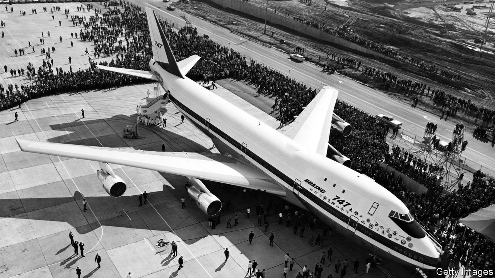

###### The Economist explains

# What caused the demise of Boeing’s 747 airliner? 

##### The end has come for the world’s most iconic passenger jet 

 

> Dec 10th 2022 

The death of a queen is a time for reflection. So it was when the last 747 jumbo jet—the “Queen of the Skies” to legions of fans—rolled off Boeing’s production line in Washington state on December 6th. Her demise has been slow and a little undignified. The last plane to be sold as passenger transport was in 2017, to Korean Air Lines. After that she was used only for cargo, and not many operators wanted her for that. Only 30 747s were ordered over the past five years. Even so, for those who associate the bumpy-headed bird with aviation’s heyday, it feels like the end of an era. 

PanAm flew the first commercial 747 route in 1970, between JFK airport in New York and London Heathrow. Strict regulation of the industry at the time restricted which routes airlines could fly. Ticket prices were also controlled. Those first jumbos typically carried 366 passengers, compared with around 200 on the Boeing 707s that flew the transatlantic route in the 1960s. That gave carriers a better chance of turning a profit in the face of these constraints. But their size would also prove to be a burden. When the oil shock struck in the mid-1970s, the gas-guzzling, four-engined beasts were a factor in airlines’ crippling losses—not least because the recession meant it was more difficult to fill its seats. 

In 1978 America deregulated its aviation market, the world’s biggest. That prompted airlines to develop the “hub-and-spoke” business model. With fewer limitations on which routes they could operate, carriers could fly huge aircraft to their home airports, before decanting passengers onto smaller planes that took them to their final destination; this changed both domestic and international air travel. That allowed operators to serve more airports with fewer planes. The more customers that could be squeezed onto the hub-bound flights, the better. That was a boon for what was then the world’s largest passenger plane. To secure its place in this system, in 1988 Boeing launched the 747-400, which could fly up to 8,354 miles (13,450 km) non-stop, around 650 miles more than its predecessor, the 747-300. It typically carried 416 passengers. 

During the 2000s competition squeezed Boeing’s jumbo. In 2007 Airbus, the American firm’s great European rival, launched the A380. This double-decker giant remains the largest passenger plane ever made, with up to 615 seats. For carriers whose prime interest was funnelling huge numbers of people through their hubs, it became the aircraft of choice. A new breed of “super-connector” airlines, such as Emirates and Qatar, built their business models around them. Emirates operates 118 A380s and no 747s. More recently, carriers have been lured by new ultra-long-range, super-efficient planes such as Airbus’s A350 and Boeing’s own 777. These carry almost as many passengers as Boeing’s jumbo, but have just two engines, making it economically viable to fly more point-to-point long-distance routes. The 747 could not survive this competitive pincer. An ailing Queen of the Skies was already on her deathbed when the pandemic killed her off. 

Yet the future of big passenger planes has begun to look a little brighter than it did before covid-19 struck, even if the 747 will no longer be among their number. (Nor might the A380 be for long, because of those new long-range planes.) Air traffic has rebounded from the effects of the pandemic. But analysts think that, in the Zoom age, leisure passengers will return to the skies more readily than business folk. Those on the company dime are more likely to pay a premium to board a flight at a convenient time, which means carriers must offer them more frequent flights on smaller planes. But holidaymakers are more concerned about price than about a civilised departure time. They are also more likely to book far in advance. This makes their custom less lucrative, but means they can be stuffed onto larger jets. The queen may be dead, but the monarchy is alive and well.■

