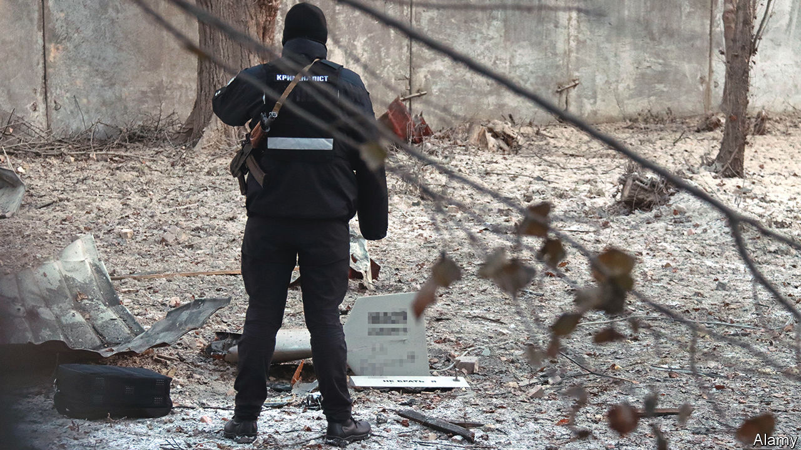

###### The world this week

# Politics 

#####  

 

> Dec 15th 2022 

The head of Ukraine’s armed forces, , predicted that Vladimir Putin would mount a  as early as January, or more likely in the spring. Russian forces continued to attack Ukraine’s civilian infrastructure with drones, many of which were shot down. America is reportedly close to approving the supply of Patriot anti-missile batteries to Kyiv. Ukrainian forces claimed to have struck a hotel in occupied Luhansk province which was being used as a headquarters by Wagner, a Russian mercenary group run by a friend of Mr Putin.

Cash for favours

The  removed Eva Kaili as a vice-president after she was accused of accepting bribes from Qatar. Ms Kaili, a Socialist MEP from Greece, denies wrongdoing, as does Qatar. Belgian authorities have charged four people with trousering €1.5m ($1.6m) in exchange for influencing laws that could be beneficial to the Gulf country. Several hundred thousand euros were found in a bag in a hotel room. 

A court sentenced the mayor of Istanbul, Ekrem Imamoglu, to two-and-a-half years in prison and banned him from politics for insulting public officials in 2019. (He called some election officials “fools”.) Dissidents say the regime is trying to disqualify the most plausible challengers to Turkey’s president, Recep Tayyip Erdogan, who faces an election next year.

 reached a preliminary deal with the IMF for a $3bn bail-out. Before the loan can be released Ghana will have to convince its domestic and foreign creditors to, in effect, reduce the value of what it owes them by pausing interest payments and extending the time it has to repay them.

,  president, survived a parliamentary vote that could have impeached him over allegations of misconduct. He was accused of failing to declare foreign currency, after $580,000 in cash was stolen from a farm he owns. 

The Arab world cheered , who reached the semi-finals of the World Cup in Qatar, the first African or Arab country to do so. They lost to France, which plays Argentina in the final on December 18th. 

A state of emergency was declared in  after the impeachment of Pedro Castillo, a left-wing president who was ousted after he attempted a coup. Eight protesters have been killed. Dina Boluarte, Mr Castillo’s constitutional successor, tried to quell the unrest by announcing that a general election would be held in December 2023. Left-wing governments in Argentina, Bolivia, Colombia and Mexico expressed support for Mr Castillo.

Protesters who refuse to accept Jair Bolsonaro’s defeat in  presidential election attacked federal police headquarters and burned cars and buses in the capital, Brasília. The violence broke out after the supreme electoral court certified the victory of Luiz Inácio Lula da Silva. Bolsonaristas have been camping outside army barracks in various cities, seeking military intervention, ever since Mr Bolsonaro lost the election. 

 passed a law that bans anyone born after 2008 from buying cigarettes. The minimum age covered by the ban will steadily increase until cigarettes are outlawed. 

A provisional tally of votes in election suggested that Frank Bainimarama will return to office as prime minister. The final result will be known in a few days. Mr Bainimarama first came to power after instigating a coup in 2006. 

Troops from  and  clashed along part of their countries’ disputed border. This time the mêlée occurred in the Tawang sector of India’s north-east Arunachal Pradesh state, which borders Tibet. No one was killed. In 2020 a skirmish in the Galwan valley, located far to the west, claimed the lives of 20 Indian and four Chinese soldiers. 

 continued to . Many locals shared their stories of infection online. The government stopped counting most cases. Experts think this wave will peak in January. Some fear the country’s weak health system will be overwhelmed, and that many people will die.

 in Britain (apart from Scotland) went on . Emergency and essential services were not affected. 

Rishi Sunak,  prime minister, promised more resources to clear a backlog of applications for asylum, especially for those made by Albanians, who make up a large share of the migrants crossing from France illegally in small boats. An extra 400 staff will process claims to stay in Britain; new guidance to case-workers will make it clear that Albania is a safe country. 

The day after Mr Sunak’s announcement at least four migrants died trying to cross the . Almost 45,000 have made the journey this year. 

A group of 7,000 irregular  crossed from Mexico into Texas. Experts predict a spike in such crossings into the United States now that Title 42 measures, which allowed the quick removal of illegal migrants at the border during the pandemic, are about to end. Many of those crossing the Rio Grande into Texas are Nicaraguans and Venezuelans. 

Joe Biden signed a federal law to reaffirm that  is legal, after Congress passed it with some Republican support. This has no practical effect, since the Supreme Court legalised gay marriage throughout the United States seven years ago. It was passed to prevent a hypothetical future Supreme Court ruling returning the matter to the states. A large majority of Americans support keeping same-sex unions legal. 

America’s National Ignition Facility carried out a  that yielded more energy than was put in by the lasers that triggered the reaction. Headlines about limitless clean energy followed. But, alas, the calculations failed to include the rest of the energy required to run the apparatus, which was considerable. 

Over the Moon

 


NASA’s  splashed back down to Earth in the Pacific Ocean after its maiden voyage around the Moon. The mission, the first in the Artemis programme that will eventually return humans to the Moon, saw the Orion come within 80 miles (129km) of the lunar surface. At its farthest the capsule was 270,000 miles from Earth, breaking the record for the distance flown by a spacecraft designed to carry people, which was previously set during the Apollo 13 mission in 1970. 

