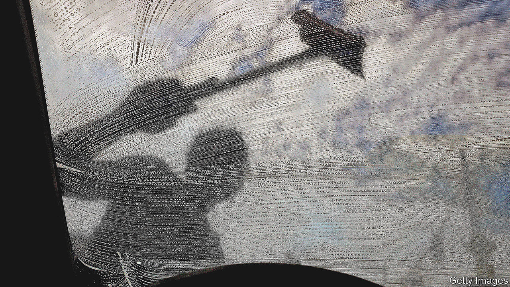

###### Or else

# A city experiments with paying people not to be annoying 

##### Baltimore’s squeegee kids are the subject of a new policy experiment 

 

> Dec 15th 2022 

In 1993 Rudy Giuliani won New York City’s mayoral race by promising to crack down on crime. The former prosecutor vowed not only to shackle murderers and rapists, but also to rid the city of “squeegee men” who, sometimes menacingly, washed car windows for cash at red lights. The new mayor’s cops took to the streets and by the late 1990s the men were gone. 

Baltimore did no such thing. There, it has long been teenagers who squeegee, ditching school to make ends meet. The city has for years tolerated “squeegee kids”—poor black boys as young as eight years old—leaping into rush-hour traffic. But sentiments changed when a 14-year-old window-washer fatally shot an aggravated driver in July. Commuters now take circuitous routes, afraid of what the boys will do if they refuse service. More than ever, squeegee politics are the talk of the town.

The mayor has intervened. From January squeegeeing will be banned at six of Baltimore’s busiest intersections, and vans will pluck squeegee workers off street corners and return them to school. More contentiously, the city will pay older squeegee kids $15 an hour to work or enroll in job training instead of washing windows. 

Baltimore is not the only city experimenting with cash incentives. San Francisco gives teenagers who lash out in school $500 a month if they sign up for mentoring and stay far from trouble. Atlanta offers stipends for “water boys”, who sell bottled water in traffic jams, to give up their gig and attend summer classes.

Some think this a bad idea. A former Baltimore police commissioner said paying squeegee kids to stop amounts to extortion. Larry Hogan, Maryland’s outgoing governor, called for “crackdowns, not handouts”. But getting kids off the streets is not simple. Squeegeeing is technically panhandling, which in 2015 the Supreme Court ruled is protected under the First Amendment. Previous attempts to criminalise it were blocked by the courts.

The mayor’s less hawkish strategies may not work. The evidence on whether job-training programmes keep kids out of trouble is mixed. Even enlisting teenagers could be hard. Squeegee kids working the city’s main arteries told your correspondent that they make $200-300 a day wiping windows. On a hot summer day they can make as much as $600. After taxes, an eight-hour work shift at $15 an hour would yield just a fraction of that. Some, however, would take the pay cut for a stable job. Squeegee work is gruelling. Drivers sometimes pull guns on the kids. “It’s as rough as trapping,” says one, referring to the perils of selling drugs.

Even if the plan diverts some teenagers, as long as squeegeeing remains profitable they will be replaced by others, warns Philip Cook of Duke University. Suppressing demand may be the best way to curb the practice. But some locals want to encourage the young folk who, unlike many of their peers, go after money legally. Many come from violent neighbourhoods and are years behind at school. Despite being adolescents, some of them are bringing up toddlers. “These kids are entrepreneurs,” says Faith Leach, the mastermind behind Baltimore’s plan. The city is trying to tap into that. But as long as drivers reward the hustle with cash, Baltimore’s boys will continue to soap up windscreens. ■


